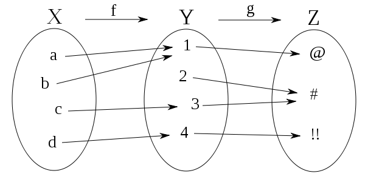
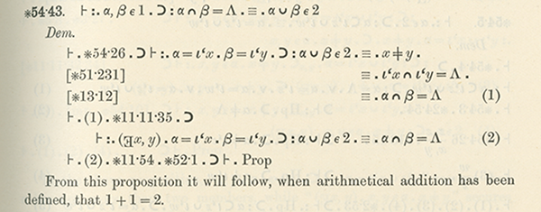

Modal Logic and Binary Relations

<table>
<colgroup>
<col style="width: 6%" />
<col style="width: 17%" />
<col style="width: 33%" />
<col style="width: 38%" />
<col style="width: 3%" />
</colgroup>
<thead>
<tr class="header">
<th colspan="2"><strong>Domain</strong></th>
<th></th>
<th></th>
<th></th>
</tr>
</thead>
<tbody>
<tr class="odd">
<td></td>
<td>total</td>
<td>∀<em>x</em>∀<em>y</em>R<em>xy</em></td>
<td>All possible arrows exist.</td>
<td></td>
</tr>
<tr class="even">
<td></td>
<td>empty</td>
<td>∀<em>x</em>∀<em>y</em>~R<em>xy</em></td>
<td>There are no arrows.</td>
<td></td>
</tr>
<tr class="odd">
<td></td>
<td>vacuous</td>
<td>∀<em>x</em>∀<em>y</em>(R<em>xy</em> → <em>x</em> = <em>y</em>)</td>
<td>Only loops are arrows.</td>
<td></td>
</tr>
<tr class="even">
<td colspan="2"></td>
<td></td>
<td></td>
<td></td>
</tr>
<tr class="odd">
<td colspan="2"><strong>Seriality</strong></td>
<td></td>
<td></td>
<td></td>
</tr>
<tr class="even">
<td></td>
<td>serial (<em>right</em>)</td>
<td>∀<em>x</em>∃<em>y</em>R<em>xy</em></td>
<td>Every element is a tail of an arrow.</td>
<td></td>
</tr>
<tr class="odd">
<td></td>
<td>serial (<em>left)</em></td>
<td>∀<em>x</em>∃<em>y</em>R<em>yx</em></td>
<td>Every element is a head of an arrow</td>
<td></td>
</tr>
<tr class="even">
<td></td>
<td></td>
<td></td>
<td></td>
<td></td>
</tr>
<tr class="odd">
<td colspan="2"><strong>Reflexivity</strong></td>
<td></td>
<td></td>
<td></td>
</tr>
<tr class="even">
<td></td>
<td>totally reflexive</td>
<td>∀<em>x</em>R<em>xx</em></td>
<td>All elements have loops.</td>
<td></td>
</tr>
<tr class="odd">
<td></td>
<td>weakly reflexive</td>
<td>∀<em>x</em>[∃<em>y</em>(R<em>xy</em> ∨ R<em>yx</em>) →
R<em>xx</em>]</td>
<td>Heads and tails of arrows have loops.</td>
<td></td>
</tr>
<tr class="even">
<td></td>
<td>irreflexive</td>
<td>∀<em>x</em>~R<em>xx</em></td>
<td>There are no loops.</td>
<td></td>
</tr>
<tr class="odd">
<td></td>
<td>co-reflexive</td>
<td>∀<em>x</em>∀<em>y</em>(R<em>xy</em> → R<em>xx</em>)</td>
<td>Any tail of an arrow has a loop.</td>
<td></td>
</tr>
<tr class="even">
<td></td>
<td>non-reflexive</td>
<td>Neither reflexive nor irreflexive</td>
<td></td>
<td></td>
</tr>
<tr class="odd">
<td colspan="2"></td>
<td></td>
<td></td>
<td></td>
</tr>
<tr class="even">
<td colspan="2"><strong>Symmetry</strong></td>
<td></td>
<td></td>
<td></td>
</tr>
<tr class="odd">
<td></td>
<td>symmetric</td>
<td>∀<em>x</em>∀<em>y</em>(R<em>xy</em> → R<em>yx</em>)</td>
<td>All arrows are double arrows.</td>
<td></td>
</tr>
<tr class="even">
<td></td>
<td>asymmetric</td>
<td>∀<em>x</em>∀<em>y</em>(R<em>xy</em> → ~R<em>yx</em>)</td>
<td>No arrow is a double arrow.</td>
<td></td>
</tr>
<tr class="odd">
<td></td>
<td>antisymmetric</td>
<td>∀<em>x</em>∀<em>y</em>∀<em>z</em>(R<em>xy</em> ∧ R<em>yx</em> →
<em>x</em> = <em>y</em>)</td>
<td>Only loops are double arrows.</td>
<td></td>
</tr>
<tr class="even">
<td></td>
<td>non-symmetric</td>
<td colspan="2">Neither symmetric nor asymmetric</td>
<td></td>
</tr>
<tr class="odd">
<td></td>
<td></td>
<td></td>
<td></td>
<td></td>
</tr>
<tr class="even">
<td colspan="2"><strong>Transitivity</strong></td>
<td></td>
<td></td>
<td></td>
</tr>
<tr class="odd">
<td></td>
<td>transitive</td>
<td>∀<em>x</em>∀<em>y</em>∀<em>z</em>(R<em>xy</em> ∧ R<em>yz</em> →
R<em>xz</em>)</td>
<td>Any indirect path has a shortcut.</td>
<td></td>
</tr>
<tr class="even">
<td></td>
<td>intransitive</td>
<td>∀<em>x</em>∀<em>y</em>∀<em>z</em>(R<em>xy</em> ∧ R<em>yz</em> →
~R<em>xz</em>))</td>
<td>No indirect path has a shortcut.</td>
<td></td>
</tr>
<tr class="odd">
<td></td>
<td>non-transitive</td>
<td>Neither transitive nor intransitive</td>
<td></td>
<td></td>
</tr>
<tr class="even">
<td></td>
<td></td>
<td></td>
<td></td>
<td></td>
</tr>
<tr class="odd">
<td colspan="2"><strong>Euclideanness</strong></td>
<td></td>
<td></td>
<td></td>
</tr>
<tr class="even">
<td></td>
<td>Euclidean (<em>right</em>)</td>
<td>∀<em>x</em>∀<em>y</em>∀<em>z</em>(R<em>xy</em> ∧ R<em>xz</em> →
R<em>yz</em>)</td>
<td colspan="2">Heads with a common tail are connected.</td>
</tr>
<tr class="odd">
<td></td>
<td>Euclidean (<em>left</em>)</td>
<td>∀<em>x</em>∀<em>y</em>∀<em>z</em>(R<em>yx</em> ∧ R<em>zx</em> →
R<em>yz</em>)</td>
<td>Tails with a common head are connected.</td>
<td></td>
</tr>
</tbody>
</table>

> A relation is *euclidean* if it is both left and right euclidean.

**Orderings**

<table>
<colgroup>
<col style="width: 26%" />
<col style="width: 54%" />
<col style="width: 18%" />
</colgroup>
<thead>
<tr class="header">
<th>Poset (Partial)</th>
<th>reflexive, anti-Symmetric, transitive</th>
<th></th>
</tr>
</thead>
<tbody>
<tr class="odd">
<td>Total (Linear) Ordering</td>
<td>Poset + Total</td>
<td></td>
</tr>
<tr class="even">
<td>Well Ordering</td>
<td>Total + Every non-empty set has a least element</td>
<td></td>
</tr>
<tr class="odd">
<td></td>
<td></td>
<td></td>
</tr>
</tbody>
</table>

Equivalence relation: reflexive, symmetric, transitive

Partial equivalence: symmetric, transitive

Exercises

\#1. Construct derivations for the following.

1.  All *weakly reflexive* relations are *co-reflexive.*

2.  Any *asymmetric* or *intransitive* relation is *irreflexive.*

3.  Any *reflexive* relation is *serial.*

4.  Any *co*-*reflexive* *euclidean* relation is a *partial equivalence*
    (i.e. symmetric and transitive)

5.  All *serial euclide*an relations are *eqivalence relations*.

\#2. Explain the following facts.

\(A\) Only the *identity* relation is both *reflexive* and
*co-reflexive*.

\(B\) Any *co-reflexive* relation is a subset of the *identity*
relation.

\(C\) The relation *y* = *x*2 is neither *reflexive*,
*irreflexive*, nor co-*reflexive*.

\(D\) A *transitive* relation is irr*eflexive* iff *it is asymmetric.*

\(E\) A *transitive* relation is *irrflexive* iff *asymmetric*.

<table>
<colgroup>
<col style="width: 7%" />
<col style="width: 25%" />
<col style="width: 50%" />
<col style="width: 17%" />
</colgroup>
<thead>
<tr class="header">
<th colspan="2"><strong>Directed</strong></th>
<th></th>
<th></th>
</tr>
</thead>
<tbody>
<tr class="odd">
<td colspan="2">directed (<em>convergent</em>)</td>
<td>∀<em>x</em>∀<em>y</em>∀<em>z</em>[R<em>xy</em> ∧ R<em>xz</em> →
∃<em>w</em>(R<em>yw</em> ∧ R<em>zw</em>)]</td>
<td></td>
</tr>
<tr class="even">
<td colspan="2"></td>
<td></td>
<td></td>
</tr>
<tr class="odd">
<td colspan="2"><strong>Functional</strong></td>
<td></td>
<td></td>
</tr>
<tr class="even">
<td></td>
<td>partially functional</td>
<td>∀<em>x</em>∀<em>y</em>∀<em>z</em> (R<em>xy</em> ∧ R<em>xz</em> →
<em>y = z</em> )</td>
<td></td>
</tr>
<tr class="odd">
<td></td>
<td>inversely functional</td>
<td>∀<em>x</em>∀<em>y</em>∀<em>z</em> (R<em>xz</em> ∧ R<em>yz</em> →
<em>x = y</em> )</td>
<td></td>
</tr>
<tr class="even">
<td colspan="2"></td>
<td></td>
<td></td>
</tr>
<tr class="odd">
<td colspan="2"><strong>Connected</strong></td>
<td></td>
<td></td>
</tr>
<tr class="even">
<td></td>
<td>connected</td>
<td>∀<em>x</em>∀<em>y</em>(R<em>xy</em> ∨ R<em>yx</em>)</td>
<td></td>
</tr>
<tr class="odd">
<td></td>
<td>weakly connected</td>
<td>∀<em>x</em>∀<em>y</em> (<em>x</em> ≠ <em>y</em> → R<em>xy</em> ∨
R<em>yx</em> )</td>
<td></td>
</tr>
<tr class="even">
<td colspan="2"></td>
<td></td>
<td></td>
</tr>
<tr class="odd">
<td colspan="2"><strong>Dense</strong></td>
<td></td>
<td></td>
</tr>
<tr class="even">
<td></td>
<td>dense</td>
<td>∀<em>x</em>∀<em>y</em>[R<em>xy</em> ∧ <em>x</em> ≠ <em>y</em> →
∃<em>z</em> (<em>x</em>≠<em>z</em> ∧ <em>y</em>≠<em>z</em> ∧
R<em>xz</em> ∧ Rz<em>y</em>)]</td>
<td></td>
</tr>
<tr class="odd">
<td></td>
<td>weakly dense</td>
<td>∀<em>x</em>∀<em>y</em>[R<em>xy</em> → ∃<em>z</em>(R<em>xz</em> ∧
R<em>zy</em>)]</td>
<td></td>
</tr>
</tbody>
</table>

Weak Reflexivity & Euclidean ⇒ Partial Equivalence

\#1. Construct derivations for the following arguments.

\(A\) Everyone loves a lover. Romeo loves Juliet. Therefore, Tybalt
loves Mercutio.

\[Universe: persons; L*xy*: *x* loves *y*; A: Romeo; B: Juliet; C:
Mercutio; D: Tybalt\]

Everyone loves a lover: ∀*x*(*x* is a lover → everyone loves *x*)

*x* is a lover = *x* loves someone: ∃*y* L*xy*

∀*x*(∃*y* L*xy* → ∀*z* L*zx*)

∀*x*(∃*y* L*xy* → ∀*z* L*zx*) LAB ∴ LDC (In fact, it follows that
*everybody loves everybody!*)

1\. *<s>Show</s>* LDC 13 DD

2\. ∀*x*(∃*w* L*xw* → ∀*z* L*zx*) Premise

3\. LAB Premise

4\. *<s>Show</s>* ∀*x*∀*w* L*xw* 12, UD (Everyone loves everyone)

5\. ∃*y* LA*y* 3, EG (Romeo is a lover)

6\. ∃*y* LA*y* → ∀*z* L*z*A 2, UI

7\. ∀*z* L*z*A 6, 5 MP (Everyone loves Romeo)

8\. L*w*A 7, UI (*w* loves Romeo)

9\. ∃*y* L*wy* 8, EG (*w* is a lover)

10\. ∃*y* L*wy* → ∀*z* L*zw* 2, UI

11\. ∀*z* L*zw* 10, 9 MP (Everyone loves *w*)

12\. L*xw* 11, UI (*x* loves *w*)

13\. LCD 4, UI, UI (Hence, Tybalt loves Mercutio)

\(B\) Everyone loves a lover. Juliet *doesn’t* love Romeo. Therefore,
*nobody* loves *anybody*!

\(C\) Boston Blackie is a friend to those who have no friends.
Therefore, Boston Blackie has friends.

\(D\) There is a barber in the village of Alcala who shaves all and only
those adult males who don’t shave themselves. Therefore, the barber is a
female. \[*Implicit premises*: there are adults in Alcala and all adults
are either male or female.\]

\(E\) Leibniz characterized a *good person* as one who loves all persons
*as much as reason allows*. Dropping the qualification about reason,
let’s define a *good* person as one who loves *all* persons.

A person is *good* iff they love everyone. Therefore, someone loves all
good persons.

∀*x*(G*x* ↔ ∀*y*L*xy*) ∴ ∃*z*∀*w*(G*w* → L*zw*)

If good persons *don’t exist*, then it is *vacuously* true that someone
loves all good persons.

If there is *at least one* good person, then that person loves *all*
persons, hence, *a fortiori*, all *good* persons.

1\. *<s>Show</s>* ∃*z*∀*w*(G*w* → L*zw*) 21, DD

2\. ∀*x*(G*x* ↔ ∀*y*L*xy*) Premise

3\. *<s>Show</s>* ∃*w*G*w →* ∃*z*∀*w*(G*w* → L*zw*) 12, CD

4\. ∃*w*G*w* Assume (CD)

5\. G*a* 4, EI

6\. *<s>Show</s>* ∀*w*(G*w* → L*aw*) 7, UD

7\. *<s>Show</s>* G*w* → L*aw* 11, CD

8\. G*w* Assume (CD)

9\. G*w* ↔ ∀*y*L*wy* 2, UI

10\. ∀*y*L*wy* 9 BC, 8 MP

11\. L*aw* 10, UI

12\. ∃*z*∀*w*(G*w* → L*zw*) 6, EG

13\. *<s>Show</s>* ~ ∃*w*G*w →* ∃*z*∀*w*(G*w* → L*zw*) 20, CD

14\. ~ ∃*w*G*w* Assume (CD)

15\. ∀*w*~G*w* 14, QN

16\. *<s>Show</s>* ∀*w*(G*w* → L*zw*) 17, UD

17\. *<s>Show</s>* G*w* → L*zw* 18, 19 ID

18\. G*w* Assume (CD)

19\. ~ G*w* 15, UI

20\. ∃*z*∀*w*(G*w* → L*zw*) 16, EG

21\. ∃*z*∀*w*(G*w* → L*zw*) 3, 13 SC, Form I

\#2. Symbolize the following sentences on the basis of the dictionary
provided.

> N*x*: *x* is a natural number 0: the number zero

I*x*: *x* is interesting 1: the number one

*x* &lt; *y*: *x* is less than *y* S(*x*): the successor of *x* ; *x* +
1

*x* ∈ *y*: *x* is a member of *y* *x* + *y*: the sum of *x* and *y*

*x* ≠ *y*: *x* is not equal to *y* *x* × *y*: the product of *x* and *y*

\(A\) Zero is a natural number.

\(B\) The successor of any natural number is a natural number.

\(C\) Zeros is not the successor of any natural number.

\(D\) No two natural numbers have the same successor.

\(E\) (Schema) If zero has the property F and whenever any natural
number *x* has F its successor has F, then all natural numbers have F.

\#3. Several years ago I pointed out an error in John Stilwell’s
*Reverse Mathematics*. See if you can discover and correct the error—the
difference between (D) above and its converse. Here is the original text
and subsequent correspondence with the author.

\#4. Prove the following using the principle of induction and properties
of &lt;.

If any number is such that all numbers less than it are interesting,
then it is certainly interesting.

If there is an uninteresting number, then there is a *smallest* such
number, i.e., an uninteresting number less than or equal to all
uninteresting numbers. Therefore, all numbers are interesting.

∀*x*\[N*x* ∧ ∀*y*(N*y* ∧ *y* &lt; *x* → I*y*) → I*x*\]

∃*x*(N*x* ∧ ~I*x*) → ∃*x*\[N*x* ∧ ~I*x* ∧ ∀*y*(N*y* ∧ ~I*y* → *x* ≤
*y*)\] (*Well-Ordering*)

Implicit Premise: ∀*x*∀*y*(*y* &lt; *x* ↔ ~ *x* ≤ *y*) (*Trichtomy*)

Suppose some number is uninteresting. Then there is a smallest
uninteresting number. But then all number smaller than that smallest
uninteresting number will be interesting. But any number such that all
numbers less than it are interesting is interesting. Contradiction.

Lemma: ∀*y*(N*y* ∧ ~I*y* → *a* ≤ *y*)\] ↔ ∀*y*(N*y* ∧ ~ *a* ≤ *y* →
I*y*) *Exportation, Contraposition*

↔ ∀*y*(N*y* ∧ *y* &lt; *a* → I*y*) *Trichotomy*

A number is the smallest uninteresting number iff all numbers smaller
than it are interesting.

1.  *<s>Show</s>* ∀*x*(N*x* → I*x*) 5, UD

2.  ∀*x*\[N*x* ∧ ∀*y*(N*y* ∧ *y* &lt; *x* → I*y*) → I*x*\] Premise

3.  ∃*x*(N*x* ∧ ~I*x*) → ∃*x*\[N*x* ∧ ~I*x* ∧ ∀*y*(N*y* ∧ ~I*y* → *x* ≤
    *y*)\] Premise

4.  ∀*x*∀*y*(*y* &lt; *x* ↔ ~*x* ≤ *y*) Premise

5.  *<s>Show</s>* N*x* → I*x* 7, CD

6.  N*x* Assume (CD\_

7.  *<s>Show</s>* I*x* 20, 21 ID

8.  ~I*x* Assume (ID)

9.  N*x* ∧ ~I*x* 6, 8 ADJ

10. ∃*x*(N*x* ∧ ~I*x*) 9, EG (there is an uninteresting \#)

11. ∃*x*\[N*x* ∧ ~I*x* ∧ ∀*y*(N*y* ∧ ~I*y* → *x* ≤ *y*)\] 3, 10 MP
    (there is a smallest such)

12. N*a* ∧ ~I*a* ∧ ∀*y*(N*y* ∧ ~I*y* → *a* ≤ *y*) 11, EI (call it *a*)

13. *<s>Show</s>* ∀*y*(N*y* ∧ *y* &lt; *a* → I*y*) 14, UD (all \#s &lt;
    *a* are interesting)

14. *<s>Show</s>* N*y* ∧ *y* &lt; *a* → I*y*

15. N*y* ∧ *y* &lt; *a* Assume (CD)

16. ~ *a* <u>&lt;</u> *y* 15, S, 4 UI, UI, BC, MP

17. N*y* ∧ ~I*y* → *a* ≤ *y* 12, S, UI

18. I*y* 17, 16, MT, DM, 15, S, DN, MTP, DN

19. N*a* ∧ ∀*y*(N*y* ∧ *y* &lt; *a* → I*y*) → I*a* 2, UI

20. I*a*

21. ~I*a* 12, S

\#5. Fermat’s preferred method of proof is the first step of the ladder
that leads to Gentzen’s proof \[1936\] of the Consistency of Arithmetic
using transfinite induction. *Fermat’s Disproof by Infinite Descent* can
be symbolized:

∀*x*\[N*x* ∧ F*x* → ∃*y*\[N*y* ∧ *y* &lt; *x* ∧ F*y*\] → ∀*x*(N*x* →
~F*x*) .

The principle of *Strong Mathematical Induction* states that if a
natural number has a property F whenever all the numbers less than it
have the property, then all natural numbers having that property:

∀*x*\[N*x* ∧ ∀*y*(N*y* ∧ *y* &lt; *x* → F*y*) → F*x*\] → ∀*x*(N*x* →
F*x*)

Show that these two principles are logically equivalent.

\#6. *Numerical Properties*.

\(A\) For every natural number there is a greater natural number.

\(B\) There is no natural number greater than all other natural numbers.

\(C\) There is exactly one thing that has the property T.

\(D\) There are all least two things and at most three things that have
the property F.

\(E\) The things that is F has the property G.

\#5. *Infinity Schema*. There is no sentence of first-order logic that
defines being finite, i.e., which is true in all and only finite models.
This follows from the Compactness Theorem. There are, however, sets of
sentences that are only satisfied in infinite models. These sets of
sentences are called infinity schema.

\(A\) R is serial, transitive and asymmetric.

\(B\) R is serial, transitive, and irreflexive

\(C\) R is serial, asymmetric, and irreflexive

\(D\) ∀*x*∃*u*∀*y*\[(R*xy* → ~R*yu*) ∧ (R*xy* ∨ R*yu*)\]

\#6. Functions, A special category of relations are functions. A
function is *totally defined* on its domain if it assigns every member
in its domain a member of its ranges. A function is a relation that is
both *totally defined* and *not one-many-one.* If *f* is a function
mapping the elements of its domain X into a set Y containing the
elements of its range, we write:.

*f* :X → Y .

A relation is *inversely functional* if each element of the range is
mapped *onto* by a unique element of the domain. Another way to say this
is to say that an inversely functional relation is both *onto* (i.e,
each member of its range has some element of the domain mapped onto it)
and *not one-many*. If *f* is inversely functional mapping the elements
of its domain X onto its range Y, we write:.

*f-1* :Y → X .

If a relation is both functional and inversely functional, we say that
there is a *one-to-one correspondence* between the elements of the
domain and range. In such as case, it follows that both the domain and
range have the same numbers of objects.

A property chain or composition of functions is the results of applying
one function to the results of another. For example suppose we have two
functions *f*: X → Y and *g*: Y → Z. Then the composition of these
functions is written:

*g*(*f*(x)) = *g* o *f* (x) .

\(A\) The sum of any natural numbers is a natural number.

\(B\) The operation of multiplication is *commutative*.

\(C\) Addition is *associative*.

\(D\) Multiplication is *distributive* over addition.

\(E\) 0 is the additive identity.

\(F\) The sum of *x* and the successor of *y* is equal to the successor
of the sum of *x* and *y*.

\(G\) The natural numbers are *Archimedean*, i.e., for any natural
numbers *x* and *y* such that *x* is less than *y*, then there exists a
natural number *n* such that the product of *x* and *n* is greater than
*y*.

Church’s λ-Calculus

Church’s λ-calculus is a *function-based* analysis of computation, in
contrast to Turing’s *state-based* analysis. Turing’s analysis, which
Church dubbed “Turing Machines”, led to the construction of actual
computing machinery. Church’s λ-calculus led to functional programming
languages. For the last couple of decades, functional programming is a
standard component of computer languages—such as, Java, Visual Basic,
and Haskell. These functional languages are useful for social media
applications, for example, because they avoids programming errors
associated with creating of data bases and with the retrieving and
storing results in memory.

**Church’s λ-calculus** is an abstract symbol rewriting language based
on a function-based analysis of computation.

Basic objects: functions

Basic operation: functional composition

From a logical point of view, the λ-calculus is naturally recursive and
reflexive. In his original monograph “The Calculi of Lambda-Conversion
\[1941\], Church writes:

> “It is, of course, not excluded that the range of arguments or range
> of values of an function should consist wholly or partly of functions
> ……
>
> “In particular it is not excluded that one of the elements of the
> range of arguments of a function *f* should be the function *f*
> itself. This possibility has frequently been denied, and indeed, if a
> function is defined as a correspondence between two previously given
> ranges, the reason for the denial is clear. Here, however we regard
> the operation or rule of correspondence which constitutes the
> function, as being first given, and then range of the arguments then
> determined as consisting of the things to which the operation is
> applicable. This is a departure from the point of view usual in
> mathematics, but it is a departure which is natural in passing from
> consideration of functions in a special domain to the consideration of
> function in general, and it finds support in consistency theorems
> which will be proved below.

Since Church’s system is recursive and reflexive, it is easy to show
that the system will intuitively have fixed-points.

Let ψ be defined by ψ*x* = ϕ(*xx*).

Since ψ itself a functional-expression and ψ*x* = ϕ(*xx*) for any *x*,
we can form ψψ = ϕ(ψψ).

Therefore, let χ= ψψ and so ϕ(χ) = χ is the desired fixed-point.

But this is getting ahead of exposition.

The contemporary syntax for Church’s λ-Calculus
Syntax is quite economical:

Expression :: = variable *identifier*

| expression expression *application* is represented by juxtaposition

| λ variable . expression *abstraction*

| ( expression) *grouping*

λ*x*.A*x* (B) = AB

The Church- Curry Forest is inhabited by magical birds (functions).

Given any two birds A and B, if you call out the name of B to A, then A
will respond by calling out the name of a bird we designate AB. \[Think
of the birds A and B as “black boxes”, we input the name of B into the
function A and obtain the output AB.\]

.

B A A B

Note that BA is not necessarily the same as AB, and A(BC) is not
necessarily the same as (AB)C. Se we use parentheses for grouping or to
indicate the order of operations.

**Church’s λ-calculus** (and Curry’s combinatorial logic) are abstract
*function-based* symbol-rewriting analyses of computation.

The Church-Curry Forest is governed by two rules—composition and the
existence of a Mockingbird.

(C1) *Composition*: ∀A, B, ∃C ∀***x*** C*x* = A(B*x*).

For any birds A and B, there is a bird C that *composes* A and B.

(C2) There exists a *Mockingbird* M such that ∀*x,* M*x* =
*xx.*

In other words, given the (name of) any bird, the mockingbird *mimics*
what that bird returns upon hearing its own name. Alternatively, calling
out *x* to M results in the same response as called out *x* to *x*.

-   A bird A is *fond* of B if AB = B.

Theorem 1. Every bird is fond of some bird (or other).

Let A be any bird. By composition, there is a bird C that composes A and
M, where M is a mockingbird.

That is, for all birds *x*, C*x* = A(M*x*). By instantiating to C, we
have CC = A(MC). But since M is a mockingbird, we also have MC = CC and
hence, A(CC) = CC. But then CC is the required bird B such that AB = B.

This reasoning can be set forth as a natural deduction:

1.  *<s>Show</s>* ∀A∃B AB = B 7, DD

2.  ∀***x*** C*x* = A(M*x*) Composition, UI2

3.  CC = A(MC) 2, UI

4.  MC = CC 2, UI, Def. Mockingbird

5.  A(MC) = CC 3, Sym

6.  A(CC) = CC 5, 4 LL

7.  ∃B A(B) = B 6, EG

‘

-   A bird *x* is *egocentric* if *xx* = *x*.

Theorem 2. There is at least one egocentric bird.

By theorem 1 every bird, including the mockingbird, is fond of some
bird.

Hence, for some bird E, both ME = E and ME = EE, so E = EE.

It happens that any bird that a mockingbird is fond of is egocentric.

1.  *<s>Show</s>* ∃*x xx* = *x* 6, DD

2.  ∃B MB = B Thm 1, UI, where M is a mockingbird

3.  ME = E 2, EI

4.  ME = EE Def. mockingbird

5.  E = EE 3, 4 transitivity

6.  ∃*x xx* = *x* 5, EG

Birds A and B *agree* on a bird *x* if A*x* = B*x*.

A bird A is *agreeable* if for every B there is an *x* such that A*x* =
B*x*.

∀B∃*x* A*x* = B*x*

Theorem 3. Replace the existence of a mockingbird with that of an
agreeable bird in theorem 1.

Let A be an agreeable bird.

Take any bird *x*. By composition there is a bird H that composes *x*
with A.

If A is agreeable, then A agrees with H on some bird *y*, so A*y* =
H*y*.

Since H composes *x* with A, H*y* = *x*(A*y*).

Thus, A*y* = H*y* = *x*(A*y*), and so

*x*(A*y*) = A*y*, which means that *x* is fond of A*y*.

Theorem 3. ∀*x* ∃*y xy* = *y*

1.  *<s>Show</s>* ∀*x* ∃*y xy* = *y* 7, UD

2.  ∀B∃*x* A*x* = B*x* A is agreeable

3.  ∃H ∀*y*H*x* = *x*(A*y*) Composition

4.  A*y*’ = H*y*’ Def. A is agreeable

5.  H*y*’ = *x* (A*y*’) 3, UI

6.  *x*(A*y*’) = A*y*’ 4, 5, Trans, Sym of =

7.  ∃*y xy* = *y* 6, EG

Theorem 4. If C = A(B) and C is agreeable, then A is agreeable.

Take any bird D. We must show that A agrees with D on some bird (or
other).

By composition, there exists E that composes D with B, i.e., for all x,
Ex = D(Bx).

Also since C is agreeable, C agrees with E on some bird y, i.e., Cy =
Ey.

C*y* = A(B*y*) = C*y* = E*y* = D(B*y*). Hence, A(B*y*) = D(B*y*), so
∃*x*(A*x* = D*x*), for every D,

i.e., A is agreeable.

1.  *<s>Show</s>* C = A(B) ∧ C is agreeable → A is agreeable 3, CD

2.  C = A(B) ∧ C is agreeable Assume (CD)

3.  *<s>Show</s>* ∀D, ∃*x* (A*x* = D*x*) 9, UD

4.  E*y* = D(B*y*) Composition, EI

5.  ∀*x*(C*x* = E*x*) 2, S, Def. Agreeable, UI

6.  C*y* = E*y* 5, UI

7.  C*y* = A(B*y*) 2, S, Def. Comp, UI

8.  A(B*y*) = D(B*y*) 4, 6, 7, Trans2, Sym

9.  ∃*x*(A*x* = D*x*)

Theorem 5. ∀A,B,C ∃D∀*x* D*x* = A(B(C*x*)))

By composition, there exists a bird E that composes B with C, i.e., ∀*x*
E*x* = B(C*x*).

Hence, A(E*x*) = A(B(C*x*)).

By composition, there exists a bird D that composes A with E, i.e., D*x*
= A(E*x*).

Therefore, D*x* = A(E*x*) = A(B(C*x*)), and so D*x* = A(B(C*x*)

-   A and B are *compatible* if ∃x∃y (Ax = y ∧ By = x)

-   A is *happy* if it is compatible with itself.

-   A is *normal* if it is fond of at least one bird.

Given C1 and C2, any two birds are compatible.

Any normal bird is happy (but a happy bird is not necessarily normal).

If the composition condition holds and there is at least one happy bird
then there is at least one normal bird.

A bird B is *egocentric* if BB = B.

A bird B is *hopelessly egocentric* if ∀x, Bx = B.

A bird B is *fixated* on bird B if ∀xAx = B.

A bird is *kestrel* if ∀xy, (Kx)y = x.

In other words, if K is kestrel, then for every bird x Kx is fixated on
x.

Any kestrel who is egocentric is hopelessly egocentric.

Raymond Smullyan explicates these operations in combinatorial logic in
terms of birds.

(C1) Combination: ∀A,B ∃C C*x* = A(B*x*)

> Given birds A and B, if you call out the name of B to A , the. A will
> respond by calling out the name of some bird to you. The bird designed
> AB. Thus AB is the bird named by A upon hearing the name of B. Then M
> is a *Mockingbird* if given any bird *x*, M*xx* = *x*.

This is appropriate since Haskell Curry, the inventor of combinatorial
logic, was an avid bird-watcher.

<table>
<colgroup>
<col style="width: 6%" />
<col style="width: 7%" />
<col style="width: 10%" />
<col style="width: 18%" />
<col style="width: 31%" />
<col style="width: 25%" />
</colgroup>
<thead>
<tr class="header">
<th colspan="4">Smullyan Birds</th>
<th>λ-Calculus</th>
<th>Use</th>
</tr>
</thead>
<tbody>
<tr class="odd">
<td></td>
<td>I</td>
<td></td>
<td>Idiot</td>
<td><blockquote>

λ<em>a.a</em>

</blockquote></td>
<td><em>identity</em></td>
</tr>
<tr class="even">
<td></td>
<td>M</td>
<td></td>
<td>Mockingbird</td>
<td><blockquote>

λ<em>f.ff</em>

</blockquote></td>
<td><em>self-application</em></td>
</tr>
<tr class="odd">
<td></td>
<td>K</td>
<td></td>
<td>Kestrel</td>
<td><blockquote>

λ<em>ab.a</em>

</blockquote></td>
<td><em>first</em></td>
</tr>
<tr class="even">
<td></td>
<td>KI</td>
<td>= CK</td>
<td>Kite</td>
<td><blockquote>

λ<em>ab.b</em>

</blockquote></td>
<td><em>second</em></td>
</tr>
<tr class="odd">
<td></td>
<td>C</td>
<td></td>
<td>Cardinal</td>
<td><blockquote>

λ<em>fab.fba</em>

</blockquote></td>
<td><em>reverse arguments</em></td>
</tr>
</tbody>
</table>

Everything you need for a foundational system—Boolean propositional
logic, arithmetic, recursion, etc. is λ-definable.

Let’s begin with boolean propositional logic. From a computational
perspective, what does logic do? It makes a choice. If something is
true, do something. If something is false, do something else. We can use
this idea of making a choice to encode true and false in the λ-calculus.

TRUE = λ*x*λ*y* *x*

FALSE = λ*x*λ*y* *y*

A *Boolean* *value* *b* is either TRUE or FALSE.

NOT = λ*b*.*b* FALSE TRUE

As Leibniz said, “Let us calculate!”:

(λ*b*. *b* FALSE TRUE) TRUE = TRUE FALSE TRUE

= λ*x*λ*y* *x* FALSE TRUE

= FALSE

(λ*b*. *b* FALSE TRUE) FALSE = FALSE FALSE TRUE

= λ*x*λ*y* y FALSE TRUE

= TRUE

Exercises: Show that the λ-calculus has
the boolean logical connectives:

<table>
<colgroup>
<col style="width: 6%" />
<col style="width: 17%" />
<col style="width: 16%" />
<col style="width: 31%" />
<col style="width: 28%" />
</colgroup>
<thead>
<tr class="header">
<th colspan="2">Boolean Logic</th>
<th>Sym. Bird</th>
<th>λ-Calculus</th>
<th>Use</th>
</tr>
</thead>
<tbody>
<tr class="odd">
<td>T</td>
<td>True</td>
<td>K =</td>
<td><blockquote>

λ<em>ab.a</em>

</blockquote></td>
<td><blockquote>

<em>encodes true</em>

</blockquote></td>
</tr>
<tr class="even">
<td>F</td>
<td>False</td>
<td>KI = CK =</td>
<td><blockquote>

λ<em>ab.b</em>

</blockquote></td>
<td><blockquote>

<em>encodes true</em>

</blockquote></td>
</tr>
<tr class="odd">
<td></td>
<td>Not</td>
<td>C =</td>
<td><blockquote>

λ<em>pq</em>.<em>p</em>FT

</blockquote></td>
<td><blockquote>

<em>negation</em>

</blockquote></td>
</tr>
<tr class="even">
<td></td>
<td>And</td>
<td></td>
<td><blockquote>

λ<em>pq</em>.<em>p</em>F or λ<em>pq</em>.<em>pqp</em>

</blockquote></td>
<td><blockquote>

<em>conjunction</em>

</blockquote></td>
</tr>
<tr class="odd">
<td></td>
<td>Or</td>
<td>M* =</td>
<td><blockquote>

λ<em>pq</em>.<em>p</em>T<em>q</em> or. λ<em>pq</em>.<em>ppq</em>

</blockquote></td>
<td><blockquote>

<em>disjunction</em>

</blockquote></td>
</tr>
<tr class="even">
<td></td>
<td>If .. (Then)</td>
<td></td>
<td></td>
<td><blockquote>

<em>conditional</em>

</blockquote></td>
</tr>
<tr class="odd">
<td></td>
<td>Iff</td>
<td></td>
<td><blockquote>

λ<em>pq</em>.<em>p q</em>(Not
<em>q</em>)

</blockquote></td>
<td><blockquote>

<em>biconditional</em>

</blockquote></td>
</tr>
</tbody>
</table>

The λ-calculus also has arithmetic. Instead of constructing the numbers
set-theoretically as object, you think of the numbers a iterative
application of a function once, twice, three-times, etc.:

Define

> 0 := λ*sx*.*x*
>
> S := λ*abc.b* ( *abc* )

0 is a function that has two input expressions *s* and *x*. This
function ignores what is input for *s* and outputs whatever is input for
*x*.

The successor function has three input expressions or functions. This
function first concatenates the three functions and then substitutes
this concatenation into the second input expression.

S(0) = \[ λ*abc.b*( *abc* ) \] ( λ*sx*.*x* )

= λ *bc.b*(( λ*sx*.*x* ) *bc* )

> We do the same for: (( λ*sx*.*x* ) *bc* ) = (( λ*x*.*x* ) *c* ) = *c*
>
> Since the variable *s* binds nothing in the expression *bc* it can be
> ignored.
>
> Leaving (( λ*x*.*x* ) *c* ) = *c*

= λ *bc.b*( *c* ) since ( ( λ*sx*.*x* ) *bc* ) = (( λ*x*.*x* ) *c* ) =
*c*

> = λ *sx.s*(*x*) by alphabetic variance

Define

1 := S(0)

S(1) = \[ λ*abc.b* ( *abc* ) \] ( λ *sx.s*(*x*) )

> = λ *bc.b* (( λ*sx*.*s*(*x*) ) *bc* ) substituting λ*sx*.*s*(*x*) for
> *a*

= λ *bc.b* (( *b*(*c*) ) ) ( λ*sx*.*s*(*x*) ) *bc* = (( λ*x*.*b*(*x*) )
*c* ) = *b*(c)

= λ *bc.b*(*c*)

> = λ *sx.*(*s*(*x*)) by alphabetic variance

Define

2 := S(1)

Church’s Definition of Addition: *m* + *n* := *m*S*n*

1 + 1 = 1S1

> = λ*sx.s*(*x*) S λ*sx.s*(*x*)
>
> = λ*sx.s*(*x*) λ*abc.b* ( *abc* ) λ*sx.s*(*x*)
>
> = λ*sx.s*(*x*) λ*abc.b* ( *abc* ) λ*ty.t*(*y*)
>
> = λ*sx.s*(*x*) λ*<s>a</s>bc.b* (λ*ty.t*(*y*)*bc* )
>
> = λ*sx.s*(*x*) λ*bc.b* (λ*ty.t*(*y*)*bc* )
>
> = λ*sx.s*(*x*) λ*bc.b*(*b(c*))
>
> = λ*sx.s*(*x*) λ*bc.b(c*)
>
> = λ*sx.s*(*x*) λ*sx.s*(*x*)
>
> = 2

Don Kalish donated all of his books to the Philosophy Library except for
three volumes of *Principia Mathematica*. It takes over 360 pages for
Russell to set up the constructions that will allow for the proof of 1 +
1 = 2.

*“From this proposition, it will follow, when arithmetical addition has
been defined, that 1 + 1 = 2.”*

*The images above were obtained from the Rare Book Collection at
Franklin and Marshall College, Lancaster, Pennsylvania.*

[Index to Mathematical Treasures](http://www.maa.org/node/647835)

<table>
<colgroup>
<col style="width: 8%" />
<col style="width: 18%" />
<col style="width: 11%" />
<col style="width: 33%" />
<col style="width: 27%" />
</colgroup>
<thead>
<tr class="header">
<th colspan="2">Arithmetic</th>
<th>Bird</th>
<th>λ-Calculus</th>
<th>Use</th>
</tr>
</thead>
<tbody>
<tr class="odd">
<td>N0</td>
<td>Zero</td>
<td>F =</td>
<td><blockquote>

λ<em>fa.a</em>

</blockquote></td>
<td><em>Apply f no times to a</em></td>
</tr>
<tr class="even">
<td>N1</td>
<td>Once</td>
<td>I* =</td>
<td><blockquote>

λ<em>fa.f a</em> 

</blockquote></td>
<td><em>Apply f one time to a</em></td>
</tr>
<tr class="odd">
<td>N2</td>
<td>Twice</td>
<td>C =</td>
<td><blockquote>

λ<em>fa.f</em> (<em>f a</em>)

</blockquote></td>
<td><em>Apply f twice to a</em></td>
</tr>
<tr class="even">
<td>N3</td>
<td>Thrice</td>
<td></td>
<td><blockquote>

λ<em>fa.f</em> (<em>f</em> (<em>fa</em>))

</blockquote></td>
<td><em>Apply f thrice to a</em></td>
</tr>
<tr class="odd">
<td>N4</td>
<td>Fourfold</td>
<td>M* =</td>
<td><blockquote>

λ<em>fa.f</em> (<em>f</em> (<em>f</em> (<em>fa</em>)))

</blockquote></td>
<td><em>Apply f four times to a</em></td>
</tr>
<tr class="even">
<td>N5</td>
<td>Fivefold</td>
<td></td>
<td><blockquote>

λ<em>fa.f</em> (<em>f</em> (<em>f</em> (<em>f</em>
(<em>fa</em>))))

</blockquote></td>
<td><em>Apply f five times to a</em></td>
</tr>
<tr class="odd">
<td></td>
<td></td>
<td></td>
<td></td>
<td></td>
</tr>
<tr class="even">
<td>Succ</td>
<td>Successor</td>
<td>K =</td>
<td><blockquote>

λ<em>nf.</em>B <em>f (nf)</em>

</blockquote></td>
<td><em>Successor of n</em></td>
</tr>
<tr class="odd">
<td>Add</td>
<td>Addition</td>
<td>KI = CK =</td>
<td><blockquote>

λ<em>nk.n</em> SUCC <em>k</em>

</blockquote></td>
<td><em>Addition of n and k</em></td>
</tr>
<tr class="even">
<td>Mult</td>
<td>Multiplication</td>
<td>B =</td>
<td><blockquote>

λ<em>nkf.n</em>(<em>kf</em>)

</blockquote></td>
<td><em>Multiplication of n and k</em></td>
</tr>
<tr class="odd">
<td>Pow</td>
<td>Power</td>
<td>Th =</td>
<td><blockquote>

λ<em>nk.nk</em>

</blockquote></td>
<td><em>Raise n to power of k</em></td>
</tr>
<tr class="even">
<td>Pre</td>
<td>Predecessor</td>
<td></td>
<td><blockquote>

λ<em>n.</em>Fst <em>(n</em> Φ (Pair N0 N0))

</blockquote></td>
<td><em>Predecessor of n</em></td>
</tr>
<tr class="odd">
<td>Sub</td>
<td>Subtraction</td>
<td></td>
<td><blockquote>

λ<em>nk.k</em> Pred <em>n</em>

</blockquote></td>
<td><em>Subtract k from n</em></td>
</tr>
</tbody>
</table>

Haskell Curry discovered the Y-combinator, which is the key to doing
recursion in the λ−calculus:

Y = λ*f*.(λ*x*.*f*(*xx*)) (λ*x*.*f*(*xx*))

Professor Graham Hutton on computerphile: if you at human DNA it has the
same structure as this combinator, so recursion is analogous to
self-replication of DNA.

<https://video.search.yahoo.com/yhs/search?fr=yhs-iba-syn&hsimp=yhs-syn&hspart=iba&p=lambda+calculus+youtube#id=3&vid=8a715348507bf5e2dc941cc5989ede28&action=click>

[<u>https://video.search.yahoo.com/yhs/search?fr=yhs-iba-syn&hsimp=yhs-syn&hspart=iba&p=lambda+calculus+youtube#id=2&vid=2e0e484c73e7370bb4a2fca0a13dcd9e&action=click</u>](https://video.search.yahoo.com/yhs/search?fr=yhs-iba-syn&hsimp=yhs-syn&hspart=iba&p=lambda+calculus+youtube#id=2&vid=2e0e484c73e7370bb4a2fca0a13dcd9e&action=click)
