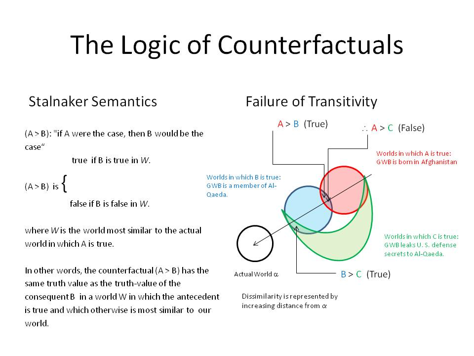

Chapter 7. “*Possibly*” and
“*Necessarily*”

>  style="width:2.13194in;height:1.70833in" alt="tweedlee" />

# Contents

1. Modes of Truth
and Modal Logics. [2](#modes-of-truth-and-modal-logic.)

Exercises [13](#exercises-1)

2. Translation and Symbolization.
[5](#translation-and-symbolization.)

Exercises [6](#_Toc341185815)

3. Axioms for Modal Logics.
[13](#axioms-for-modal-logics.)

4. Modal Inference Rules.
[17](#modal-inference-rules.)

Exercises [18](#exercises-2)

5. Natural Deduction for (T), (B), (S4), and
(S5). [18](#natural-deduction-for-t-b-s4-and-s5.)

Exercises [29](#exercises-3)

6\. Fallacies. [31](#fallacies.)

Exercises [36](#exercises-4)

7. Possible World Semantics.
[38](#_Toc341185823)

Exercises [44](#exercises-5)

8.
Theorems. [50](#theorems.)

Exercises [55](#_Toc341185826)

9.
Counterfactuals “Would” and “Could”
[57](#counterfactuals-would-and-could)

Exercises [61](#exercises-7)

10. Quantified
Modal Logic [62](#quantified-modal-logic)

Exercises [69](#exercises-8)

11. Modal
Provability Systems and Gödel’s Incompleteness Theorems.
[73](#modal-provability-systems-and-gödels-incompleteness-theorems.)

Exercises [77](#_Toc341185832)

12. Philosophical
Remarks (*Nathan Salmon*).
[77](#philosophical-remarks-nathan-salmon.)

**  
**

# 1. Modes of Truth and Modal Logic. 

Historically, *necessity*, *possibility*, *impossibility,* and
*contingency* were conceived of as *modes* of truth—ways in which a
proposition could be true or false. From the very beginning, modal logic
was a part of classical logic. Aristotle’s paradox of the Sea Battle
tomorrow raised questions about the truth-values of future contingent
propositions. Medieval philosophers—such as Peter Abelard (1079 –1142),
John Buridan (1301 – c. 1359/62), and Louis de is de Molina (1535 –
1600)—debated *theologoumenon* or *possible* theological views).

During the Enlightenment, modality achieved its own category—*apodictic
judgements* in Kant’s Table of Judgments.

In 1879 in his *Begrifftschrift*, “the founding document of modern
logic”[1], Gottlob Frege (1848 – 1925) dismissed modality as having
“only grammatical significance”:

> The apodictic judgment differs from the assertory in that it suggests
> the existence of universal judgments from which the proposition may be
> inferred, while in the case of the assertory one such a suggestion is
> lacking. By saying that a proposition is necessary I give a hint about
> the grounds for my judgment. *But, since this does not affect the
> conceptual content of the judgment, the form of the apodictic judgment
> has no significance for us*. (italics in text, van Heijenoort
> \[1967\], 13)

Frege’s generally negative assessment of the relevance of modality for
logic was taken up by the American logician Willard van Orman Quine
(1908 - 2000). Quine famously disparaged modal logic as being “conceived
in sin” (by which he meant the confusion of use and mention). In a 1938
letter, Quine chastised his mentor and teacher Rudolf Carnap (1891 –
1970):

> I proceed to inveigh against your recent intensional propensities... I
> fear your principle of tolerance may finally lead you even to tolerate
> Hitler.

To which Carnap gave the spirited reply:

> Your sermon against my sin of intensionality has made a great
> impression on me. But I may say as an apology, I do not indulge in
> this vice generally and thoroughly.... Although we usually do not like
> to apply intensional languages, nevertheless we cannot help analyzing
> them. What would you think of an entomologist who refused to
> investigate fleas and lice because he dislikes them?[2]

Quine’s conservative dogma counseled logicians to translate issues in
philosophical logic into the Procrustean bed of “canonical” first-order
logic. Quine’s prejudice against modal logic, and intensional logics
more generally, cast a long shadow over the modern development of modal
logic until it burst alethically developed from the work of Saul Kripke
and othersin the 1960s and 1970s.

In his “whirlwind history” of modal logic, Johan van Bentham notes that
the emphasis on extensional logic, as opposed to intensional logics like
modal logic, was, in the short run, “immensely beneficial”:

> “especially in the analysis of the foundations of mathematics, whose
> Golden Age was the 1930s with classical results on provability,
> completeness, computability, and definability by Hilbert, Post, Gödel,
> Tarski, Turing, and many others.” (p. 1)

In retrospect, the history of logic was neither as linear and
progressive nor as periodic and confined as depicted by the victors who
lived to tell the story.

After the publication of his famous Incompleteness Theorems in 1931,
Gödel in his 1933 studies of intuitionistic logic used modal operator to
axiomatize the intuitionistic notion of provability. These “Gödel
logics” foreshadowed the emergence of modal provability logics that
would flourish in the 1970s, providing elegant proofs of Gödel’s Second
Incompleteness Theorem or the Unprovability of Consistency.

Following Frege, Russell and Whitehead championed extensional logic and
“material implication” through the publication of *Principia
Mathematica* \[1910–1913\]. However, C.I. Lewis (1883 – 1964) began in
1912 riticizing *Principia’s* use of “material implication” as leading
to paradoxical theorems:

T7 ~P → (P → Q) Law of Denying the Antecedent

T2 Q → (P → Q) Law of Affirming the Consequent

T58 (P → Q) ∨ (Q → R) Law of Conditional Excluded Middle

Lewis championed “strict implication”

P **⥽** Q := ~(P ∧ ~Q)

characterizing it in terms of the axioms for strict implication (**S4**)
and (**S5**), which would become a standard part of modal logic.
Lukasiewicz in his contributions to temporal modal logic in the 1920s
and 1930s endorsed the view taken by Aristotle in his Sea Battle Paradox
that future contingent propositions do not definitive truth-values.

Working in relative isolation in New Zealand, insulated from Quine’s
“dogmas” against modal logic, Arthur N. Prior began to develop temporal
modal logics. Prior’s John Locke Lectures were published as Time and
Modality \[1957\] caught the attention of the young Saul Kripke who
wrote a letter in 1958, raising questions about branching time.
Throughout the 1950s, modal and intentional logics were intensely
studied by Rudolf Carnap, Stig Kanger, Jaakko Hintikka, Richard
Montague, Robert Stalnaker, David Lewis. Saul Kripke, while still a high
school student, produced beautiful semantics for standard modal logical
systems in his “Semantical Considerations on Modal Logic” \[1963\].

Kripke proved completeness theorems for standard systems of modal logic
with characteristic axioms—such as (**D**) in Deontic Logic requiring
the accessibility relation to be *serial*, the logic of tautologies
(**T**) with an accessibility relation that is *reflexive*, the (B)
axiom requiring the accessibility relation be *symmetric*, axiom (**4**)
requiring the accessibility relation be *transitive* and axiom (**5**)
requiring that accessibility be an *equivalence* relation.

From the 1970 - 1990 the Philosophy of Language was dominated with the
“New Theory of Reference” and “Possible World Semantics”. Medieval
distinctions such as *the de re / de dicto* distinction were used by
Saul Kripke to challenge Quine’s arguments against the coherence of
“quantifying into” propositional attitudes and other intensional
contexts. The ideas of the medieval Jesuit Louis de Molina about divine
“middle knowledge” were revived by philosopher of religion Alvin
Plantinga as the “counterfactuals of freedom” in his masterful
discussion of the problem of evil.

After this early philosophical phrase, modal logic flourished. According
to van Bentham, the philosophical phrase was “consolidated into a
beautiful mathematical theory by … Block, Fine, Gabbay, Goldblatt,
Segerberg and Thomason, in the 1970s “crossed over to linguistics and
formal semantics with “Montague Grammars”, in the 1980s, modal logics
found their way into computer science in the study of program
verification, and into “economics in the study of knowledge of players
in games Aumann, 1976)”. Van Bentham underscores the transition from
viewing modal logic as *extensions* of classical logic in the 1960s to
the view that they are *fragments* of classic logics with the virtue of
lower computational complexity. These applications have broken down the
distinction between pure and applied logic lowering comutational
complexity in applications as diverse as image processing and branching
programming.

# 2. Syntax for Modal Propositional Logic. 

Propositional modal logic come from propositional logic by adding two
new operators:

> diamond (read “it is possible that”)
>
> box (read “it is necessary that”)

To be more explicit, the class of symbolic sentences is exhaustively
characterized:

1.  *Sentence letters are symbolic sentences.*

2.  *If* ϕ *and* ψ *are symbolic sentences, then so are*: ~ ϕ , (ϕ → ψ)
    , (ϕ ∧ ψ) , (ϕ ∨ ψ) , (ϕ ↔ *ψ) .*

3.  *If* ϕ *is a symbolic sentence, then so are*:

> ϕ
>
> *and*

ϕ .

Sentences obtained by (3) are *modal sentences*. The occurrence of ϕ in
the modal sentences ϕ or ϕ is called the *scope* of the corresponding
modal operator.

A more succinct way of specifying our grammar is this notation:

| P, Q, …, Z | ~ϕ | (ϕ ∧ ψ) | (ϕ ∨ ψ) | (ϕ → ψ) |(ϕ ↔ ψ )| ϕ | ϕ |

Symbolic sentences can be parsed into *grammatical trees* to
systematically display all the sub-sentences involved it its
construction. Here, in addition to the kinds of nodes of Chapter II,
non-branching nodes are also reached by clause (3).

((P → Q) → ~~R)

(P→ Q) ~~ R

(P→ Q) ~ R

P Q ~ R

P R

We shall continue to use the informal conventions of KM2 for
omitting outer parentheses, replacing pairs of matching parentheses with
matching pairs of square brackets, for resolving questions of scope
among the various connectives and operators:

1.  The negation and modal operators ‘’ and ‘’ and ‘~’ by convention
    have the *narrowest* scope.

2.  The connectives ‘∧’, and ‘∨’ have *narrower* scope than ‘→’ and ‘↔’.

3.  Repeated conjunctions or disjunctions are grouped by association to
    the left.

Thus, for example, the official sentence

(~P → Q) ↔ (((P ∧ Q) ∨ (P ∧ Q)) ∨ (~P ∧ Q))

becomes informally

(~P → Q) ↔ (P ∧ Q) ∨ (P ∧ Q) ∨ (~P ∧ Q) .

# 2. Translation and Symbolization. 

# 

The English sentence

1.  It is necessary that God exists

has a number of stylistic variants in English:

> *Necessarily*, God exists ,
>
> *It is necessary for* God to exist ,
>
> God *must* exist ,
>
> God *has to* exist .

Similarly, the sentence

1.  It is possible that God exists

may also be expressed with a number of stylistic variants:

> *Possibly*, God exists ,
>
> *It is possible for* God to exist ,
>
> God *can* exist ,
>
> God *might* exist .

Using the modal operators with the sentential connectives of chapters I
and II, we can develop stylistic variants of a number of English
expressions. For instance, the expression

It is impossible that God exists

may be paraphrased as either

It is *necessary* that God *fails* to exist ,

or

> It is *not possible* that God exists .

Modal operators, when they interact with other operators and
connectives, can create *scope ambiguities* such that that between the
necessity of the consequence and the necessity of the consequent, which
we discussed in the previous section.

### Exercises

1\. Symbolize the following sets of sentences using the given the scheme
of abbreviation. If a sentence is ambiguous briefly explain the
different possible readings.

> P: Plato is rational. R: Theatetus is a cyclist.
>
> Q: Plato is risible. S: Theatetus is bipedal.

1.  It is possible that Plato is rational.

It is impossible that Plato is not rational.

It is contingently true that Plato is rational.

It is neither contingently true nor contingently false that Plato is
rational.

1.  Necessarily, if Plato is risible, then Plato is rational.

> If Plato is risible, then it is necessary that Plato is rational.
>
> If it is possible that Plato is risible, then it is possible that
> Plato is rational.
>
> If Plato is risible, then it is necessarily possible that Plato is
> rational.
>
> It is impossible for Plato to be risible if he is not rational.

1.  Theatetus could be a cyclist provided he is bipedal.

> It is possible that Theatetus is both a cyclist and bipedal.
>
> It is impossible that Theatetus is a cyclist if he is not bipedal.
>
> If it is possible for Theatetus to be cyclist and necessarily if he is
> a cyclist then he is bipedal, then it is compatible that Theatetus is
> cyclist and bipedal.

2\. Fill in the following chart by finding expressions using only the
connective and operators at the top of the chart equivalent to the
expressions in the first column.

-   A sentence P is *contingent* (in symbols, ∇P) if it is neither
    > necessary nor impossible.

-   A sentence P *strictly implies* Q (in symbols, P ⇒ Q) if it is
    > impossible for P to be true while Q is false.

-   P and Q are *compatible* if (P ∧ Q).

-   P and Q are *incompatible* if ~ (P ∧ Q).

<table style="width:100%;">
<colgroup>
<col style="width: 29%" />
<col style="width: 17%" />
<col style="width: 17%" />
<col style="width: 17%" />
<col style="width: 17%" />
</colgroup>
<tbody>
<tr class="odd">
<td></td>
<td>{ ~, }</td>
<td>{~, }</td>
<td>{~, ⇒}</td>
<td>{~, ∇}</td>
</tr>
<tr class="even">
<td>P is <em>necessarily true</em></td>
<td></td>
<td></td>
<td></td>
<td></td>
</tr>
<tr class="odd">
<td>P is <em>impossible</em></td>
<td></td>
<td></td>
<td></td>
<td></td>
</tr>
<tr class="even">
<td>P is <em>possibly true</em></td>
<td></td>
<td></td>
<td></td>
<td></td>
</tr>
<tr class="odd">
<td>P is <em>possibly false</em></td>
<td></td>
<td></td>
<td></td>
<td></td>
</tr>
<tr class="even">
<td>P is <em>contingently true</em></td>
<td></td>
<td></td>
<td></td>
<td></td>
</tr>
<tr class="odd">
<td>P is <em>contingently false</em></td>
<td></td>
<td></td>
<td></td>
<td></td>
</tr>
<tr class="even">
<td>P is <em>contingent</em></td>
<td></td>
<td></td>
<td></td>
<td></td>
</tr>
<tr class="odd">
<td>P <em>strictly implies</em> Q</td>
<td></td>
<td></td>
<td></td>
<td></td>
</tr>
<tr class="even">
<td>P is <em>compatible</em> with Q</td>
<td></td>
<td></td>
<td></td>
<td></td>
</tr>
<tr class="odd">
<td>P is <em>incompatible</em> with Q</td>
<td></td>
<td></td>
<td></td>
<td></td>
</tr>
</tbody>
</table>

1.  Use the distinction between the necessity of the consequence and the
    necessity of the consequent to explain why someone might accept
    Axiom (**B)** ϕ → ϕ as intuitively obvious while rejecting its
    logically equivalent form Axiom (**B**) ϕ → ϕ. What are the two
    ways in which one might interpret “if ϕ then necessarily it is
    possible that ϕ”?

Some philosophers have argued that propositions like “5 + 7 = 12” or
“Socrates was snub-nosed or Socrates was not snub-nosed”—mathematical or
logical truths—were *necessarily true*, or in Leibniz’s vivid
terminology “true in all possible worlds”. Some medieval philosophers
such as Saint Anselm argued that “God exists” if true is *necessarily
true*; while some atheists have argued that the very idea of theism is
incoherent and so “God exists” is *necessarily f*alse or *impossible*.
Empirical truths like “the cat is on the mat” or “Vienna is the capital
of Austria” are only contingently true or contingently false, because
they depend on how the world happens to be rather than being necessarily
true or how all possible world must turn out or to be “true in all
possible worlds.”

Using the ‘’ for ‘it is necessary that’, the principle that all
necessary truths are true is captured by:

(**T**) ϕ → ϕ ,

Adding its converse that all truths are necessary:

(**V**) ϕ → ϕ

collapses the notions of truth and necessary truth.

Another modal principle, the (**K**) axiom (named after Kripke) that 
distributes over →:

(**K**) (ϕ → ψ) → (ϕ → ψ) .

Another way of expressing (**K**) is to state that necessary truths
imply only necessary truths.

Medieval philosophers, concerned with such theological issues as
articulating the nature of the Trinity, appealed to such modal notions
as essence and accident, contingency and necessity in their labyrinthine
theological reflections.[3] Akin to the problem is logical fatalism is
the problem of *theological fatalism*: the problem of reconciling divine
foreknowledge and human freedom. Saint Augustine (354 - 430) in his
treatise *On the Free Choice of Will* considers an argument for
*theological fatalism* proposed by Evodius. Evodius argued that “God
foreknew that man would sin, that which God foreknew must necessarily
come to pass.” We may explicate this argument for theological fatalism
for an instance central to theology:

> If God knew that Adam would sin, then, *necessarily* Adam sinned.
>
> God knew that Adam would sin (because God is omniscient).
>
> Therefore, Adam *necessarily* sinned.

St. Thomas Aquinas (1225 - 1274) in his *Summa Contra Gentiles* (part I,
chapter 67) criticized this kind of fatalistic argument as resting on an
ambiguity. The critical first premise “if God knew Adam would sin, then,
*necessarily*, Adam sinned” has two distinct readings:

(1a) It is *necessarily* the case that if God knows that Adam will sin
then Adam will sin.

(1b) If God knows that Adam will sin, then it is *necessarily* the case
that Adam will sin.

Aquinas distinguished between the conditional in (1a) the *necessity of
the consequence* from (1b) the *necessity of the consequent*. Using the
‘’ to abbreviate ‘it is necessary that’, the difference between these
two propositions can be made more perspicuous in terms of the scope of
the :

(1a’) (P → Q)

(1b’) (P → Q)

In the former, the scope of is the conditional; in latter, the scope of
is the consequent.

According to Aquinas, the Aristotle’s problem of fatalism, as well as
the theological problem reconciling divine foreknowledge with human
freedom, turn on exposing ambiguities of this sort.

Let’s use a metrical temporal logic to represent Aristotle’s dilemma.
Let the parameter *tn* stand for “today”,
*tn*-1 stand for “yesterday”, and
*tn*+1 stand for “tomorrow”. Let ϕt
stand for “ϕ is true at day *t*.” Then Aristotle’s Paradox of Future
Contingents can be represented as follows:

(A1) (ϕ*t-1* ∨ ~ϕ *t-1*)

(A2) (ϕ*t-1* → ϕ *t+1*)
(A2’) (ϕ*t-1* → ϕ *t+1*)

(A3) (~ϕ*t-1* → ~ϕ *t+1*)
(A3’) (~ϕ*t-1* → ~ϕ *t+1*)

> ∴ ϕ*t+1* ∨ ~ϕ *t+1*

Aquinas’s diagnosis is that the Aristotle’s argument for fatalism
depends on equivocating between the necessity of the consequent as in
(A2) and (A3) with the necessity of the
consequence as in (A2’) and (A3’).

However, given the principle that that past is no longer open to change
and so is necessarily true, then (A1) is equivalent to:

(A1’) ϕ*t-1* ∨ ~ϕ *t-1*

Then assuming that the (**K**) axiom holds in this case, we have

(A1’) ϕ*t-1* ∨ ~ϕ *t-1*0

(A2’) (ϕ*t-1* → ϕ *t+1*) and
(ϕ*t-1* → ϕ *t+1*)→ (ϕ*t-1* → ϕ
*t+1*)

(A3’) (~ϕ*t-1* → ~ϕ *t+1*) and
(~ϕ*t-1* → ~ϕ *t+1*) → (~ϕ*t-1* → ~ϕ
*t+1*)

> ∴ ϕ*t+1* ∨ ~ϕ *t+1*

which again leads to the necessity of the future. Aquinas’s distinction
does not, by itself, resolve Aristotle’s problem of future contingents
or the problem of logical fatalism.

The medieval counterpart to Aristotle’s problem of future contingents is
the problem of reconciling God’s *foreknowledge* with human *freedom*.
Christianity, as well as other theistic religions that hold a doctrine
of divine omniscience and to doctrine of human free will, are faced with
the problem of reconciling three essential theological doctrines:

1.  Human beings have libertarian free will;

2.  Future events are determined by Divine providence;

3.  God is essentially omniscient.

For example, *Calvinism* replaces (I) libertarian free will with
compatibilist free will affirming both (II) and (III); *open theism*
affirms (I) while denying (II) while severely curtailing (III); and
*Molinism* affirms (I) and softens (II) while attempting to deliver
(III) by means of God’s *middle knowledge* in terms of what are now
called “counterfactuals of freedom.” Later we will encounter some of the
logical problems posed by counterfactuals.

Perhaps the most famous theological application of modal logic is Saint
Anselm’s modal ontological argument. According to Saint Anselm (1033 -
1109), it follows from God’s nature that it is necessary that God exists
if God exists at all. Moreover, this conditional itself, being a
conceptual truth, is itself necessarily true. We then have the following
argument:

Necessarily, if God exists, then God necessarily exists.

It is possible that God exists.

Therefore, God necessarily exists.

Using ‘’ for ‘it is possible that’, the above argument can be
symbolized:

\(2\) (G → G) . G ∴ G

The question of whether Anselm’s argument is valid became a precise
question when various systems of modal logic were proposed and developed
in the 1960s.

The emergence of modal logics is connected to implication, in
particular, what are called the paradoxes of material implication. One
of the most puzzling consequences for beginning logic students, is that
a *contradiction implies anything*. This problem is known as *Lewis’s
Dilemma* or as the *explosion* *problem.* In classical logic, the
following is a theorem:

P ∧ ~P → Q ,

This, intuitively outrageous, implication is justified by the,
intuitively obvious, inference rules of simplification, addition, and
*modus tollendo ponens*:

1\. *<s>Show</s>* P ∧ ~P → Q 6, CD

2\. P ∧ ~P Assume (CD)

3\. P 2, S

4\. ~P 2, S

5\. P ∨ Q 3, ADD

6\. Q 5, 4 MTP

Thus any attempt to rescue implication from this unacceptable classical
consequence must reject conditional derivation or at least one of the
intuitively acceptable inference rules. There is a branch of logic known
a *relevance* *logics* which explores these possibilities.

C. I. Lewis investigated modal logic in order to find a
conditional—*strict implication*—which did not result in the paradoxes
of material implication. Lewis defined strict implication P ⇒ Q (read “P
*strictly implies* Q”) by combining modality with the truth-functional
conditional:

P ⇒ Q := (P ∧ ~Q) ,

or alternatively,

P ⇒ Q := (P → Q) .

Lewis proposed axioms for different systems of strict impliations:

(**S4**) ϕ → ϕ

and

(**S5**) ϕ → ϕ .

The philosopher Leibniz (1646 - 1716) explicitly invoked that language
of possible worlds to explain the difference between necessary and
contingent truths. What is logically or necessarily true are those
truths truth in *all* possible worlds, whereas a contingent truth is one
that is true in *some* possible world. Drawing this logical connection
between universal and existential quantification with the modal notions
of necessity and possibility implies that modal notions also obey the
classical Aristotelian Square of Opposition expressing the laws of
duality or modal negation.

In the modern period, logicians noticed that other phenomena—such as
obligation and permissibility, knowledge and belief, and future tenses
such as “it was once true that” and “it has always been the case that”,
as well as, past tenses such as “it will be the case that” and “it will
always be the case that”—have modal structure. This led to the
development of deontic, temporal, and epistemic logics.

In *deontic logic*, is interpreted as moral necessity or as “it is
obligatory that” and is read “it is permissible that”. Notice that Axiom
(**T**) is too restrictive for deontic logic since not everyone fulfills
their moral obligations. Kant’s maxim that “*ought implies can*” implies
that whatever is obligatory is possible. A related implication is that
whatever is morally obligatory is morally permissible, which is captured
in Axiom (**D**):

(**D**) P → P .

*Epistemic logic* has been developed to model what philosophers have
called propositional attitudes in which is read as “*s* knows that P”
and is read as “*s* believes that P”. Axioms for epistemic logic include
such axioms as:

(**K**) (P → Q) → (P → Q) *logical omniscience*

(**T**) P → P *veridicality*

(**4**) P → P *positive introspection*

(**E**) ~P → ~P *negative introspection*

The axiom (**K**) of logical omniscience is the assumption that an agent
knows that his or her beliefs are closed under *modus ponens*—that, he
knows all the logical consequences of his beliefs. Axiom (**T**) states
the truism that whatever is known is true. Axiom (**4**), sometimes
known as the KK thesis, presupposes a high degree of *positive
introspective knowledge*: it is the claim that if someone knows P, then
she knows that she knows that P. Axiom (**E**) presupposes a high degree
of *negative* introspective knowledge: it is the claim that if someone
doesn’t know that P, then he knows he doesn’t know P.

The Browersche (**B**) axiom was named by the logician Carl Becker after
the Dutch mathematician L. E. J. Brouwer who championed a philosophy of
mathematics known as *intuitionism*. The (**B**) axiom expresses the
acceptable form of double negation introduction allowed in
intuitionistic logic:

(**B**) ϕ → ~~ϕ

The idea behind intuitionistic logic is that the connectives are
reinterpreted as involving a kind of provability.

Diodorian temporal logic was studied by the logician A. N. Prior. To
model temporal language, we introduce a pair of modal operators for the
*future* and a pair of modal operators for the *past*.

> G It *is always going* \[i.e., in *all* futures\] to be the
> case that
>
> F It *will* \[i.e., in *some* future\] be the case that
>
> H It *has always been* \[i.e., in *all* pasts\] the case
> that
>
> P It *was once* \[i.e., in *some* past\] the case that

These temporal operators can express a surprising number of tenses:

<table>
<colgroup>
<col style="width: 16%" />
<col style="width: 8%" />
<col style="width: 10%" />
<col style="width: 2%" />
<col style="width: 25%" />
<col style="width: 12%" />
<col style="width: 24%" />
</colgroup>
<thead>
<tr class="header">
<th><em>I see Rose.</em></th>
<th>R</th>
<th><em>Present</em></th>
<th></th>
<th><em>I had seen Rose</em></th>
<th>P P R</th>
<th><em>Past Perfect</em></th>
</tr>
</thead>
<tbody>
<tr class="odd">
<td><em>I saw Rose</em></td>
<td>P R</td>
<td><em>Past</em></td>
<td></td>
<td><em>I will have seen Rose</em></td>
<td>F P R</td>
<td><em>Future Perfect</em></td>
</tr>
<tr class="even">
<td><em>I will see Rose</em></td>
<td>F R</td>
<td><em>Future</em></td>
<td></td>
<td><em>I was going to see Rose</em></td>
<td>P F R</td>
<td><em>Past Future Imperfect</em></td>
</tr>
</tbody>
</table>

Tense logic contains two axioms concerning the interaction of the past
and future that have the form of the so-called Brouwersche axiom:

\(B\) ϕ → G P ϕ What is, will always have been

\(B\) ϕ → H F ϕ What is, has always been going to
happen

Around the 1970s it was noticed that the famous incompleteness theorems
of Gödel (1931) were propositional in character and that their logic
could be captured in propositional modal logic. These modal provability
logics added to Axiom (**K**) the following axiom known as the Gödel-Löb
axiom or also the well-ordering axiom.

(**G**) (ϕ → ϕ) → ϕ .

Modal Provability Logics developed in the 1970s, but the genesis of the
idea goes back to a short note of Gödel’s \[1933\] in which he noted
that intuitionistic truth defined in terms of proof and provability was
a kind of necessity. The above axiom can be read as a kind of soundness
theorem. If it is provable that ϕ’s being provable implies its truth,
then ϕ is provable.

Later we will show have modal provability logics exhibit the
propositional logic of key parts of Gödel’s First and Second
Incompleteness Theorems.

In contemporary logic, modal logic has grown beyond these philosophical
origins and is at the interface of a number of disciplines including the
studies information flow and dynamics, game-theory, and computability.

### Exercises

1.  Symbolize the following modal arguments and claims.

<!-- -->

1.  It is impossible to measure both the position and momentum of
    particle P. The position of P is measured. Therefore, it is not
    possible to measure the momentum of P.

2.  It is conceivable that I am having experiences qualitatively
    identical to those I am having now about the external world on the
    supposition that I am being deceived by an evil genius. Therefore, I
    cannot have knowledge of the external world.

3.  Johan van Bentham (\[2010\], 12) was once asked to symbolize the
    philosophical claim that “*nothing is absolutely relative*”. How
    would you symbolize this claim?[4]

4.  *“If it was so, it might be; and if it were so, it would be; but as
    it isn’t, it ain’t. That’s logic.”*

5.  If George Bailey had not existed, then his baby brother Harry Bailey
    would have drowned as a child. If Harry Bailey had drowned as a
    child, then he would not have become a war hero saving the lives of
    200 hundred men on the transport. Therefore, if George Bailey had
    not existed, then 200 men on the transport would not have been
    saved. (Is this *transitivity* of counterfactuals intuitively
    valid?)

2\. Match the following modal symbolic sentences with their English
translations:

<table>
<colgroup>
<col style="width: 22%" />
<col style="width: 77%" />
</colgroup>
<thead>
<tr class="header">
<th>P H ϕ</th>
<th>Whatever will always be, will sometime be ϕ</th>
</tr>
</thead>
<tbody>
<tr class="odd">
<td>Gϕ → F ϕ</td>
<td>Once upon a time, it was always the case that ϕ</td>
</tr>
<tr class="even">
<td>H F ϕ</td>
<td>It was always the case that it will sometime be the case that ϕ</td>
</tr>
<tr class="odd">
<td>F P ϕ</td>
<td>It will sometime be the case that it was once the case that ϕ</td>
</tr>
</tbody>
</table>

**2. Modal Propositional Logic.**

# 3. Axioms for Modal Logics. 

The logical relations in the previous section capture what is common to
the many of the various interpretations for necessity. The distinctive
notions of necessity discussed initially can be characterized by
formulating distinctive modal axioms. For example, the axiom

P → P

says that whatever is necessary is actually the case. This axiom
characterizes what some philosophers have called ‘tautological
necessity.’ This axiom would hold for temporal logics since whatever is,
was, or will be the case, is the case. This axiom, known as the (**T**)
axiom, is named after a system of modal logic studied by Gödel, Feys,
and von Wright in which *tautologies* are necessary truths.

Notice that the (**T**) axiom is too strong for deontic logics. George
Washington, should he fail to live up to his reputation for veracity,
might be morally obligated to tell the truth but fail to do so. It is a
sad reality of moral life that obligations remain unfulfilled. However,
whatever is morally obligatory is at least morally permissible. The
(**D**) axiom (named for *deontic logic*) weakens the (**T**) axiom and
states that what is necessary is possible.

P → P .

Let’s consider another axiom, known as the (**4**) axiom (named after
the strict implication system S4 studied by C. I. Lewis). Jaakko
Hintikka developed an epistemic interpretation using the (**4**) axiom:

P → P .

This interpretation says that if an individual knows that P, then that
individual knows that s/he knows that P (sometimes called the KK
thesis). Axiom (**4)** as we have seen above, has been used to
characterize some systems of temporal logic, for what is always true is
always always true.

Another axiom has been championed by philosophers such as Alvin
Plantinga, who claims that the notion of “broadly logical necessity” is
best captured by axiom (**5)** (named after C. I. Lewis’ fifth axiom for
strict implication):

P → P .

Whereas Axiom **4** states that necessary truths are necessary, Axiom
**5** extends this necessity to the modality of possibility: if P is
possible, then it is necessary that P is possible. Intuitively, what is
logically necessary is logically necessary in all possible worlds and
what is logically possible is also logically possible in all possible
worlds. Modal propositions are the same in all possible worlds.

Another modal axiom is axiom (**B)** was named by Oskar Becker (1930)
after Luitzen Egbertus Jan Brouwer (1881-1966), the founder of
intuitionism, a philosophy of mathematics in which the logical
connectives are given a proof-theoretic interpretation.[5] The (**B**)
axiom is syntactically similar to the form of double negation valid in
intuitionistic logic, the law of double negation introduction:

P → ~~P .

By the logical equivalences noted earlier, this axiom can also be
expressed by the more familiar form:

P → P .

<table>
<colgroup>
<col style="width: 10%" />
<col style="width: 21%" />
<col style="width: 48%" />
<col style="width: 19%" />
</colgroup>
<thead>
<tr class="header">
<th>System</th>
<th>Key Axiom</th>
<th>Named After</th>
<th>Accessibility</th>
</tr>
</thead>
<tbody>
<tr class="odd">
<td><strong>D</strong></td>
<td>P → P</td>
<td><strong>D</strong>eontic Logic</td>
<td><em>Serial</em></td>
</tr>
<tr class="even">
<td><strong>T</strong></td>
<td>P → P</td>
<td>Tautology logic of Gödel, Feys, von Wright</td>
<td><em>Reflexive</em></td>
</tr>
<tr class="odd">
<td><strong>B</strong></td>
<td>P → P</td>
<td><strong>B</strong>rouwerian Intuitionistic Double Negation</td>
<td><em>Symmetric</em></td>
</tr>
<tr class="even">
<td><strong>S4</strong></td>
<td>P → P</td>
<td>Lewis’s Axiom <strong>4</strong> for Strict Implication</td>
<td><em>Transitive</em></td>
</tr>
<tr class="odd">
<td><strong>S5</strong></td>
<td>P → P</td>
<td>Lewis’s Axiom <strong>5</strong> for Strict Implication</td>
<td><em>Euclidean</em></td>
</tr>
</tbody>
</table>

Ancient philosophers like Aristotle discussed modality and medieval
logicians such as Jean Buridan discussed modal notions with great
subtlety. However, the modern treatment of modal logic began around 1912
when C. I. Lewis, after reading Russell and Whitehead’s *Principia*
*Mathematica*, proposed various axioms (such as **4** and **5**) to find
a connective more suitable than the material conditional to express our
informal concept of entailment. In the 1930s Gödel discussed an
interpretation of the modal operator as ‘it is provable in system M
that,’ and in the 1950s *epistemic*, *doxastic*, *deontic* and
*tense-logic* interpretations were intensively investigated.

Around the 1960s modal logic was being investigated by numerous
logicians—including, among others, Rudolf Carnap, Jaakko Hintikka,
Richard Montague \[1955\], and Arthur Prior and Carew Meredith
\[1955\].[6] However, it was Saul Kripke’s remarkable paper *A
Completeness Theorem in Modal Logic* (1961) (published while he was
still a high school student in Lincoln, Nebraska) who first presented
possible world semantics in an elegant way that ignited logical and
philosophical research for decades.

Kripke’s *possible world semantics* gave formal expression to the
Leibnizian idea that a proposition is *necessary* if it is true in *all*
possible worlds, possible if it is true in *some* possible world, and
*contingent* if it is neither necessary nor impossible. The above axioms
turned out to be valid in modal systems with very natural conditions on
the relation of modal accessibility or relative possibility:

Normal systems of modal logic are those in which the laws of logic, such
as *modus ponens*, are assumed to hold. Axiom (**K**), which
characterizes such normal systems, is named after Kripke:

(P → Q) → (P → Q) .

In this chapter we will develop natural deduction systems for
propositional modal logic and set forth the possible world semantics for
them. In a subsequent chapter we’ll set forth these further axioms and
the Provability Logic that enables us to capture the propositional modal
logic structure of Gödel’s Incompleteness Theorems.

Exercises

1\. Construct a diagram to chart these notions in logical space and give
English examples of each.

> \(A\) The realm of the *necessary*, i.e., propositions are necessarily
> true or necessarily false).
>
> \(B\) The realm of the *contingent*, i.e., propositions which are
> neither necessary nor impossible, or alternatively, propositions that
> are either contingently true or contingently false).
>
> \(C\) The realm of the *possible*, i.e., propositions are not
> impossible, or alternatively, necessarily true or contingent).
>
> \(D\) The realm of the *true*, i.e., propositions which are
> necessarily true or contingently true.
>
> \(E\) The realm of the *false*, i.e., propositions that are either
> impossible or contingently false.

2\. Find succinct expressions using only ‘’ and “~’ for each of the
following notions:

<table>
<colgroup>
<col style="width: 47%" />
<col style="width: 52%" />
</colgroup>
<tbody>
<tr class="odd">
<td>P is <em>contingently true</em></td>
<td></td>
</tr>
<tr class="even">
<td>P is <em>contingently false</em></td>
<td></td>
</tr>
<tr class="odd">
<td>P is <em>contingent</em></td>
<td></td>
</tr>
<tr class="even">
<td>P and Q are <em>incompatible</em></td>
<td></td>
</tr>
<tr class="odd">
<td>P and Q are <em>compatible</em></td>
<td></td>
</tr>
<tr class="even">
<td>P <em>strictly implies</em> Q</td>
<td></td>
</tr>
</tbody>
</table>

3\. Find succinct equivalent expressions using only ‘’ and ‘~’ and the
relevant sentence letters.

<table>
<colgroup>
<col style="width: 8%" />
<col style="width: 24%" />
<col style="width: 66%" />
</colgroup>
<tbody>
<tr class="odd">
<td><h4 id="d">D</h4></td>
<td>P → P</td>
<td></td>
</tr>
<tr class="even">
<td><strong>T</strong></td>
<td>P → P</td>
<td></td>
</tr>
<tr class="odd">
<td><strong>B</strong></td>
<td>P → P</td>
<td></td>
</tr>
<tr class="even">
<td><strong>4</strong></td>
<td>P → P</td>
<td></td>
</tr>
<tr class="odd">
<td><strong>5</strong></td>
<td>P → P</td>
<td></td>
</tr>
</tbody>
</table>

4\. Discuss whether the following pairs of axioms are intuitively
acceptable in the modalities specified.

\(A\) P ∧ Q → (P ∧ Q); (P ∨ Q) → (P ∨ Q) physical possibility

\(B\) ϕ → ϕ ; (ϕ → ϕ) obligatoriness

\(C\) ϕ → GP ϕ ; ϕ → Hϕ temporality

\(D\) ϕ → ϕ ; ϕ → ϕ epistemology

\(E\) ϕ → ϕ ; ϕ → ϕ conceivability

1.  Translate the axioms into temporal propositions of English:

\(4\) G P → G G P (*transitivity*)

(4) FP →F FP (*density*)

(Hamblin’s Axiom) P ∧ H P → GH P (*discreteness*)

5\. Here ‘∇P’ is read “it is contingently true that ….” Translate the
following equivalences into English.

> ∇P ↔ ~ (P ∨ ~P)
>
> ∇P ↔ ∇~P
>
> P ↔ (P ∧ ~∇P)

# 4. Modal Inference Rules. 

The new inference rules are intuitively analogous to inference rules
from quantifier logic.

Figure 1 A Modal Diamond
of Opposition

The modal sentences at opposite ends of the diagonals of the square are
*contradictories*. These logical relations are captured in the rules of
*modal negation* \[MN\].

> <u>~ϕ</u> <u>~ϕ</u> <u>~ϕ</u> <u>~ϕ</u>
>
> ~ϕ ~ϕ ~ϕ ~ϕ

The modal sentences at the top of the square are not contradictories,
but *contraries*, a sentence cannot be both necessary and impossible,
but it may be neither.

-   A sentence that is neither necessary nor impossible is *contingent*.

-   A sentence is *contingently true* if it happens to be true but could
    have been false.

-   A sentence is *contingently false* if it happens to be false but
    could have been true.

The realm of the possible is everything other than the impossible, and
so includes what is contingently true, contingently false, and
necessarily true.

The analogy to quantification also holds for the corresponding laws of
*modal distribution*:

(P ∧ Q) ↔ (P ∧ Q)

(P ∨ Q) ↔ (P ∨ Q)

The rule of *necessity instantiation* \[NI\] is analogous to an
application of the rule of universal instantiation.[7]

> <u>∀α ϕ</u> <u>ϕ</u>
>
> ϕ ϕ

Here the rule of NI allows us to drop an initial box. Intuitively, this
rule says that whatever is necessary is also the case. The rule of
*Possibility Generalization* \[PG\] is a derived rule analogous to
existential generalization:

> <u>ϕ</u> <u>ϕ</u>
>
> ∃αϕ ϕ

Here the rule of PG allows us to infer ‘ϕ’ from ϕ. Intuitively, this
rule says that whatever is the case is also possibly the case. PG
follows from NI and the third form of MN.

### 

### Exercises

1.  Which of the following inferences come by an application of NI, PG,
    or MN? Briefly explain.

\(A\) <u>(P → Q)</u> <u>(P → Q)</u> <u>P ∧ Q</u> <u>P → Q</u> <u>P</u>

P → Q P → Q P ∧ Q P → Q P

\(B\) <u>(P → Q)</u> <u>(P → Q)</u> <u>P ∧ Q</u> <u>P → Q</u> <u>P.
\_</u>

(P → Q) (P → Q) P ∧Q P → Q P

\(C\) <u>~ (P ∨ Q)</u> <u>~ (P → Q)</u> <u>(P → ~~P)</u> <u>~(P ↔ Q)</u>
<u>~ P</u>

~ (P ∨ Q) P → Q (P → P) ~ (P ↔Q) ~P

1.  Show that PG can be derived from NI and the third form of MN.

# 5. Natural Deduction for (T), (B), (S4), and (S5). 

In addition to the inference rules NI and MN, we add two form of strict
derivation.

The strict form of derivation known as *necessity derivation* \[ND\]
appears as follows:

*Show* ϕ

χ1

.

.

.

χm

where the scope ϕ occurs unboxed among χ1 through
χm.

In a *necessity derivation* for *Show* ϕ, one derives ϕ using premises
or antecedent lines that are themselves necessary. To ensure that this
form of strict derivation only allows us to derive necessary truths, we
must restrict the lines that may be imported into the strict derivation.

To understand these restrictions, we first supplement the notion of an
*antecedent* line from propositional logic to obtain the notion of an
*accessible* line for modal logic. An *antecedent* *line*, as it is
defined for propositional logic, is a preceding line that is neither
boxed nor contains uncancelled ‘*Show’*. An *accessible line* is defined
as an antecedent line such that there is at most one intervening modal
‘*Show’* line, that is, a ‘*Show’* line of one of the forms

*Show* ϕ

or

*Show* ϕ .

The basic restrictions on for a strict derivation are that none of the
lines χ1 through χn are (*i*) premises or (*ii*)
comes by an application of an inference rule to an inaccessible line, or
(*iii*) comes by an application of an inference rule other than an
admissible *strict importation rule* to an accessible line.

Next we formulate the *admissible* *strict importation rules* for the
various systems of modal logic. These strict importation rules can be
elegantly formulated as restrictions on the rule of repetition.

-   The characteristic strict importation rule for **T** is NI: when
    importing an accessible sentence of the form ‘ϕ’ into a strict
    derivation, we must drop the initial ‘’.

-   The characteristic strict importation rule for **B** is PG: when
    importing an accessible line into a strict derivation, we must
    prefix a ‘’.

-   The characteristic strict importation rule for **S4** is R: when
    importing an antecedent line into a strict derivation, you may apply
    the rule of repetition R to an accessible line of the form ‘ϕ’.

-   The characteristic strict importation rule for **S5** is R: when
    importing an antecedent line into a strict derivation, you may apply
    the rule of repetition R to an accessible line of the form ‘ϕ’.

Each of the modal systems **B**, **S4**, and **S5** has NI as a strict
importation rule in addition to its characteristic strict importation
rule. In addition, **S5** also has the strict importation rules for
**B** and for **S4**, namely, PG and R. (The annotation for these strict
importation rules will be the line number of the sentence involved and
either ‘NI**’**, ‘PG**’**, ‘R**’**, or ‘R**’**.)

The second form of strict derivation is *possibility derivation*
\[Annotation: PD\]. If we have a ‘*Show’* line of the form

*Show* ϕ ,

and there is some accessible line ψ, then on the next line immediately
after th*e ‘Show’* line one may enter

ψ ,

as an assumption for *possibility derivation* \[Annotation:
Assume(PD)\]. The restrictions for PD are the same as those for the
first form of strict derivation: none of the lines χ1 through
χn are premises or comes by an application of an inference
rule to an inaccessible line, or comes by an application of an inference
rule other than an admissible strict importation rule to an accessible
line.

Intuitively, *possibility derivation* allows us to *Show* ψ by deriving
ψ using necessary truths from the assumption that ϕ, where ϕ is an
accessible line. The subsidiary derivation can be thought of as confined
to a particular possible world in which ϕ is assumed to be true. The
intuitive basis for this form of strict derivation is captured by T502:

(P → Q) → (P → Q) ,

which states that whatever is logically entailed by something possible
it itself possible.

The foregoing remarks on derivations constitute only an informal
introduction. The following is an explicit set of directions for
constructing a derivation.

1.  *If ϕ is a symbolic sentence, then*

> *Show* ϕ
>
> *may occur as a line.*

1.  *Any one of the premises may occur as a line.* \[*Annotation:*
    ‘Premise’\]

2.  *If* ϕ *and* ψ *are symbolic sentences such that*

> *Show* (ϕ → ψ)
>
> *occurs as a line, then* ϕ *may occur as the next line.*
> \[*Annotation:* ‘Assume (CD)’*.*\]

1.  *If ϕ is a symbolic sentence such that*

> *Show* ϕ
>
> *occurs as a line, then*
>
> ~ϕ
>
> *may occur as the next line; if ϕ is a symbolic sentence such that*
>
> *Show* ~ϕ
>
> *occurs as a line, then*
>
> ϕ
>
> *may occur as the next line.* \[*Annotation:* ‘Assume (ID)’*.*\]

1.  *If ϕ is a symbolic sentence such that*

> *Show* ϕ
>
> *occurs as a line, then*
>
> ψ
>
> *may occur as the next line provided that* ◊ψ *is an accessible line,
> that is, a preceding line that is neither boxed nor contains
> uncancelled ‘Show’ and is such that there is at most one intervening
> ‘Show’ line of the form*

*Show* ϕ

*or*

*Show* ϕ *.*

> \[*Annotation: the line number of the modal sentence involved and
> ‘*Assume (PD)*’.*\]

1.  *A symbolic sentence may occur as a line if it follows by an
    inference rule*

    1.  *of sentential logic applied to antecedent lines, that is,
        > preceding lines which neither are boxed nor contain
        > uncancelled ‘Show’* \[*here the annotation should refer to
        > line numbers of the preceding lines involved and the inference
        > rule employed*\]; *or*

    2.  *of modal logic applied to accessible lines that is, antecedent
        > lines for which there is at most one intervening modal ‘Show’
        > line* \[*here the annotation should refer to line numbers of
        > the preceding lines involved and the inference rule
        > employed*\].

2.  *When the following arrangement of lines has appeared:*

*Show* ϕ

χ*1*

.

.

.

χ*n*

> *where none of the* χ1 *through* χ*n contains
> uncancelled ‘Show’ and either*

1.  *the conclusion to be shown* ϕ *occurs unboxed among* χ1
    *through* χ*n, and neither* χ1 *nor* ϕ *was
    introduced by an assumption for Possibility Derivation,*

2.  ϕ *is of the form*

> (ψ*1* → ψ*2*)
>
> *and the consequent* ψ*2 occurs unboxed among occurs
> unboxed among* χ*1 through* χ*n and*
> χ*1 but was not introduced by an assumption for Possibility
> Derivation,*

1.  *for some sentence* χ*, both* χ *and its negation occur unboxed
    among* χ1 *through* χ*n and neither of the
    contradictory sentences was introduced by an assumption for
    Possibility Derivation,*

2.  ϕ *is of the form*

> ψ
>
> *or*
>
> ψ
>
> *and* ψ *occurs unboxed among* χ1 *through* χ*n
> and none of* χ1 *through* χ*n are premises or
> comes by an application of an inference rule to an inaccessible line,
> or by an application of an inference rule other than an admissible
> strict importation rule to an accessible line antecedent to the
> displayed occurrence of*

*Show* ϕ *,*

> *then one may simultaneously cancel the displayed occurrence of ‘Show’
> and box all subsequent lines.* \[*When we say that a symbolic
> sentence* ϕ *occurs among certain lines, we mean that one of those
> lines is either* ϕ *or* ϕ *preceded by ‘Show’. Furthermore,
> annotations for clause (7), parts (i), (ii), (iii),and (iv) are,
> respectively,* ‘DD’, ‘CD, ‘ID’*, and either* ‘ND’ or ‘PD’, *to be
> entered together with the relevant line numbers justifying the
> cancelled ‘Show’.*\]

A derivation is said to be *complete* if each of its lines is either
boxed or contains cancelled ‘*Show’*. A symbolic sentence ϕ is said to
be *derivable* from given symbolic sentences in *modal system* M if, by
using only clauses (1) - (6) and the strict importation rules for M, a
complete derivation from those premises can be constructed in which

*<s>Show</s>* ϕ

occurs as an unboxed line.

We can illustrate clause 6, part (ii), by verifying the claim made above
that *Possibility Generalization* \[PG\] can be derived from Necessity
Instantiation and the third form of Modal Negation.

P ∴ P

1.  *<s>Show</s>* P 3, 5 ID

2.  ~P Assume (ID)

3.  P Premise

4.  ~P 2, MN

5.  ~P 4, NI

An annotated derivation in modal system **T** will illustrate a strict
derivation corresponding to the form of derivation in quantificational
logic known as *universal derivation*. We will construct a derivation
for the (**K**) axiom (named after Kripke):

(P → Q) → (P → Q) .

To use the modal premises properly one must be careful to employ the
accompanying strict importation rules associated with the various modal
systems.

1.  *<s>Show</s>* (P → Q) → (P → Q)

2.  (P → Q)

3.  *<s>Show</s>* P → Q

4.  P

5.  *<s>Show</s>* Q

To complete the strict (necessity) derivation began in line 5, we use
two applications of NI, the strict importation rule for **T**, and then
apply MP.

1.  *<s>Show</s>* (P → Q) → (P → Q) 3, CD

2.  (P → Q) Assume (CD)

3.  *<s>Show</s>* P → Q 5, CD

4.  P Assume (CD)

5.  *<s>Show</s>* Q 8, ND

6.  P → Q 2, NI

7.  P 4, NI

8.  Q 6, 7 MP

We may box and cancel line 4 by strict derivation because we have
derived the *scope* of the modal sentence in line 5 and the lines 6 - 8
have only come from accessible lines by the strict importation rule for
**T**.

Intuitively, the first form of strict derivation *necessity derivation*
amounts to showing ‘Q’ by deriving ‘Q’ in an arbitrary possible world in
the box surrounding lines 6 - 8. The restriction on strict derivation
here is that we are only allowed to enter the scope ϕ of accessible
lines of the form ‘ϕ’, that is, the lines entered into the strict
derivation in lines 5-7 are sentences stripped of an initial ‘’. If we
can derive ‘Q’ for this arbitrary possible world, we are justified in
concluding that ‘Q’ holds in all possible worlds.

The second form of strict derivation is *possibility derivation*
\[Annotation: PD\]. The initial ‘*Show’* line is

*Show* ϕ .

With possibility derivation, if ψ occurs as an accessible line, then on
the next line one may enter

ψ

as an assumption for *possibility derivation* \[Annotation: *Assume*
(PD)\]. The restrictions are the same as those for the first form of
strict derivation: none of the lines χ1 through χn
are premises or comes by an application of an inference rule to an
inaccessible line, or comes by an application of an inference rule other
than an admissible strict importation rule to an accessible line.
Intuitively, this form of strict derivation allows us to show a sentence
is possibly true by deriving it using necessary truths from a sentence
that is possible.

The intuitive basis for PD is modal theorem T502 (P → Q) → (P → Q),
which states that whatever is logically entailed by what is possible is
possible. We may prove T502 to illustrate PD.

1.  *<s>Show</s>* (P → Q) → (P → Q)

2.  (P → Q) Assume (CD)

3.  *<s>Show</s>* P → Q

4.  P Assume (CD)

5.  *<s>Show</s>* Q

6.  P Assume (PD)

Line 6 comes from ‘P’ in the modally accessible line 4 by possibility
instantiation, which is analogous to existential instantiation in
quantifier logic in which we have the restriction that which we must
instantiate to a variable that is completely *new* to the derivation.
Here, in contrast to the previous example, the derivation of ‘Q’ is in a
*particular*, rather than an *arbitrary*, possible world, namely, a
world in which ‘P’ is assumed to be true.

Therefore, unlike the necessity derivation in the previous example,
since we begin with an assumption for PD for a *particular* possible
world, we are only justified in concluding ‘Q’ by a strict *possibility*
derivation.

1.  *<s>Show</s>* (P → Q) → (P → Q) 3, CD

2.  (P → Q) Assume (CD)

3.  *<s>Show</s>* P → Q 5, CD

4.  P Assume (CD)

5.  *<s>Show</s>* Q 8, PD

6.  P 4, Assume (PD)

7.  P → Q 2, NI

8.  Q 7, 6 MP

Readers are encouraged to check their grasp of the ideas in this example
by annotating and boxing and cancelling the derivation for

(P ∨ Q) ∴ ~P → Q .

1\. *Show* ~P → Q

2\. ~P

3\. ~P

4\. (P ∨ Q)

5\. *Show* Q

6\. (P ∨ Q)

7\. ~P

8\. Q

Next we illustrate the new strict importation rule PG which supplements
the strict importation rule NI in the modal system **B**. We shall
construct a derivation for the Anselmian modal ontological argument
discussed in the introductory section above. Letting ‘G’ abbreviate the
sentence ‘God exists’, we may symbolize the Anselmian argument as
follows:

(G → G) G ∴ G

T570 P → P Axiom (B)

1.  *<s>Show</s>* P → P 3, CD

2.  P Assume (CD)

3.  *<s>Show</s>* P 4, ND

4.  P 2, PG

T571 P → P

Notice that T571, the dual form of Axiom (B), comes from T570 by
contraposition and modal negation.

1.  *<s>Show</s>* G 11, DD

2.  (G → G) Premise

3.  G Premise

4.  *<s>Show</s>* G 7, PD

5.  G 3, Assume (PD)

6.  G → G 2, NI

7.  G 5, 6 MP

8.  G → G T571

9.  G 4, 8, MP

10. G → G 2, NI

11. G 9, 10 MP

We suggest that the reader test her knowledge of the modal system B by
annotating the following version of the above Anselmian argument:

(G → ~~G) . G ∴ G

To illustrate the strict importation rule for the modal system **S4**,
we construct a derivation for

∴ (P → Q) → (P → Q) .

To show the theorem we assume its antecedent and show its consequent,
which is a modal sentence. To show the consequent, therefore, we
commence a strict derivation. In order to maintain the accessibility of
the initial assumption, which is a necessity, we apply the rule of R
obtain line 4 before entering the next ‘*Show’* line in line 5 for the
scope of modal sentence in line 3.

1.  *Show* (P → Q) → (P → Q)

2.  (P → Q) Assume (CD)

3.  *Show* (P → Q)

4.  (P → Q) 2, R

5.  *Show* P → Q

We then proceed by conditional derivation until we reach the consequent.

1.  *Show* (P → Q) → (P → Q)

2.  (P → Q) Assume (CD)

3.  *Show* (P → Q)

4.  (P → Q) 2, R

5.  *Show* P → Q

6.  P Assume (CD)

7.  *Show* Q

We can now complete the derivation by applying NI to lines 4 and 6. Note
that the ‘*Show’* line in 7 is the only intervening modal ‘*Show’* after
line 2 since the ‘*Show’* line in line 5 is for conditional derivation.

1.  *<s>Show</s>* (P → Q) → (P → Q) 3, CD

2.  (P → Q) Assume (CD)

3.  *<s>Show</s>* (P → Q) 5, ND

4.  (P → Q) 2, R

5.  *<s>Show</s>* P → Q 8, CD

6.  P Assume (CD)

7.  (P → Q) 4, R

8.  *<s>Show</s>* Q 11, ND

9.  P → Q 7, NI

10. P 6, NI

11. Q 9, 10 MP

Technically, in applying R we are allowed to pass over only one
uncancelled modal ‘*Show’* at a time—that is, a ‘*Show’* of the form
‘*Show* ϕ’ or ‘*Show* ϕ’. Notice, however, with repeated applications of
R, we can, in effect, pass over any number of modal ‘*Show’* lines for
strict derivations. This follows from the fact that the characteristic
axiom for **S4** allows us to prefix any finite number of ‘’s to a
necessary sentence. In order to eliminate repetitious use of R, we shall
allow R to be applied across *n*-nested strict derivations (annotation
R*n*). We may use this short-cut in our previous example,

1.  *<s>Show</s>* (P → Q) → (P → Q) 3, CD

2.  (P → Q) Assume (CD)

3.  *<s>Show</s>* (P → Q) 4, ND

4.  *<s>Show</s>* P → Q 6, CD

5.  P Assume (CD)

6.  *<s>Show</s>* Q 11, ND

7.  (P → Q) 2, R2

8.  P 5, NI

9.  P → Q 7, NI

10. Q 9, 8 MP

Intuitively, we may derive necessary truths only from premises which are
themselves necessary. Syntactically, this condition is satisfied if we
require that the lines used to show a necessary statement are themselves
either necessary or follow from necessary statements by the laws of
propositional logic and modal negation. This requirement is met by a
restriction on importation: whenever we import a sentence into a strict
derivation by crossing over an uncancelled ‘*Show*’ for a strict
derivation, we must drop an initial ‘’. When we have a series of nested
strict derivations, we may apply the rule of R across one strict
derivation ‘*Show*’ line at a time, or we may generalize the rule of R
to allow for importation across multiple nested strict derivations as
illustrated above.

Lastly, we wish to construct a derivation in **S5** that illustrates the
strict importation rule R. Alvin Plantinga’s modal version of an
ontological argument is based on the intuition that God exists if and
only if God is the greatest possible being. If God is the greatest
possible being, Plantinga argues, then God has the greatest form of
existence possible, namely, necessary existence. Using the resources of
propositional modal logic, we shall formulate God’s having necessary
existence as the proposition that ‘it is necessary that God exists’.
Then Plantinga’s modal ontological argument can be stated as follows:

> If it is possible that God exists, then it is possible that it is
> necessary that God exists.
>
> It is possible that God exists. Therefore, God exists.

G → G . G ∴ G .

We shall construct an indirect derivation.

1.  *<s>Show</s>* G

2.  ~G Assume (ID)

3.  G → G Premise

4.  G Premise

5.  G 3, 4 MP

Notice that applying PG to the indirect assumption yields ~G. Since
modalities in **S5** are necessarily true, we may import this modal
statement into a strict derivation by the characteristic strict
importation rule for **S5**, R. This allows us to construct a strict
derivation for ~G, which is, by modal negation, the contradictory of
line 5.

1.  *<s>Show</s>* G 5, 10 ID

2.  ~G Assume (ID)

3.  G → G Premise

4.  G Premise

5.  G 3, 4 MP

6.  ~G 2, PG

7.  *<s>Show</s>* ~G 9, ND

8.  ~G 6, R

9.  ~G 9, MN

> 10\. ~G 7, MN

Now in **S5** we also have all the previous strict importation rules
including NI and PG, and in particular both R and R. Technically, in
applying R and R, we can pass over only one uncancelled modal ‘*Show’*
at a time—that is, a ‘*Show’* of the form ‘*Show* ϕ’ or ‘*Show* ϕ’.
Notice, however, in **S5** we can, in effect, prefix any finite number
of ‘’s to any modal sentence, and so, in effect, pass over any number of
modal ‘*Show’* lines with any modal sentence. In order to eliminate
repetitious uses of R and R, we shall allow R and R to be applied across
*n*-nested strict derivations (annotations R*n* and
R*n*).

Plantinga’s modal ontological argument uses these strong modal
assumptions of **S5** in which the modal status of any modal proposition
is the same is all possible worlds. Hence, if it is possible that God
exists, then it is necessarily possible that God exists (and, inversely,
if it is possible that God does *not* exist, then it is *impossible*
that God exists). Even if Plantinga’s argument is valid (and, indeed,
*sound* if there is *at least one* sound arguments for the existence of
God), it need not be modally persuasive: the way the argument
goes—either theistically or atheistically—depends on the loaded
possibility premise.

These derivations in the various modal systems can be tedious due to the
various restrictions. We can make the modal natural deduction system
less restricted by proving modal theorems. It is particularly useful to
generalize MN for a string of modal operators, and to be able to employ
the rule of Interchange of Equivalence using previously proven
biconditional theorems. Modal theorems for the various modal systems are
listed in a subsequent section. However, first, we shall explain why the
various restrictions as set forth in the formal characterization of a
modal derivation are required.

### 

### Exercises

*In constructing modal derivations, the following strategic hints may be
useful.*

*Hint 1: After entering the ‘Show’ line for the conclusion and taking
any useful assumptions, enter the premises.*

*Hint 2: If your initial ‘Show’ line is a modal statement, you may need
to reenter the ‘Show’ line to commence a strict derivation.*

*Hint 3: To show a sentence of the form* ‘ϕ’*, use strict derivation in
the form of a necessity derivation, that is derive* ϕ *from other
necessary truths.*

*Hint4. To show a sentence of the form ‘*ϕ*’, use strict derivation in
the form of possibility derivation, i.e., judiciously choose from the
accessible lines of the form* ‘ψ’ *to get an assumption for possibility
derivation that will enable you to derive* ϕ*.*

*Hint 5. If you have an iterated modal statement as an accessible line,
you may need to get a contradiction for indirect derivation by modal
negation.*

1\. Construct derivations for theorems in the different modal systems.

1.  T553 P ∨ ~P in **D**

2.  T550 P→ P in **T**

3.  T571 P → P in **B**

4.  T561 P → P in **S4**

5.  T571 P → P in **S5**

2\. Construct **T**-derivations for the following.

> \(A\) (P → Q) . (Q → R) . ~R ∴ ~P
>
> \(B\) (P ∨ Q) . ~P ∴ Q
>
> \(C\) P ∨ Q ∴ (P ∨ Q)
>
> \(D\) (P ∨ Q) . (P → R) . (Q → S) ∴ (R ∨ S)
>
> \(E\) P ↔ Q ∴ ~~P → ~~Q

3\. Construct **B**-derivations for the following.

> \(A\) P ∴ P
>
> \(B\) (P → ~~P) ∴ P → P
>
> \(C\) (P ∧ Q) ∴ P ∧ Q
>
> \(D\) (P ∨ Q) ∴ P ∨ Q
>
> \(E\) (P → Q) ∴ (P → Q)

4\. Construct **S4**-derivations for the following.

> \(A\) P ∴ (Q → P)
>
> \(B\) P → Q ∴ P → (R → Q)
>
> \(C\) (P → Q) ∴ (R → (P → Q))
>
> \(D\) ∴ P ↔ P
>
> \(E\) ∴ P ↔ P

5\. Construct **S5**-derivations for the following.

> \(A\) (P ↔ P) . P ∴ P
>
> \(B\) (P ↔ P) ∴ P → P
>
> \(C\) ~P . (~P → ~P) ∴ ~P
>
> \(D\) ∴ P ↔ P
>
> \(E\) ∴ P ↔ P

6\. In this exercise, we construct modal derivations of the following
Anselmian modal arguments. For the purpose of this exercise, we allow
ourselves to use the letter ‘G’ for the proposition ‘God exists.’

\(A\) Construct a **T**-derivation for the following argument**:**

> It is necessary that if God exists then it is necessary that God
> exists. It is possible that God does not exist. Therefore, God does
> not exist.

\(B\) Construct a **B**-derivation for the following argument:

> *“No one...doubts that if it \[that than which a greater cannot be
> thought\] did exist, its nonexistence, either in actuality or in the
> understanding, would be impossible. For otherwise it would not be that
> than which a greater cannot be thought.”*

(G → ~~G)

> *“Therefore, if that than which a greater cannot be thought can even
> be thought, it cannot be nonexistent.”*

∴ G → G

\(C\) Construct an **S4**-derivation for the following argument taken
from Anselm’s *Reply to Gaunilo* where he writes: *“But as to whatever
can be conceived, but does not exist—if there were such a being, its
non-existence, either in reality or in the understanding, would be
possible.”*

This first premise is actually a schema since Anselm substitutes for the
statement denying that God has existence, statements denying that God
has various perfections:

(G ∧ ~G → ~P)

If, however, God is a being than which none greater can be conceived,
then God necessarily has all perfections. Hence, we have as a second
premise:

P .

From these two premises, derive the conclusion that it is necessary that
if God’s existence is possible then God exists:

(G → G) .

\(D\) Taking the conclusion of exercise (C) as a premise, namely ‘(G →
G)’, construct an **S5**-derivation for the conclusion that it is
necessary that God exists if it is possible that God exists:

G → G .

\(E\) Construct an **S5**-derivation for the argument:

> It is necessary that if God exists then it is necessary that God
> exists. It is possible that God exists. Therefore, it is necessary
> that God exists.

# 6. Fallacies. 

In the directions for constructing a modal derivation, a number of
restrictions appear whose significance is not perhaps immediately
obvious. Recall that a *fallacy* is a procedure that permits the
validation of a *false English argument*, that is, an argument whose
premises are true sentences of English and whose conclusion is a false
sentence of English (or at least are regarded so for the sake of
argument). Here we show that the neglect of the various new restrictions
on modal derivation would lead to fallacies.

Consider the following argument:

> If Descartes is thinking, then Descartes exists. Descartes is
> thinking. Therefore, it is necessary that Descartes exists.

Descartes is a continent being and so the conclusion of the argument is
false. Let us take it for granted that Descartes exists if he is
thinking and even that Descartes is thinking. It does not follow from
these premises that it is necessary that Descartes exists.

P → Q . P ∴ Q

Where is the fallacy in the following attempted derivation?

1\. *<s>Show</s>* Q 4, ND

2\. P → Q Premise

3\. P Premise

4\. Q 2, 3 MP

The fallacy occurs in line 1, where one attempts to box and cancel by
strict derivation. One of the restrictions on strict derivation is that
premises cannot be among the lines that are boxed. Intuitively, premises
are true in the actual world but may not be true in every possible
world, and therefore, cannot enter into strict derivations.

Consider the argument:

> Roses could be green, but they aren’t. Therefore, is possible that the
> moon is made of green cheese.

P ∧ ~P ∴ Q

Here the premise does not assert an actual contradiction. Instead the
premise asserts that it is contingently false that roses are green. The
conclusion asserts something that is not only false but clearly
irrelevant to the premises. Where is the fallacy in the following
attempted derivation?

1\. *<s>Show</s>* Q 6, PD

2\. P ∧ ~P Premise

3\. P 2, S

4\. *<s>Show</s>* P → ~P 5, CD

5\. ~P 2, S

6\. *<s>Show</s>* Q 7, PD

7\. *<s>Show</s>* Q 8, 9 ID

8\. P 3, Assume (PD)

9\. ~P 8, 4 MP

An assumption for possibility derivation can only occur immediately
after a sentence of the form ‘*Show* ◊ϕ’. Therefore a fallacy occurs in
line 8. Moreover, one cannot box and cancel by indirect derivation if
the derivation begins with an assumption for possibility derivation.
Consequently, a fallacy also occurs in line 7 when one attempts to box
and cancel by indirect derivation.

The following argument is clearly invalid. In fact, assuming it is only
contingently true that roses are red, it is a *false* English argument
because its premise would be true while the conclusion is false.

Roses are red and violets are blue. Therefore, it is necessary that
roses are red.

Where is the fallacy in the following attempted derivation?

P ∧ Q ∴ P

1\. *<s>Show</s>* P 3, DD

2\. P ∧ Q Premise

3\. *<s>Show</s>* P 4, ND

4\. P 2, S

One of the restrictions on strict derivation is that inference rules
cannot be applied to inaccessible lines. In this example, the premise in
line 2 is not accessible from line 4. The rule of simplification cannot
be applied to line 2 to obtain line 4 in the strict derivation. This
line prohibits the boxing and cancelling in line 3. Intuitively,
premises are true in the actual world but may not be true in every
possible world.

The following English argument is not only *invalid* but *false*,
assuming that the premise is a true future contingent proposition.

The sea battle will happen. Therefore, it is necessary that the sea
battle will happen.

P ∴ P

Where is the fallacy in the following attempted derivation?

1.  *<s>Show</s>* P 4, DD

2.  P Premise

3.  P 2, PG

4.  *<s>Show</s>* P 5, ND

5.  P 3, Assume (PD)

Here the assumption for possibility derivation in line 5 is incorrect.
Such an assumption must occur immediately after a ‘*Show’* line of the
form ‘*Show* ◊ϕ’, whereas in this case, the ‘*Show’* line is of the form
‘ϕ’, a necessary statement. Furthermore, one may not box and cancel by
strict derivation in line 4 even though we have obtained the scope of
the sentence in the ‘*Show’* line 4, namely, P, in line 5. The reason is
not that line 5 is a premise, or comes by an application of an inference
rule to an inaccessible line, but because it was *obtained by a means
other than an admissible strict importation rule to an accessible
antecedent line.*

Consider the following two arguments. The first is intuitively valid:

> It is possible that Schödinger’s cat is dead, or it is possible that
> Schrödinger’s cat is alive. Therefore, it is possible that
> Schrödinger’s cat is dead or alive.

Conversely, the following argument is also intuitively valid:

> It is possible that Schrödinger’s cat is dead or alive. Therefore, it
> is possible that Schödinger’s cat is dead, or it is possible that
> Schrödinger’s cat is alive.

However, the argument obtained by *conjoining* the two separate
possibility statements under a single possibility operator is clearly
invalid:

> It is possible that Schrödinger’s cat is dead. It is possible
> Schrödinger’s cat is alive.
>
> Therefore, it is possible that Schrödinger’s cat is both dead *and*
> alive.

P . Q ∴ (P ∧ Q)

Where is the fallacy in the following attempted derivation?

1\. *<s>Show</s>* (P ∧ Q) 4, DD

2\. P Premise

3\. Q Premise

4\. *<s>Show</s>* (P ∧ Q) 7, PD

5\. P 2, Assume (PD)

6\. Q 3, Assume (PD)

7\. P ∧ Q 5, 6 ADJ

The restriction on entering as assumption for possibility derivation
states that such an assumption must occur *immediately after* the
uncancelled ‘*Show*’ line. Line 5 is legitimate since occurs immediately
after line 4, which is of the form ‘*Show* ϕ’. However, line 6, the
second application of entering as assumption for PD is fallacious since
it does not occur immediately after the uncancelled ‘*Show’* line 4.

Consider next the following more intricate fallacious argument which is
a variation on Ivan’s famous argument in *The Brother Karamazov*.

> If God is dead, then everything is permitted. It is possible that God
> is dead.
>
> Therefore, it is possible that everything is permitted.

P → Q . P ∴ Q

Where is the fallacy in the following attempted derivation?

1\. *<s>Show</s>* Q 4, DD

2\. P → Q Premise

3\. P Premise

4\. *<s>Show</s>* Q 6, PD

5\. P 3, Assume (PD)

6\. Q 2, 5 MP

Here the fallacy occurs in line 4 in the attempt to box and cancel by
strict derivation. In a strict derivation, none of the boxed lines may
come from an application of an inference rule to an inaccessible line,
or by an application of an inference rule other than an admissible
strict importation rule to an accessible line. Notice that line 6 comes
from an application of an inference rules to the premise in line 2 and
so violates the above restriction.

Sometimes when we say that P is possible, what we mean is not that P is
*metaphysically* possible, but only that “for all we know” P is the
case. This is an *epistemic* interpretation of possibility. In 1637
Fermat read Diophantus’ *Arithmetic*, a 3rd century treatise
and noted in the margins “dividing a cube into two cubes, or in general
an *n*th power of two *n*th powers, is impossible if *n* is larger than
2. I have found a remarkable proof of this fact, but the margin is too
narrow to contain it.” This enigmatic remark led to the centuries of
mathematicians trying to prove “Fermat’s Last Theorem”. The status of
Fermat’s conjecture was not established until 1995 when Andrew Wiles,
together with his graduate student Richard Taylor, published a proof of
Fermat’s Last Theorem.

Now consider the following English argument (given before 1995):

> It is possible (*for all we know*) that Fermat’s Last Theorem is a
> theorem (and hence, necessarily true). Therefore, if it is possible
> (*for all we know*) that Fermat was right in believing he had a proof
> of his theorem, then Fermat’s Last Theorem is a true.

This argument is intuitively fallacious. Here’s an attempted
symbolization:

P ∴ Q → P

(Here it could be argued that the premise is not properly symbolized
because it mixes metaphysical and epistemic modalities.) Nevertheless,
let’s consider the following attempted derivation of the argument as
symbolized. Where is the fallacy?

1\. *<s>Show</s>* Q → P 3, DD

2\. P Premise

3\. *<s>Show</s>* Q → P 5, CD

4\. P 2, Assume (PD)

5\. P 4, NI

One may enter an assumption for possibility derivation only after a
‘*Show’* line of the form ‘*Show* ϕ’. However, the sentence in line 3 is
conditional, not a modal sentence. One may enter an assumption for
possibility derivation only after a ‘*Show’* line of the form ‘*Show*
ϕ’. Therefore, a fallacy occurs in line 4. It happens that if we
interpret the modal operators as uniformly metaphysically and assume the
modal system **S5**, then we can construct a derivation of the
conclusion from the premise. The verification of this claim is left as
an exercise for the reader.

Consider one final intuitively fallacious English argument. Let’s
suppose that the universe is “fine-tuned”, namely, that it is physically
impossible for this universe to exist and for the fundamental constants
of physics to be other than they actually are. We could ask the further
speculative question of whether this universe could have existed if it
operated according to a different system of physical laws together with
a different set of constants. Suppose the answer to this question is
‘yes’. Then the following argument is intuitively fallacious:

It is possible that it is possible that the laws of physics could have
been different than they are.

Therefore, the law of physics could have been different than they are.

One way to symbolize this argument is as follows:

P ∴ P

Can you identify the fallacy in the following attempted derivation?

1\. *<s>Show</s>* P 3, DD

2\. P Premise

3\. *<s>Show</s>* P 4, DD

4\. P 2, Assume (PD)

One cannot box and cancel the direct derivation in line 3 because line 4
was introduced by an assumption for possibility derivation. One of the
new restrictions on a direct derivation for ‘*Show* ϕ’ in modal
propositional logic is that ϕ occurs unboxed among subsequent lines
χ1 through χ*n* and χ1 but was *not
introduced by an assumption for Possibility Derivation*. Therefore, a
fallacy occurs in the boxing and cancelling of line 3. It turns out,
however, that this argument can be validated in **S4**. The verification
of this claim is left as an exercise for the reader.

The above examples justify, in part, the new restrictions set forth in
our official syntactical characterization of the natural deduction
systems for modal propositional logic. In the next section, we shall see
how these restrictions—in particular, the rules of strict
importation—are related to the characteristic axioms of the various
modal systems. The reason for these *syntactical* restrictions on
derivations can be more clearly understood in light of the *semantics*
for propositional modal logic, which we set forth in the next section.

### Exercises

1\. Identify all the fallacies steps in the following attempted
derivations for intuitively fallacious (i.e., “false”) English
arguments. Accurately state the restriction or restrictions that are
violated and explain why how the restriction has been violated in the
particular case.

\(A\) Clearly the following argument involves a fallacious wishful
thinking.

> It is possible that I will win the lottery. Therefore, I will win the
> lottery.

P ∴ P

Where are the fallacies committed in the following three attempted
derivations?

1\. *<s>Show</s>* P 7,8, ID

2\. ~ P Assume (ID)

3\. *<s>Show</s>* ~P 4, ND

4\. ~P 2, R

5\. ~P 3, MN

6\. P Premise

1\. *<s>Show</s>* P 3, DD

2\. P Premise

3\. *<s>Show</s>* P 4, 5 ID

4\. ~ P Assume (ID)

5\. P Assume (PD)

1\. *<s>Show</s>* P 5, DD

2\. P Premise

3\. *<s>Show</s>* ~P → P 4, CD

4\. P 3, Assume (PD)

5\. *<s>Show</s>* P 6, 7, ID

6\. ~P Assume (ID)

7\. P 6, 3, MP

\(B\) Evil exists and it is necessary that God exists. Therefore,
necessarily, both that evil exists and that God exists.

P ∧ Q ∴ (P ∧ Q)

1.  *<s>Show</s>* (P ∧ Q) 7,8, ID

2.  P ∧ Q Premise

3.  P 2, S

4.  Q 2, S

5.  *<s>Show</s>* (P ∧ Q) 8, ND

6.  P 3, R

7.  Q 4, NI

8.  P ∧ Q 6, 7 ADJ

\(C\) It is possible that Theatetus is sitting. Therefore, if it is
possible that Theatetus is standing, then it is possible that Theatetus
is both sitting and standing.

P ∴ Q → (P∧ Q)

1.  *<s>Show</s>* Q → (P ∧ Q) 4, CD

2.  Q Assume (CD)

3.  P Premise

4.  *<s>Sho</s>w* (P ∧ Q) 7, PD

5.  P 3, Assume (PD)

6.  Q 2, Assume (PD)

7.  P ∧ Q 5, 6 ADJ

2\. Show that allowing the following violations of the restrictions
would result in the validation of a fallacious (i.e., ‘false’) English
argument.

> \(A\) Allowing the result of applying inference rules to premises into
> strict derivations.
>
> \(B\) Allowing the application of a strict importation law to an
> inaccessible line.
>
> \(C\) Allowing boxing and canceling by CD when the derivation begins
> with an assumption for possibility derivation.
>
> \(D\) Allowing a necessity derivation to commence with an assumption
> for possibility derivation.
>
> \(E\) Allowing an assumption for possibility derivation to be entered
> into a strict derivation but not immediately after the relevant
> uncancelled ‘*Show’* line.

# 7. Possible World Semantics. 

The Leibnizian idea of characterizing necessity and possibility in terms
of truth in all or some possible worlds was given an elegant
formalization by Saul Kripke (1959, 1963) when he was only a teenager.
According to Leibniz, a sentence is *necessary* if it is true in *every*
possible world, and a sentence is *possible* if it is true is *some*
possible world. Kripke showed that by placing very natural conditions on
a relation of *relatively possibility* or *accessibility* on a set of
possible world, the various systems of modal logic could be validated.

Intuitively, a possible world tells us for each sentence letter whether
it is true or false in that world. Stripping away inessentials, we can
represent a possible world by a subset of sentence letters. A *modal
structure* **M** is an ordered triple &lt;*W*, R, α&gt;, where *W* is a
set of possible worlds, R is a relation on *W* x *W* known as the
*accessibility relation* or the *relative possibility relation*, and α
is a distinguished element of *W* known as the *actual world*.

We can exhaustively characterize the notion of the *truth of a sentence
in a possible world ββ*

⊨β ϕ .

\(1\) If ϕ is a sentence letter S, then

⊨ β S ⇔ S ∈ β (i.e., S is a member of β) .

\(2\) If ϕ is a ~ψ, then

⊨ β ~ψ ⇔ ⊭β ψ (i.e., it is not the case that ⊨
β ψ) .

\(3\) If ϕ is (ψ ∧ χ), then

⊨ β (ψ ∧ χ) ⇔ ⊨ β ψ & ⊨ β χ (i.e., both
⊨ β ψ and ⊨ β χ) .

If ϕ is (ψ ∨ χ), then

⊨ β (ψ ∨ χ) ⇔ (⊨ β ψ V ⊨ β χ ) (i.e.,
either ⊨ β ψ or ⊨ β χ, or both) .

If ϕ is (ψ → χ), then

⊨ β (ψ → χ) ⇔ (⊨ β ψ ⇒ ⊨ β χ) (i.e., if
⊨ β ψ then ⊨ β χ , or either |≠ β ψ or
⊨ β χ) .

If ϕ is (ψ ↔ χ), then

⊨ β (ψ ↔ χ) ⇔ (⊨ β ψ ⇔ ⊨ β χ) (i.e., ⊨
β ψ if, and only if, ⊨ β χ) .

Finally, the law clause gives the Leibnizian truth conditions for
necessity and possibility:

\(4\) If ϕ is ψ, then

⊨ β ψ ⇔ ∀γ ∈ W(Rβγ ⇒⊨ γ ψ) (i.e., ψ is true in
*all* possible worlds γ possible relative to β) .

If ϕ is ψ, then

⊨ β ψ ⇔ ∃γ ∈ W(Rβγ & ⊨γ ψ) (i.e., ψ is true in
*some* possible world γ possible relative to β) .

This completes the definition of truth in a model for modal
propositional logic. Using this definition of truth, we can now defined
what it means for a sentence to be *semantic valid.*

⊨ ϕ (i.e., ϕ is *semantically valid*) if and only if ∀α ∈ W,
⊨αϕ .

Next we obtain different systems of modal logic when various conditions
are placed on the accessibility or relative possibility relation R. We
say that a relation R is a *series* if R is serial. R is a *reflexivity*
if R is totally reflexive. R is a *similarity* if R is totally reflexive
and symmetric. R is a *partial ordering* if R is totally reflexive and
transitive. R is an *equivalence relation* if R is totally reflexive and
euclidean. It turns out that the axioms of modal logic discussed above
are validated when natural conditions are imposed on the accessibility
or relative possibility relation R.

<table>
<colgroup>
<col style="width: 9%" />
<col style="width: 25%" />
<col style="width: 18%" />
<col style="width: 47%" />
</colgroup>
<thead>
<tr class="header">
<th><strong>D</strong></th>
<th>ϕ → ϕ</th>
<th><em>serial</em></th>
<th>∀α∃β Rαβ</th>
</tr>
</thead>
<tbody>
<tr class="odd">
<td><strong>T</strong></td>
<td>ϕ → ϕ</td>
<td><em>reflexive</em></td>
<td>∀α Rαα</td>
</tr>
<tr class="even">
<td><strong>B</strong></td>
<td>ϕ → ϕ</td>
<td><em>symmetric</em></td>
<td>∀α∀β(Rαβ ⇒ Rβα)</td>
</tr>
<tr class="odd">
<td><strong>4</strong></td>
<td>ϕ → ϕ</td>
<td><em>transitive</em></td>
<td>∀α∀β∀γ( Rαβ &amp; Rβγ ⇒ Rαγ)</td>
</tr>
<tr class="even">
<td><strong>5</strong></td>
<td>ϕ → ϕ</td>
<td><em>euclidean</em></td>
<td>∀α∀β∀γ (Rαβ &amp; Rαγ ⇒ Rβγ)</td>
</tr>
</tbody>
</table>

**Properties of
Accessibility**

Systems of modal logic are *normal* when everything derivable from
necessary truths are themselves necessary. This will be the case if the
rule of *modus ponens* and axiom **K** are valid:

(ϕ → ψ) → (ϕ → ψ) .

Axiom **K** expresses the intuition that *necessary truths imply only
necessary truths*.

We can conveniently summarize the above systems of modal logic in a
chart. The various modal systems can be characterized by the axioms that
are valid in them. The smallest normal modal logic system **K** contains
axiom **K**. The four most famous modal logics are system (T) named
after the Gödel-Feyes-von Wright modal logic to model tautologies,
system **S4** and **S5**, named after C. I. Lewis’s axioms for strict
implication, and the unduly neglected Brouwersche system **B,** named by
Becker after the intuitionist L. E. J. Brouwer due to the characteristic
axiom’s similarity to intuitionistic double negation. All these systems
contain **K** and **T**. The system (**D**) which is weaker system than
(**T**), containing axioms K and **D**, is named for deontic logic.

Notice that relationships of containment among the modal systems follow
from the logic of relations. Axiom **B** requires that R be symmetric
and **4** requires that R be transitive. System **S5** with axioms **T**
and **E** require R be an equivalence relation (i.e., reflexive,
symmetric, and transitive); hence, **S5** could also be specified by
requiring axioms **T**, **4**, and **B** to be valid. Therefore, **S5**
contains **S4** and **B**, neither of which contains the other. Systems
**S5**, **S4** and **B** all contain system **T**, which contains **D**.

A convenient way of describing these modal logics is by their *Lemmon
code* listing the axioms valid in them. For example, **S5** = **KTE** =
**KT4B** = **KD4B**. We can represent these containment relations in a
diagram in which downward paths represent containment.

<table>
<colgroup>
<col style="width: 10%" />
<col style="width: 37%" />
<col style="width: 3%" />
<col style="width: 15%" />
<col style="width: 9%" />
<col style="width: 23%" />
</colgroup>
<thead>
<tr class="header">
<th>System</th>
<th>Named For</th>
<th><h1 id="section-3"></h1></th>
<th>Axiom</th>
<th>Code</th>
<th>Accessibility</th>
</tr>
</thead>
<tbody>
<tr class="odd">
<td><strong>D</strong></td>
<td>Deontic Logic</td>
<td><h4 id="d-1">D</h4></td>
<td>P → P</td>
<td><h4 id="kd">KD</h4></td>
<td><em>seriality</em></td>
</tr>
<tr class="even">
<td><strong>T</strong></td>
<td>Gödel-Feys-von Wright Tautology</td>
<td><strong>T</strong></td>
<td>P → P</td>
<td><strong>KT</strong></td>
<td><em>reflexivity</em></td>
</tr>
<tr class="odd">
<td><strong>B</strong></td>
<td>Brouwersche System</td>
<td><strong>B</strong></td>
<td>P → P</td>
<td><strong>KTB</strong></td>
<td><em>similarity</em></td>
</tr>
<tr class="even">
<td><strong>S4</strong></td>
<td>Lewis’ Strict Implication System 4</td>
<td><strong>4</strong></td>
<td>P → P</td>
<td><strong>KT4</strong></td>
<td><em>partial ordering</em></td>
</tr>
<tr class="odd">
<td><strong>S5</strong></td>
<td>Lewis’ Strict Implication System 5</td>
<td><strong>E</strong></td>
<td>P → P</td>
<td><strong>KTE</strong></td>
<td><em>uivalence relation</em></td>
</tr>
</tbody>
</table>

Figure 2 Modal Axioms and Accessibility

**S5**

**B S4 .**

**T .**

# 

**D .**

Logical Containment of the Modal Systems

Various deontic modal systems can also be characterized by their axioms
(*Lemmon code*).

<table>
<colgroup>
<col style="width: 21%" />
<col style="width: 41%" />
<col style="width: 22%" />
<col style="width: 14%" />
</colgroup>
<tbody>
<tr class="odd">
<td>System <strong>T</strong></td>
<td><strong>KT</strong></td>
<td>Deontic <strong>D</strong></td>
<td><strong>KD</strong></td>
</tr>
<tr class="even">
<td>System <strong>B</strong></td>
<td><strong>KTB</strong></td>
<td></td>
<td></td>
</tr>
<tr class="odd">
<td>System <strong>S4</strong></td>
<td><strong>KT4</strong></td>
<td>Deontic <strong>S4</strong></td>
<td><strong>KD4</strong></td>
</tr>
<tr class="even">
<td>System <strong>S5</strong></td>
<td><strong>KTE = KT4B = KD4B</strong></td>
<td>Deontic <strong>S5</strong></td>
<td><strong>KD4E</strong></td>
</tr>
</tbody>
</table>

Figure 3 Lemmon Codes for Deontic Modal
Systems

The logical relationships among the above systems of modal logic can be
set forth in a diagram (due to Krister Segerberg who omits **KD5** and
**K45**). As before, a modal logic is included in another if it is
connected to it, directly or indirectly, by an upward path.

S5

**S4**

**dS5**

**T dS4**

**K5**

**K4**

**D**

**K**

**Picasso's Chair**

Hhere is a more elaborate “Picassos’ Electric
Chair” that includes deontic modal logics.

One way to visualize how the conditions on the accessibility relation
validate their respective axioms is use the definitions of ‘’ and ‘’ in
terms of possible worlds and use directed graphs from chapter IV to
represent the accessibility relation R. Here the accessibility relation
Rαβ (read “β is possible relative to α” or “β is accessible to α”) is
represented by an arrow from a circle representing possible world α to a
circle representing possible world β.

> Rαβ

α β

**Accessibility Represented by Directed
Graphs**

We can, using the directed graphs from the theory of relations,
translate properties of accessibility relations into geometric
properties of directed graphs. Symmetry, for example, requires that all
accessibility arrows are double arrows. Reflexivity requires that every
world be accessible to itself and so every world has a loop, which is a
special case of a double arrow. Seriality requires that every world is a
tail of an arrow. Transitivity requires that for every indirect path of
accessibility from α to β and from β to γ, there is a direct path from α
to γ. Being euclidean and serial is equivalent to being an equivalence
relation, that is, to being reflexive, symmetric and transitive.
Expressing R in terms of love and worlds in terms of persons, we have
the following intuitive translations:

<table>
<colgroup>
<col style="width: 14%" />
<col style="width: 32%" />
<col style="width: 52%" />
</colgroup>
<thead>
<tr class="header">
<th>serial</th>
<th>∀α∃β Rαβ</th>
<th><em>Everyone is a lover.</em></th>
</tr>
</thead>
<tbody>
<tr class="odd">
<td>reflexive</td>
<td>∀α Rαα</td>
<td><em>Everyone is a self-lover.</em></td>
</tr>
<tr class="even">
<td>symmetric</td>
<td>∀α∀β( Rαβ ⇒ Rβα)</td>
<td><em>All love is requited; all love is mutual.</em></td>
</tr>
<tr class="odd">
<td>transitive</td>
<td>∀α∀β∀γ( Rαβ &amp; Rβγ ⇒ Rαγ)</td>
<td><em>Love is transitive.</em></td>
</tr>
<tr class="even">
<td>euclidean</td>
<td>∀α∀β∀γ (Rαβ &amp; Rαγ ⇒ Rβγ)</td>
<td><em>All beloveds of the same lover, love each other and
themselves.</em></td>
</tr>
</tbody>
</table>

**Relational Properties of Directed
Graphs**

Using the definition of truth in a modal system set forth above, we can
rigorously demonstrate that if R is transitive, then axiom **4** is
valid. This demonstration is carried out in the meta-language. We use
the use the symbols ‘∀’, ‘∃’, ‘&’, ‘⇒’ and ‘∈’ in the meta-language for
‘all’, ‘some’, ‘and’, ‘if… then’, and ‘is an element of’, respectively.
Once the truth clauses are unpacked, the logical demonstration is no
more complicated than a derivation in the theory of relations.

A semantic derivation shows that the transitivity of R implies the
validity of axiom (4):

1.  *<s>Show</s>* R is *transitive* ⇒ ⊨ (ϕ → ϕ) 3, CD

2.  ∀α∀β∀γ(Rαβ & Rβγ ⇒ Rαγ) Assume (CD), Def. *transitive*

3.  *<s>Show</s>* ⊨ (ϕ → ϕ) 24, DD

4.  *<s>Show</s>* ∀α ∈ *W* (⊨α ϕ ⇒ ⊨α ϕ) 5, UD

5.  *<s>Show</s>* ⊨α ϕ ⇒ ⊨α ϕ 8, CD

6.  ⊨α ϕ Assume (CD)

7.  ∀β ∈*W* (Rαβ ⇒ ⊨β ϕ) 6, Truth-Def.

8.  *<s>Show</s>* ⊨α ϕ 23, DD

9.  *<s>Show</s>* ∀β∈*W* (Rαβ ⇒ ⊨β ϕ) 10, UD

10. *<s>Show</s>* Rαβ ⇒ ⊨β ϕ 12, CD

11. Rαβ Assume (CD)

12. *<s>Show</s>* ⊨ β ϕ 22, DD

13. *<s>Show</s>* ∀γ ∈ *W* (Rβγ ⇒ ⊨γ ϕ) 14, UD

14. *<s>Show</s>* Rβγ ⇒ ⊨γ ϕ 16, CD

15. Rβγ Assume (CD)

16. *<s>Show</s>* ⊨γ ϕ 22, DD

17. Rαβ & Rβγ 11, 15 ADJ

18. Rαβ & Rβγ ⇒ Rαγ 2, UI3 (transitivity!)

19. Rαγ 18, 17 MP

20. Rαγ ⇒ ⊨γ ϕ 7, UI

21. ⊨γ ϕ 20, 19 MP

22. ⊨ β ϕ 12, Truth-Def.

23. ⊨α ϕ 9, Truth-Def.

24. ⊨ (ϕ → ϕ) 4, Def. ⊨ (*logical consequence*)

The above semantic derivation can be visualized graphically to prove the
above result contrapositively. We will show that if

ϕ → ϕ

is false, then the accessibility relation cannot be transitive. Axiom
(4) fails when its antecedent ‘ϕ’ is true but its consequent ‘ ϕ’ is
false in α. By modal negation, ~ϕ is equivalent to ~ϕ.

ϕ

So both ‘ϕ’ and ‘~ϕ’ are true in some possible world α. Eliminating
the first , we have that in some possible world β accessible to α, ~ϕ
is true. Applying the definition of truth for  again, we have that for
some world γ accessible to β, ~ϕ is true in γ. Notice that the
transitivity of the accessibility relation R would require that γ be
accessible to α, which would contradict that ϕ. The invalidity of axiom
(**4**) implies the failure of the transitivity of the accessibility
relation R. Stating this result contrapositively, if the accessibility
relation R is transitive, then axiom (**4**) is valid.

 

\#

> ϕ ϕ ~ϕ
>
> ~ ϕ ~ϕ
>
> ~ϕ

γ

β

> α

**Transitivity Validates Axiom (4)**

The semantic demonstration together with the graphic proof using
directed graphs support one another in building our intuitions for modal
logic. The graphic proofs are satisfying because of their simplicity and
ability to make the critical step visually perspicuous. On the other
hand, the semantic proof is satisfying insofar as the explicit
definitions of , , ⊨ are shown to work elegantly and precisely with
our natural deduction systems using the quantifier logic with UD, UI,
EI, EG and the theory of relations. We will use the directed graphs in
the context of discovering new axioms and the semantic proofs in the
context of justifying that these axioms correspond to imposing
requirements on the accessibility relation.

### Exercises

1.  R is the relative possibility or accessibility relation in a modal
    system. First construct a graphic demonstration to discover the
    logical key that unlocks the relationship between the validity of an
    axiom and its corresponding accessibility relation, and then provide
    rigorous semantic derivation to justify your discovery.

    1.  If R is a serial, then axiom (**D)** is valid.

> 1\. *<s>Show</s>* R is *serial* ⇒ ⊨ (ϕ → ϕ) 3, CD
>
> 2\. \_\_\_\_\_\_\_\_\_\_\_\_\_ Assume (CD), Def. *serial*
>
> 3\. *<s>Show</s>* ⊨ (ϕ → ϕ) 18, DD
>
> 4\. *<s>Show</s>* ∀α∈*W* ⊨α (ϕ → ϕ) 5, UD
>
> 5\. *<s>Show</s>* ⊨α (ϕ → ϕ) 17, DD
>
> 6\. *<s>Show</s>* ⊨α ϕ ⇒ ⊨αϕ 16, CD
>
> 7\. ⊨α ϕ Assume (CD)
>
> 8\. ∀β∈*W* (Rαβ ⇒ \_\_\_\_\_ ) 7, Truth-Def.
>
> 9\. *<s>Show</s>* ⊨αϕ 16, DD
>
> 10\. *<s>Show</s>* ∃β∈*W* (Rαβ & \_\_\_\_) 15, DD
>
> 11\. Rαγ 2, \_\_\_, \_\_\_
>
> 12\. Rαγ ⇒ ⊨γ ϕ 8, \_\_\_
>
> 13\. ⊨γ ϕ 11, 12 \_\_\_
>
> 14\. Rαγ & ⊨γ ϕ 11, 13 \_\_\_
>
> 15\. ∃β∈W (\_\_\_\_\_\_\_\_\_\_\_\_) 14, EG
>
> 16\. \_\_\_\_\_\_ 10, Truth-Def. 
>
> 17\. \_\_\_\_\_\_\_\_\_\_ 6, Def. \_\_\_\_
>
> 18\. ⊨ ϕ → ϕ 4, Def. ⊨ (*logical consequence*)

1.  If R is reflexive, then axiom (**T)** is valid.

> 1\. *<s>Show</s>* R is *reflexive* ⇒ ⊨ (ϕ → ϕ) 3,CD
>
> 2\. ∀αRαα Assume (CD), Def. *Reflexive*
>
> 3\. *<s>Show</s>* ⊨ (ϕ → ϕ) 14, DD
>
> 4\. *<s>Show</s>* ∀α∈ *W* ⊨α (ϕ → ϕ) 5, UD
>
> 5\. *<s>Show</s>* ⊨α (ϕ → ϕ) 13, DD
>
> 6\. *<s>Show</s>* ⊨α ϕ ⇒ ⊨αϕ 9, CD
>
> 7\. ⊨α ϕ Assume (CD)
>
> 8\. ∀β∈*W* (Rαβ ⇒ ⊨β ϕ ) 7, Def. Truth
>
> 9\. *<s>Show</s>* ⊨α ϕ 12, DD
>
> 10\. Rαα ⇒ ⊨αϕ 8, UI
>
> 11\. Rαα 2, UI
>
> 12\. ⊨α ϕ 10, 11 MP
>
> 13\. ⊨α (ϕ → ϕ) 6, Def. Truth →
>
> 14\. ⊨ (ϕ → ϕ) 5, Def. |= (*logical consequence*)

An intriguing philosophical application of R is *symmetric* ⇒ ⊨ (ϕ → ϕ)
is a modal ontological argument, which we state in a weaker form that is
possible.

> (G → G) . G ∴ G

Let’s read  is “it is conceivable that” and  as “it is conceptually
necessary that”. Then the first premise can be translated: “It is
conceptually necessary that if God exists, then it is necessary that God
exists.” The intuitive philosophical idea is that God’s existence, like
the existence of numbers, couldn’t be accidental: if God exists at all,
then God’s existence is not contingent but necessary. Moreover, this
conditional itself is a conceptual truth. Then if it is even
conceivable, i.e., conceptually possible that God exists, then God
actually exists!

How can it be that purely conceptual premises logically imply the actual
existence of God? Is there an “intuitionistic” sleight of mind going on
here? It happens that modal axiom (**B**) is what is required to
validate this argument. Use a semantic diagram to see why this is the
case!

1.  *<s>Show</s>* R is *symmetric* ⇒ ⊨ (ϕ → ϕ)

2.  \` \`

3.  *<s>Show</s>* ⊨(ϕ → ϕ)

4.  *<s>Show</s>*

5.  *<s>Show</s>*

6.  *<s>Show</s>* ⊨α ϕ ⇒ ⊨α ϕ

7.  

8.  *<s>Show</s>*

9.  *<s>Show</s>*

10. *<s>Show</s>* Rαβ ⇒ ⊨β ϕ

11. 

12. *<s>Show</s>*

13. *<s>Show</s>*

14. 

15. 

16. Rβα & ⊨α ϕ

17. ∃γ ∈*W* (Rβγ & ⊨γ ϕ)

18. ⊨β ϕ

19. ⊨α ϕ

20. ⊨α (ϕ → ϕ)

21. ⊨ ϕ → ϕ

    1.  If R is euclidean, then **E** is valid.

<!-- -->

1.  *<s>Show</s>* R is *euclidean* ⇒ ⊨ (ϕ → ϕ)

2.  

3.  *<s>Show</s>*

4.  *<s>Show</s>* ∀α∈W⊨ α (ϕ → ϕ)

> 5\. *<s>Show</s>* ⊨ αϕ → ϕ
>
> 6\. *<s>Show</s>* ⊨= αϕ ⇒ ⊨ α ϕ
>
> 7\.
>
> 8\. ∃β∈W(Rαβ & \_\_\_\_\_)
>
> 9\. *<s>Show</s>* ⊨ α ϕ
>
> 10\. *<s>Show</s>* ∀β(Rαβ ⇒ \_\_\_\_\_)
>
> 11\. *<s>Show</s>* Rαβ ⇒ ⊨ β ϕ
>
> 12\.
>
> 13\. *<s>Show</s>* ⊨ β ϕ
>
> 14\. *<s>Show</s>* ∃γ∈W(Rβγ & ⊨γ ϕ)
>
> 15\. Rαγ′ & ⊨ γ′ ϕ
>
> 16\. Rαβ & Rαγ′
>
> 17\.
>
> 18\.
>
> 19\. Rβγ′ & ⊨ γ′ ϕ
>
> 20\. ∃γ∈W (Rβγ & ⊨γ ϕ)
>
> 21\. ⊨ β ϕ
>
> 22\. ⊨ α ϕ
>
> 23\. ⊨ αϕ → ϕ
>
> 24\.                    ⊨ϕ → ϕ

2\. There are different axiomatizations for different philosophical
conception of time. According to the *tensed theory of time* championed
by the philosopher C. D. Broad, the past is real and the present moves
up the tree of possible futures turning the unreal future into the real
past. Another theory, due to A. N. Prior, known as *presentism*, holds
that only the present is real and the past and the future are unreal.
What do the following axioms express about the structure of time?

(D1) F F ϕ → F ϕ
*transitivity* ∀*x* &lt; *t* ∀*y* &lt; *x*: *y* &lt; *t*

(D2) F ϕ → G(P ϕ ∨ ϕ ∨
Fϕ) *future-linearity* ∀*x*∀*y*(*y* &lt; *x* → ∀*z*(R*xz* →
*y* &lt; *z*))

(D3) P **⊤** *regress into past* ∀*t* ∃*x* *x*
&lt; *t*

(D4) P ϕ → P ϕ *necessity of the past*

Premise D2 corresponds to the condition of
*future-linearity*, namely, that all times future to a moment of time
are comparable to a past moment of that time. The argument is valid
because this premise implies the reduction of modality to temporality:

ϕ → (P ϕ ∨ ϕ ∨ F ϕ) .

What properties of time to the following axioms express?

F **⊤**

P **⊤**

F F ϕ → F ϕ

P P ϕ → P ϕ

F ϕ → F F ϕ

P ϕ → P P ϕ

ϕ → F H(ϕ ∨ F ϕ)

F ϕ ∧ F ψ → F (ϕ ∧ ψ) ∨ F (ϕ
∧ F ψ) ∨ F (F ϕ ∧ ψ)

P ϕ ∧ P ψ → P (ϕ ∧ ψ) ∨ P (ϕ
∧ P ψ) ∨ (P (P ϕ ∧ ψ)

*unending future* ∀*x*∃*y* *x* &lt; *y*

*past successors* ∀*x*∃*y* *y* &gt; *x*

*future transitivity* ∀*x*∀*y*∀*z* (*x* &lt; *y* &lt; *z* → *x* &lt;
*z*)

*past transitivity* ∀*x*∀*y*∀*z* (*x* &gt; *y* &gt; *z* → *x* &gt; *z*)

*future* *density* ∀*x*∀*y*(*x* &lt; *y* → ∃*z*(*x* &lt; *z* ∧ *z* &lt;
*y*))

*past density* ∀*x*∀*y*(*x* &gt; *y* → ∃*z*(*x* &gt; *z* ∧ *z* &gt;
*y*))

*future discreteness* ∃*y*(*x* &lt; *y* ∧ ∀*z*(*z* &lt; *y* → *z* = *y*
∨ *z* &lt; *x*))

*linearity* *with respect to the future* ∀*y*∀*z*(*x* &lt; *y* ∧ *x*
&lt; *z*) → (*y* &lt; *z* ∨ *z* &lt; *y* ∨ *z* = *y*))

*linearity* *with respect to the past* ∀*y*∀*z*(*x* &gt; *y* ∧ *x* &gt;
*z*) → (*y* &gt; *z* ∨ *z* &gt; *y* ∨ *z* = *y*))

3\. Prior’s axiomatization of temporal logic known as the *Diodorean
System* consists of **KT4** and the following axiom **Dum** (named after
the philosopher Michael Dummett, a champion of intuitionism). Give a
reading of his axiom in temporal logic:

> ((P→P)→P)→ (P →P) .

4\. Demonstrate that the following axioms require the corresponding
conditions on R.

<table>
<colgroup>
<col style="width: 11%" />
<col style="width: 16%" />
<col style="width: 13%" />
<col style="width: 39%" />
<col style="width: 19%" />
</colgroup>
<thead>
<tr class="header">
<th><h4 id="dc">DC</h4></th>
<th>Converse <strong>D</strong></th>
<th></th>
<th>∀α∀β∀γ (Rαβ &amp; Rαγ ⇒ β = γ)</th>
<th>R is <em>functional</em></th>
</tr>
</thead>
<tbody>
<tr class="odd">
<td><strong>T</strong></td>
<td>Necessitation <strong>T</strong></td>
<td></td>
<td>∀α∀β(Rαβ ⇒ Rββ)</td>
<td>R is <em>point reflexive</em></td>
</tr>
<tr class="even">
<td><strong>4C</strong></td>
<td>Converse <strong>4</strong></td>
<td></td>
<td>∀α∀β[Rαβ ⇒ ∃γ (Rαγ &amp; Rγβ)]</td>
<td>R is <em>dense</em></td>
</tr>
<tr class="odd">
<td><strong>C</strong></td>
<td>Convergent</td>
<td></td>
<td>∀α∀β∀γ[R αβ &amp; Rαγ ⇒ ∃η(Rαη &amp; R γη)]</td>
<td>R is <em>convergent</em></td>
</tr>
</tbody>
</table>

Formulate each of the conditions on R in terms of a directed graph. Then
demonstrate that if each of the axioms is assumed to be invalid, then
the corresponding condition on R must fails to hold.

5\. An elegant result due to Lemmon and Scott (1977) states a
correspondence between conditions on R and axioms of the generalized
form:

*hi*ϕ → *j**k*ϕ .

Here *m* and *n* represents *m* diamonds and *n*
boxes in a row, respectively. The corresponding condition on R imposed
by the generalized axiom is given by

R*h*αβ & R*j*αγ ⇒ ∃η(R*i*βη &
R*k*γη) .

Here the *composition* R ° S of two relations R and S (in symbols, R °
S) can be defined as

R ° S αβ =df ∃γ(Rαγ & Sγβ) .

For example, if R is the relation *being a sister of* and S is the
relation *being a parent of*, then the composition of the relations R
° S is the relation *being* *an aunt of*, that is

R ° S αβ ↔ ∃γ(Rαγ & Sγβ) .

If R is the relation *being a parent of*, then R ° R = R
2 is the relation *being a grandparent of*, and R
° R ° R = R3 is the relation *being a
great-grandparent of*. R0 is the *identity relation*, i.e.,
R0αβ if and only if α = β, and R 1 = R.

Verify that the values for *h, i, j, k* as indicated in the chart yield
the standard axioms, and that the standard condition on R for each of
the axioms is equivalent to the one specified by the Lemmon-Scott
Generalized Correspondence theorem:

<table>
<colgroup>
<col style="width: 6%" />
<col style="width: 5%" />
<col style="width: 5%" />
<col style="width: 5%" />
<col style="width: 6%" />
<col style="width: 20%" />
<col style="width: 50%" />
</colgroup>
<tbody>
<tr class="odd">
<td></td>
<td><em>h</em></td>
<td><em>i</em></td>
<td><em>j</em></td>
<td><em>K</em></td>
<td colspan="2">Condition on R</td>
</tr>
<tr class="even">
<td><strong>B</strong></td>
<td>0</td>
<td>0</td>
<td>1</td>
<td>1</td>
<td><em>Symmetric</em></td>
<td>∀α∀β(Rαβ ⇒ Rβα)</td>
</tr>
<tr class="odd">
<td><strong>4</strong></td>
<td>0</td>
<td>1</td>
<td>2</td>
<td>0</td>
<td><em>Transitive</em></td>
<td>∀α∀β∀γ(Rαβ &amp; Rβγ ⇒ Rαγ)</td>
</tr>
<tr class="even">
<td><strong>5</strong></td>
<td>1</td>
<td>0</td>
<td>1</td>
<td>1</td>
<td><em>Euclidean</em></td>
<td>∀α∀β∀γ (Rαβ &amp; Rαγ ⇒ Rβγ)</td>
</tr>
<tr class="odd">
<td><strong>C</strong></td>
<td>1</td>
<td>1</td>
<td>1</td>
<td>1</td>
<td><em>Convergent</em></td>
<td>Rαβ &amp; Rαγ ⇒ ∃η(Rβη &amp; R γη)</td>
</tr>
</tbody>
</table>

5\. Another interpretation of the ‘’ is provability. The *Gödel-Löb
Provability System* is the system **K4W,** where the **(W)** axiom (here
‘W’ stands for “well-ordering”) is as follows:

(**W**) (ϕ → ϕ) → ϕ .

Give an informal argument to show that (**W**) requires the
accessibility relation to be transitive, irreflexive, and *finite*
(i.e., indirect paths of R chains terminate in a *finite* number of
steps.) It is interesting to note that being ‘finite’ cannot be
expressed in a sentence of first-order logic. This follows from the
compactness meta-theorem that states that any infinite set of sentences
that is finitely satisfiable (i.e., any finite subset has a model) must
also be satisfiable (i.e., there is a model that satisfies the entire
infinite set).

# 8. Theorems. 

First we list the *characteristic axioms* for various modal systems.

> T538 P → P Axiom (**D**)
>
> T560 P → P Axiom (**T**)
>
> T570 P → P Axiom (**B**)
>
> T580 P → P Axiom (**4**)
>
> T590 P → P Axiom (**5**)

Next we list some theorem common to all the modal systems we have been
discussing. T501 and T502 state *modal derivation* *principles*. T501,
known as axiom (K**)** (after Kripke), expresses the principle that
justifies strict derivation in the form of necessity derivation:
whatever is entailed by a necessary truth is necessary. T502 is the
basis for possibility derivation: whatever is logically entailed by
something possible is itself possible.

> T501 (P → Q) → (P → Q)
>
> T502 (P → Q) → (P → Q)

Theorems T503-T506 express the *laws of modal negation*:

> T503 ~ P ↔ ~ P
>
> T504 ~ P ↔ ~ P
>
> T505 P ↔ ~~P
>
> T506 P ↔ ~~ P

In addition to T501 and T502 above, T507-T520 state *laws of modal
distribution* that are valid in all systems of normal modal logic.

> T507 (P ∨ Q) ↔ P ∨ Q
>
> T508 (P ∧ Q) ↔ P ∧ Q
>
> T509 (P ∧ Q) → P ∧ Q
>
> T510 P ∨ Q → (P ∨ Q)
>
> T511 (P → Q) → (P → Q)

T512 (P → Q) → (P → Q)

> T513 (P ↔ Q) → (P ↔ Q)

T514 (P ↔ Q) → (P ↔ Q)

> T515 ~ P → ~ P

T516 (P ∨ Q) → P ∨ Q

> T517 ~P → ~P
>
> T518 (P → Q) → (P → Q)
>
> T519 (P → Q) → (P → Q)

T520 (P → Q) → (P → Q)

> T521 (~P ∧ Q) → (~P ∧ Q)

The following theorems are modal counterparts to *consequentia
mirabilis*:

T522 (~P → P) ↔ P

> T523 (~P → P) ↔ P
>
> T524 (P → ~P) ↔ ~P
>
> T525 (P → ~P) ↔ ~P
>
> T526 (P → ~P) ↔ ~P
>
> T527 (~P → P) ↔ P

Analogues to theorems T229 and T230 in monadic quantifier logic (which
we may call the “Drinking Theorems” after a joke by Smullyan) are
(**T)** theorems despite the nested modal operators:

T529 (P → P)

T530 (P → P)

Corresponding to quantifier theorems T234 − T247 are the modal theorems
T534 − T547. Theorems T533 and T535 state principles—*transitivity* and
*strengthening*—that hold for strict implications but which do not hold
for *counterfactual conditionals* (that is, conditionals of the form,
*if it were the case that* P*, then it would be the case that* Q).

T533 (P → Q) → (P ∧ R → Q)

T534 \[(P → Q) ∧ (Q→ R) → (P → R)\]

T535 (P → Q) ∧ (Q → R) → (P → R)

T536 (P ↔ Q) ∧ (Q ↔ R) → (P ↔ R)

T537 (P → Q) ∧ (P → R) → (P → Q ∧ R)

T538 P → P

T539 (P ∧ Q) → (P ∧ Q)

T540 (P → Q) ∧ (P ∧ R) → (Q ∧ R)

T541 (P → Q ∨ R) → (P → Q) ∨ (P ∧ R)

Theorems T542 − T547 concern *strict implication*. T544 states the
equivalence of two characterizations of strict implication.

T542 ~(P → Q) ↔ (P ∧ ~Q)

T543 ~(P ∧ Q) ↔ (P → ~ Q)

T544 (P → Q) ↔ ~(P ∧ ~Q)

T545 ~P ↔ (P → Q) ∧ (P → ~Q)

T546 ~P ∧ ~Q → (P ↔ Q)

T547 (P → Q) ↔ (P → Q)

Although C. I. Lewis’s axioms of *strict implication* were introduced to
overcome the paradoxes of material implication, theorems T548-T552 are
corresponding *paradoxes of strict implication*:

T548 ~(P → Q) → P

T549 ~(P → Q) → ~Q

> T550 Q → (P → Q)
>
> T551 ~P → (P → Q)
>
> T552 (P → Q) ∨ (Q → P)

Next we list theorems for the various modal systems. T538, the
characteristic axiom for the modal system (**D),** is followed by other
theorems of that system**.**

T538 P → P

> T553 P ∨ ~P
>
> T554 ~(P ∧ ~P)
>
> T555 (P → ~Q) → (P → ~Q)

T560, the characteristic axiom for system (**T),** is followed by its
logical dual T561, other theorems of that system.

T560 P → P

> T561 P → P
>
> T562 (P → P)
>
> T563 (P → P)
>
> T564 P → P
>
> T565 P → P
>
> T566 P → P
>
> T567 P → P

T570, the characteristic axiom for system (**B),** is followed by its
logical dual T571, other theorems of that system. Theorems T573 and T574
are valid in **KB**, that is, their proofs do not require NI as an
inference rule, but only NI and ◊R as admissible strict importation
rules. Theorems T576 and T577 are related to Anselmian arguments
discussed in the introduction that can be validated using (**B)**.

T570 P → P

> T571 P → P
>
> T572 P → ~~P
>
> T573 (P → Q) → (P → Q)
>
> T574 (P → Q) → (P → Q)
>
> T575 P → P

T576 (P → P) ∧ P → P

T577 (P → P) ∧ P → P

T580, the characteristic theorem of system **S4**, is followed by its
logical dual T581 and other theorems of system **S4** (also known as
**KT4**). Theorems T582 − T584 are valid in **K4**, that is, they do not
require NI as an inference rule but only NI and R as admissible strict
importation rules. Theorems T585 and T586 are the *modal reductions
laws* for (**S4)**: one may collapse any string of iterated uniform
operators to a single occurrence of that operator.

> T580 P → P
>
> T581 P → P
>
> T582 (P → Q) → (P → Q)
>
> T583 (P ∨ Q) → (P ∨ Q)
>
> T584 ((P → Q) → R) → ((P→Q) → R)
>
> T585 P ↔ P
>
> T586 P ↔ P

Theorem T587 established that the (**G)** schema is valid in any normal
**KB** system. T588 is an alternative basis for (**S4)**.

> T587 P → P

T588 (P → Q) → (P → Q)

Theorems T590−T595 are theorems of the system (**S5)** (also known as
**KT5**). T590 is the characteristic theorem of the system, and T571 is
its logical dual. Theorems T592−T598 are valid in **K5**, that is, they
do not require NI as an inference rule, but they may employ NI, R, and
◊R as admissible strict importation rules. Theorems T599−T590 are valid
in any normal **K5** system.

T590 P → P

> T591 P → P
>
> T592 P → P
>
> T593 P → P
>
> T594 P → P
>
> T595 P → P
>
> T596 P → P
>
> T597 (P ∨ Q) → P ∨ Q
>
> T598 P ∧ Q → (P ∧ Q)

T599 (P ↔ P)

> T600 (P ↔ P)
>
> T601 (P ↔ P)
>
> T602 (↔P ↔ P)
>
> T603 P ↔ P
>
> T604 P ↔ P
>
> T605 P ↔ P
>
> T606 P ↔ P
>
> T607 P ↔ P
>
> T608 P ↔ P
>
> T609 P ↔ P
>
> T610 P ↔ P

Theorems T611−T612 are the additional *modal reduction laws* for **S5**.
These modal reduction laws together with the modal reduction laws T585
and T586 for (**S4)**, which also hold in **(S5)**, imply that iterated
modalities collapse to the innermost operator.

> T611 P ↔ P
>
> T612 P ↔ P

### Exercises

1\. Verify the following claims.

1.  **K** is derivable in **T**.

2.  PG is derivable in each of the modal systems **T**, **B**, **S4**,
    and **S5**.

\(C\) Show that in each of the modal systems if ϕ is a theorem of
classical sentential logic, then ϕ is derivable (this is known as the
rule of necessitation **Nec**).

2\. Prove by induction that Interchange of Equivalents (see pp. 362-363
of KMM) is derivable in each of the modal systems.

3\. Construct **T**-derivations of the following theorems:

> \(A\) T501 (P → Q) → (P → Q)
>
> \(B\) T502 (P → Q) → (P → Q)
>
> \(C\) T541 P → P
>
> \(D\) T542 (P → P)
>
> \(E\) T523 (P → Q) ∨ (Q → P)

4\. Construct **B**-derivations for the following theorems:

> \(A\) T550 P → P
>
> \(B\) T551 P → P
>
> \(C\) T552 (P → Q) → (P → Q)
>
> \(D\) T553 (P → Q) → (P → Q)
>
> \(E\) T554 P → P

5\. Construct **S4**-derivations for the following theorems:

> \(A\) T560 P → P
>
> \(B\) T561 P → P
>
> \(C\) T562 (P → Q) → (P → Q)
>
> \(D\) T563 (P ∨ Q) → (P ∨ Q)
>
> \(E\) T564 ((P → Q) → R) → ((P→Q) → R)

6\. Construct **S5**-derivations for the following theorems:

> \(A\) T571 P → P
>
> \(B\) T573 P ∧ Q → (P ∧ Q)
>
> \(C\) T574 P → P
>
> \(D\) T594 P ↔ P
>
> \(E\) T597 P ↔ P

7\. Prove that if a relation R is reflexive, then R is euclidean if and
only if R is both symmetric and transitive, that is prove the following
theorem:

∀*x*R*xx* ⇒ (∀*u*∀*t*∀*v*(R*ut* & R*uv* ⇒ R*tv*) ⇔ \[∀*x*∀*y*(R*xy* ⇒
R*yx*) & ∀*x*∀*y*∀*z*(R*xy* & R*yz* ⇒ R*xz*)\]) .

8\. For each of the following pairs of statements, one is a theorem in
**T**, but the other is not. If a statement is a theorem, construct a
**T**-derivation of its conclusion from its premises. If statement is
not a theorem, provide an invalidating semantic diagram.

> \(A\) (P → Q) → (P → Q) ; (P → Q) → (P → Q)
>
> \(B\) (P ∧ Q) → (P ∧ Q) ; (P ∧ Q) → (P ∧ Q)

9\. Construct a semantic diagram and a semantic derivation in our
metalanguage to show that the axiom

(P → Q) ∨ (Q → P)

is valid in any modal structure in which the accessibility relation R is
*weakly connected*, i.e.,

∀*x*∀*y*∀*z*(R*xy* & R*xz* ⇒ R*yz* **∨** R*zy*) .

10\. Prove the following theorems about strict implication and strict
equivalence in system (**T**) to which we add the following deductive
rules:

*Strict Implication* \[SI\]: From P ⇒ Q to infer (P → Q), and
conversely.

*Strict Equivalence* \[SE\]: From P ⇔ Q to infer (P ↔ Q), and
conversely.

\(A\) ~(P ∧ ~Q) ↔ (P ⇒ Q)

\(B\) (P ⇒ Q) ∧ (P ⇒ ~Q) ⇒ Q

\(C\) (~P ∧ ~Q) ⇒ (P ⇔ Q)

\(D\) Q ∴ P ⇒ Q

\(E\) ~P ∴ P ⇒ Q

11\. A statement P is *contingent* if it is neither necessary nor
impossible. We may define the *contingency operator* ∇ as follows:

∇P ↔ ~(P ∨ ~P) .

Translate the following axioms about contingency into English, and then,
using the above definition, provide derivations of each of them in
**S5** in which you may use both Interchange of Equivalences (IE) and
biconditional derivation (BD).

> \(A\) ∇P ↔ ∇~P
>
> \(B\) ~∇(P ↔ Q) → (∇P → ∇Q)
>
> \(C\) ∇(P → Q) → (~∇P → P)
>
> \(D\) ~∇(P → ∇Q)
>
> \(E\) P ↔ (P ∧ ~∇P)

# 9. Counterfactuals “Would” and “Could”

Frege argued that if the conditional is truth-functional then it must
have the values it is assigned in the traditional truth table.

<table>
<colgroup>
<col style="width: 17%" />
<col style="width: 18%" />
<col style="width: 20%" />
<col style="width: 43%" />
</colgroup>
<thead>
<tr class="header">
<th></th>
<th>P</th>
<th>Q</th>
<th>P → Q</th>
</tr>
</thead>
<tbody>
<tr class="odd">
<td>1</td>
<td>T</td>
<td>T</td>
<td>T</td>
</tr>
<tr class="even">
<td>2</td>
<td>T</td>
<td>F</td>
<td>F</td>
</tr>
<tr class="odd">
<td>3</td>
<td>F</td>
<td>T</td>
<td>T</td>
</tr>
<tr class="even">
<td>4</td>
<td>F</td>
<td>F</td>
<td>T</td>
</tr>
</tbody>
</table>

Recall that an argument is *semantically valid* if and only if its
logical form is such that it is impossible for its premises to be true
while its conclusion is false. Conditional arguments occur with enough
frequency to have acquired traditional names for its valid, and
fallacious, inferences.

<table>
<colgroup>
<col style="width: 33%" />
<col style="width: 33%" />
<col style="width: 33%" />
</colgroup>
<thead>
<tr class="header">
<th>Valid Inferences</th>
<th>
P → Q

P

∴ Q
</th>
<th>
P → Q

~Q

∴ ~P
</th>
</tr>
</thead>
<tbody>
<tr class="odd">
<td></td>
<td><em>Modus Ponens</em></td>
<td><em>Modus Tollens</em></td>
</tr>
<tr class="even">
<td>Common Fallacies</td>
<td>
P → Q

Q

∴ P
</td>
<td>
P → Q

~P

∴ ~Q
</td>
</tr>
<tr class="odd">
<td></td>
<td><em>Fallacy of Affirming the Consequent</em></td>
<td><em>Fallacy of Denying the Antecedent</em></td>
</tr>
</tbody>
</table>

Notice that row 3 of the truth-table for the conditional must be T if
the fallacies of affirming the consequent or denying the antecedent are
invalid. By the definition of invalidity, it must be possible for the
following argument to have true premises and a false conclusion (steps
1-3 and 3’) However, given that a negation must have the opposite value
of the sentence it negative, P must be **F** (step 4 and 4’).

<table style="width:100%;">
<colgroup>
<col style="width: 11%" />
<col style="width: 12%" />
<col style="width: 11%" />
<col style="width: 6%" />
<col style="width: 10%" />
<col style="width: 10%" />
<col style="width: 6%" />
<col style="width: 11%" />
<col style="width: 11%" />
<col style="width: 6%" />
</colgroup>
<thead>
<tr class="header">
<th>P</th>
<th>→</th>
<th>Q</th>
<th></th>
<th>~</th>
<th>P</th>
<th></th>
<th>∴</th>
<th>Q</th>
<th></th>
</tr>
</thead>
<tbody>
<tr class="odd">
<td><strong>F</strong></td>
<td><strong>T</strong></td>
<td><strong>F</strong></td>
<td></td>
<td><strong>T</strong></td>
<td><strong>F</strong></td>
<td></td>
<td></td>
<td><strong>F</strong></td>
<td></td>
</tr>
<tr class="even">
<td>4’</td>
<td>1</td>
<td>3’</td>
<td></td>
<td>2</td>
<td>4</td>
<td></td>
<td></td>
<td>3</td>
<td></td>
</tr>
</tbody>
</table>

Therefore, if the argument is to be invalidated, the conditional must be
true when its antecedent is **T** and its consequent is **F**. The value
of the conditional in row 3 must therefore be **T**.

Next, we note that we must be able to distinguish a *conditional* (P →
Q) from its *converse* (Q → P). Therefore, the value of the second row
of the truth table for the conditional must be *different* from its
value in the third row. The value of the conditional in row 2 must
therefore be **F**.

Beside the common fallacies noted above, there are some uncommon, or
deviant, fallacies, which we shall call *modus tortoise* *ponens*, and
*modus tortoise tollens*.

<table>
<colgroup>
<col style="width: 33%" />
<col style="width: 33%" />
<col style="width: 33%" />
</colgroup>
<thead>
<tr class="header">
<th>Uncommon Fallacies</th>
<th>
P → Q

P

∴ ~Q
</th>
<th>
P → Q

~Q

∴P
</th>
</tr>
</thead>
<tbody>
<tr class="odd">
<td></td>
<td><em>Modus Tortoise Ponens</em></td>
<td><em>Modus Tortoise Tollens</em></td>
</tr>
</tbody>
</table>

<table>
<colgroup>
<col style="width: 11%" />
<col style="width: 12%" />
<col style="width: 11%" />
<col style="width: 6%" />
<col style="width: 6%" />
<col style="width: 10%" />
<col style="width: 6%" />
<col style="width: 11%" />
<col style="width: 10%" />
<col style="width: 11%" />
</colgroup>
<thead>
<tr class="header">
<th>P</th>
<th>→</th>
<th>Q</th>
<th></th>
<th></th>
<th>P</th>
<th></th>
<th>∴</th>
<th>~</th>
<th>Q</th>
</tr>
</thead>
<tbody>
<tr class="odd">
<td><strong>T</strong></td>
<td><strong>T</strong></td>
<td><strong>T</strong></td>
<td></td>
<td></td>
<td><strong>T</strong></td>
<td></td>
<td></td>
<td><strong>F</strong></td>
<td><strong>T</strong></td>
</tr>
<tr class="even">
<td>2’</td>
<td>1</td>
<td>4’</td>
<td></td>
<td></td>
<td>2</td>
<td></td>
<td></td>
<td>3</td>
<td>4</td>
</tr>
</tbody>
</table>

<table style="width:100%;">
<colgroup>
<col style="width: 11%" />
<col style="width: 12%" />
<col style="width: 12%" />
<col style="width: 6%" />
<col style="width: 10%" />
<col style="width: 11%" />
<col style="width: 6%" />
<col style="width: 11%" />
<col style="width: 6%" />
<col style="width: 10%" />
</colgroup>
<thead>
<tr class="header">
<th>P</th>
<th>→</th>
<th>Q</th>
<th></th>
<th>~</th>
<th>Q</th>
<th></th>
<th>∴</th>
<th></th>
<th>P</th>
</tr>
</thead>
<tbody>
<tr class="odd">
<td><strong>F</strong></td>
<td><strong>T</strong></td>
<td><strong>F</strong></td>
<td></td>
<td><strong>T</strong></td>
<td><strong>F</strong></td>
<td></td>
<td></td>
<td></td>
<td><strong>F</strong></td>
</tr>
<tr class="even">
<td>3’</td>
<td>1</td>
<td>2’’</td>
<td></td>
<td></td>
<td>2</td>
<td></td>
<td></td>
<td></td>
<td>3</td>
</tr>
</tbody>
</table>

To invalidate *modus tortoise ponens*, row 1 of the truth table for the
conditional must be T, and to invalidate *modus tortoise tollens*, row 4
of the truth table for the conditional must also be T.

Given this standard truth-functional definition of the conditional,
other validities also follow. Some of these have a paradoxical quality
if the conditional is interpreted “implies” and so these are known as
the *paradoxes of material implication*.

One of the most puzzling validities is known as *Lewis’s Dilemma*:

P ∧ ~P → Q ,

which states *“a contradiction implies anything”*. This implication
follows from the inference rules of simplification, addition, and *modus
tollendo ponens*, which are themselves not particularly puzzling.

1\. *<s>Show</s>* P ∧ ~P → Q 6, CD

2\. P ∧ ~P Assume (CD)

3\. P 2, S

4\. ~P 2, S

5\. P ∨ Q 3, ADD

6\. Q 5, 4 MTP

Therefore, the justification for the truth-table for the conditional,
the definition of semantic validity, and the derivation of other
theorems using conditional derivation and standard rules of inference
are all interconnected. To question one of these elements requires
revisions of all the other concepts to form a coherent whole.

The following theorems (and tautologies) are known as the paradoxes of
material implications because of their variance from the natural
language uses of the conditional.

C. I. Lewis investigated modal logic in order to find a
conditional—strict implication—which did not results in these paradoxes.
Lewis defined strict implication P ⇒ Q (read “P *strictly implies* Q”)
by combining modality with the truth-functional conditional:

P ⇒ Q := (P ∧ ~Q) ,

or alternatively,

P ⇒ Q := (P → Q) .

Lewis then added axioms such as axiom **4** and axiom **5** to
characterize different implication relations.

Nevertheless, strict implication inherited some of the paradoxical
qualities of the material implication.

T551 ~P → (P → Q) Law of Impossible Antecedent for Implication

T550 Q → (P → Q) Law of Necessary Consequent for Implication

T552 (P → Q) ∨ (Q → P) Law of Implication Excluded Middle

The *counterfactual conditional* (or subjunctive condition) states what
would be the case if its antecedent were true (although it is not true).
In contrast, the material (or indicative) conditional indicates what is
(in fact) the case if its antecedent is (in fact) true (which may or may
not be true).

The difference between indicative and subjective conditionals can be
illustrated with respect to a past time:

\(1\) If Oswald *did* not shoot Kennedy, then someone else *did*.
Indicative conditional

\(2\) If Oswald *had* not shot Kennedy, then someone else *would*
*have*. Subjunctive conditional

In the first sentence, the antecedent may or may not be true, and the
consequent may or may not be true, but what the speaker asserts (in the
past tense *indicative* mood) is what would have had to have been the
case if the antecedent were in fact true. It is a conditional statement
about the actual past.

In the second sentence, the speaker takes it for granted that the
antecedent (formulated in the past perfect subjunctive, or what is
called the *pluperfect* subjunctive, mood) is contrary to fact and
asserts what would have been the case if under that supposition.

Neither the truth-functional conditional nor the strict conditional
represents the logic of the counterfactual conditional. The antecedents
of counterfactuals are false, but that does not make them all true, as
in the case of the material conditional. Neither are counterfactual
conditionals strict conditionals.

> *Strengthening*: P ⇒ Q ∴ P ∧ R ⇒ Q
>
> *Transitivity*: P ⇒ Q . Q ⇒ R ∴ P ⇒ R

Counterexample to Strengthening the Antecedent:

1\. If the Nazis had built an atomic bomb before the U.S., Germany would
have won WWII.

2\. If the Nazis had built an atomic bomb before the U.S. and detonated
it in Berlin, then Germany would have won WWII.

Counterexample to Transitivity:

1\. If George W. Bush had been born in Afghanistan, then he would have
been a member of Al-Qaeda.

2\. If George W. Bush had been a member of Al-Qaeda, then he would have
been leaking U. S. defense secrets to Al-Qaeda prior to 9-11.

3\. So, if George W. Bush has been born in Afghanistan, then he would
have been leaking U. S. defense secrets to Al-Qaeda prior to 9-11.

Why does transitivity fail for counterfactuals? The antecedents of the
counterfactuals don’t relate to the same states of affairs. The first
premise has to do with states of affairs (or possible worlds) in
which--other things being as close as possible to the actual world—GWB
was born in Afghanistan. The second premise, however, has to do with
states of affairs (or possible worlds) in which--other things being as
close as possible to the actual world—in which GWB as President of the
U. S. was secretly an Al-Qaeda operative. The states of affairs that the
first premise has to do with need not coincide with those of the second:
if GWB had been born in Afghanistan, he wouldn't be President of the U.
S. and so presumably wouldn't have access to U. S. defense secrets.

### Exercises

1\. The counterfactual “would’ and ‘might’.

P → Q If P had been the case, then Q *would* have been the case.

P → Q If P had been the case, then Q *might* have been the case.

Negation of a Stalnaker Counterfactual \[NSCF\]:

~(ϕ → ψ) ∴ ϕ → ~ψ

Stalnaker Counterfactual Excluded Middle: (ϕ → ψ) ∨ (ϕ → ~ψ)

Lewis’s “*Might*” Counterfactual: (P → Q) := ~(P → ~Q)

Notice that given the Stalnaker Counterfactual Excluded Middle, Lewis’s
definition of “*might*” would collapse “*would*” and “*might*”
counterfactuals.

How can Stalnaker define the “*might*” counterfactuals in terms of the
“*would*” counterfactual?

P → Q := (P → Q)

P → Q is true in a world α iff Q is true is *all* the worlds that make P
true and are closest to Q.

P → Q is true in a world α iff Q is true is *at least one* of the
worlds that make P true and are closest to Q.

# 10. Quantified Modal Logic 

Such a logic gives us the ability to distinguish between what happens to
be *universally* true about all members of a kind K and what is
*essentially* true of membership in kind K. When Aristotle defined human
beings as *rational* animals, he was attempting to state an *essential*
characteristic of being a member of the kind *human being*. What makes a
human being essentially different from other animals, according to
Aristotle, is the characteristic of rationality. Suppose that all and
only human beings happened to be featherless bipeds. Still such a
definitions would not be a good *essential definition* of a human being,
since a plucked chicken would be a possible counterexample. Benjamin
Franklin (and before him Daniel Defoe) bemoaned the universality of
death and taxes, but this common plight is not essential to being human.
On the other hand, being *risible* (i.e., being capable of laughter or
being able to see the point of a joke) does seem to be essentially
related to rationality.[8]

Descartes in *Meditation VI* claims that bodies are essentially
divisible while souls are essentially indivisible. Can modal logic be
used to explicate the modal features of Descartes’ claims?

The propositional modal logic we have developed treats modal operators
as applying to sentences as unanalyzed units. This allowed us to
distinguish between the *necessity of the consequence* and the
*necessity of the consequent*, in terms of the scope of the modal
operator:

> (P → Q)
>
> (P → Q)

And to formulate the premise, combining the two, required for an
Anselmian ontological argument:

> (G → G)

Another important modal distinction is that between *de dicto* and *de
re* attributions. This distinction can also be explained in terms of
modal scopal ambiguity, but not over unanalyzed propositions, but over
open formulas with variables. This leads to the development of
*quantified modal logic.*

Consider the following set of modal claims:

> \(1\) ∀*x*(*x* is a body → *x* is divisible);
>
> \(2\) ∀*x*(*x* is a body → *x* is divisible);
>
> \(3\) ∀*x*(*x* is a body → *x* is divisible);
>
> \(4\) ∀*x*(*x* is a body → *x* is divisible);
>
> \(5\) ∀*x*(*x* is a body → *x* is divisible).

These symbolizations can be translated as follows:

> \(1\) Necessarily, whatever is a body is divisible;
>
> \(2\) Whatever is a body is necessarily or essentially divisible;
>
> \(3\) It is necessary that whatever is a body is essentially
> divisible;
>
> \(4\) It is universally true that it is necessary that whatever is a
> body is divisible;
>
> \(5\) It is universally true that it is necessary that whatever is a
> body is essentially divisible.

Statement (1) is the *de dicto* claim that it is necessary that all
bodies are divisible. There is an essential connection between being a
body and being divisible. Statement (1) expresses the necessity of the
universal over the conditional or consequence.

Statement (2) is the *de re* claim that everything that is (actually) a
body is essentially divisible. This statement does not require any
necessary connection between being a body in the actual world and being
divisible. It is compatible, for example, with there being something
that is a body in some possible world—say, an absolutely indivisible
atom—but which is not essentially divisible. The scope of the universal
quantifier in (2) is the actual world. Statement (2) expresses the
universality of a conditional or consequence with a necessary
consequent.

Statement (3) combines the *de dicto* necessity of (1) and the *de re*
necessity of (2). It asserts that it is a necessary truth that all
bodies are essentially divisible. It rules out the possibility of the
possible, but non-actual, absolutely indivisible atom mentioned above—of
there being something that is a body in some possible world that isn’t
essentially divisible. Statement (3) expresses the necessity of the
universality of a conditional or consequence with a necessary
consequent.

Statement (4) is also a *de re* claim. The *de re* statement (2)
attributes the property of being *essentially divisible* to all bodies.
Statement (4) attributes a hypothetical and essential property to all
actual things—namely, the property *essentially* having the hypothetical
property of *being divisible if a body*. Statement (4) says of any
actual thing that it is essentially such that if it is a body then it is
divisible. This statement does not preclude the possibility that there
might have been something that is a body and indivisible since the
quantifier ranges over actual things. Statement (4) expresses the
universality of the consequent or conditional with a necessary
consequent.

Statement (5) adds the feature that the hypothetical and essential
property in (4) holds, not only for all actual things, but also for
everything that could be. Statement (5) states that it is a necessary
truth that all things are such that they essentially have the
hypothetical property of being divisible if a body. Statement (5)
expresses the universality of the necessity of the consequence or
conditional in which the consequent is also necessary.

What are the logical relationships among these modal statements?
Statement (3) is the strongest statement. Statement (3) is stronger than
either (1) or (2). Statement (3) implies each of (2) and (1), but the
converses do not hold. Statement (3) is also stronger than either (4) or
(5). Statement (3) implies (5), which, in turn, implies (4).

\(3\)

\(1\) (2) (5)

\(4\)

The connection between the *de dicto* necessity in (1) and the *de re*
necessity in (2) is a matter of controversy involving the so-called
Barcan formula and its converse. We will look at these technical issues
after a brief philosophical discussion of essential properties and
possible world semantics.

Quine in “Three Grades of Modal Involvement” (1966) argued that
“…necessity resides in the way we say things, and not in the things we
talk about.” Quine didn’t want to get too modally involved. With regard
to modality—and expanding to all non-extensional contexts—Quine’s
position was to tolerate *de dicto* statements, but to banish *de re*
statements. In a famous passage about mathematical cyclists, Quine
claims that distinguishing between necessary and contingent properties
of an object is “baffling”:

> Perhaps I can evoke the appropriate sense of bewilderment as follows.
> Mathematicians may conceivably be said to be necessarily rational and
> not necessarily two-legged; and cyclists necessarily two-legged and
> not necessarily rational. But what of an individual who counts among
> his eccentricities both mathematics and cycling. Is this concrete
> individual necessarily rational and contingently two-legged or vice
> versa? Just insofar as we are talking referentially of the object,
> with no special bias towards a background grouping of mathematicians
> as against cyclists or vice versa, there is no semblance of sense in
> rating some of his attributes as necessary and others as contingent.
> Some of his attributes count as important and others as unimportant,
> yes, some as enduring and others as fleeting; but none as necessary or
> contingent.

These latter statements *de re* were “semantically incoherent” (in the
case of belief), “conceived in sin” (in the case of modalities) and were
logically backward because presupposed the coherence of “Aristotelian
essentialism.” This latter term of abuse seems to have entered into the
philosophical lexicon with Quine’s preemptive articles and books.
Quine’s rhetorical skills and intellectual influence set back the
development of quantified modal logics for generations.

Quine’s dogma began to be questioned around 1961 when *de dicto* and *de
re* necessity and essentialism became central topics of philosophical
debate. Here, for example, is Quine’s taunt seems to be tantamount to
confusing modality *de dicto* and *de re*.

Consider Quine’s argument to show that modality *de re* is incoherent in
the case of numbers.

9 &gt; 8 (*true*)

The number of the planets = 9. (*true*, at least before 2006)

∴ The number of the planets &gt; 8. (*false*, it’s a contingent fact)

Any good Russellian can distinguish two readings for the conclusion—one
in which the definite description has primary scope and one in which it
has secondary scope.

\(1\) ∃*y*(*y* =  ℩*x*N*x* ∧ *y* &gt; 8)

\(2\) ∃*y*(*y* =  ℩*x*N*x* ∧ *y* &gt; 8)

Statement (1) with the primary occurrence of the definite description is
the *de re* reading of necessity. It asserts that the actual number of
the planets (i.e., the number 9 prior to 2006, and now, officially 8)
[9] is such that that number is necessarily greater than 8.

Statement (2) with the secondary occurrence of the definite description
is the *de dicto* reading of necessity. It asserts that it is necessary
that the number of the planets is greater than 8. This statement of
necessity is false. It’s clearly a contingent fact that *there are the
number of planets that there are* in our solar system. It could have
been the case—due to some cataclysmic cosmic event—that there were more
or less planets in our solar system.

Notice that the former rendering presupposes the coherence of *de re*
necessity, and the second explanation of why statement (2) is false uses
the coherence of *de re* necessity (*italicized in blue*).

Russell’s distinction between primary and secondary scope readings of
the definite description can explain the apparent failure of the law of
identity in Quine’s counterexample.

We have been thinking of modality in terms of possible worlds. Using
this heuristic idea, *de dicto* necessity is the *truth* of a
proposition in all possible worlds and essential *de re* attribution is
an attribute being *true of* an individual in all possible worlds.

To say that Socrates is *essentially rational* is to say that he has the
property of being rational in every possible world. Socrates in fact was
snub-nosed, but this property was *accidental* rather than essential.
Socrates might not have been snub-nosed. What does it mean to say that
Socrates *possibly has an elegant Roman* nose? It is to say that
Socrates, although he is snub-nosed in the actual world, has an elegant
Roman nose in some possible world. In other words, Socrates is
*accidentally* snub-nosed, *possibly* Roman-nosed, but *essentially*
rational. To say that Socrates is a contingent being is to say that
Socrates might not have existed. If Socrates might not have existed,
then how could he be essentially rational—in the sense of being rational
in every possible world? One option, which is counterintuitive, is to
say that Socrates although he doesn’t exist is some possible world,
nevertheless has the property of being rational is that world. An
alternative is to say that Socrates’ being essentially rational means
that he has the property of being rational in every world in which he
exists.

But what are possible worlds? One way to think of them, proposed by
David Lewis, is to think of them as some kind of concrete object out
there in the universe. Another way to think about possible worlds is to
regard them as shadowy worlds containing the ghosts of possible but
non-actual objects. Alvin Plantinga has proposed thinking of possible
worlds as abstract objects with an existence similar to numbers or other
mathematical objects. He proposed of thinking of a possible world as a
maximally consistent set of statements.

On this way of thinking about possible worlds, *Socrates exists in*
those *possible worlds* in which it is impossible for those worlds to be
actual and Socrates not exist. So Socrates is a *contingent* being
provided that there are possible worlds in which Socrates does not
exist, and God is a *necessary* being provided that it is impossible for
any world to be actual and God not exist. And to say that Socrates is
*essentially rational* then is to say that it is not possible that
Socrates exist and not be rational.

Whether individual exists in more than one possible world is a matter of
philosophical dispute. David Lewis, and Leibniz, held that an individual
could exist in only one possible world. Individuals are “world bound” or
exist in one and only one possible world. Lewis talked about our
counterparts in other possible worlds.

It is natural to think that some possible worlds lack individuals who
exist in the actual world (e.g., contingent beings like Socrates) and
that some worlds contain individuals who do not exist in the actual
world (e.g., possible beings such as Santa Claus or Superman). Are we
committed to Meinongian entities? One way to avoid such a commitment is
to model possible but not actual beings as sets of properties that would
have been *exemplified* if some other world has been actual. *Actualism*
is an attempt to avoid the excesses associated with Meinongian realism.

*Actualism*: there neither are nor could have been objects that do not
exist.

According to *actualism*, propositions, properties, and essential
properties all exist, but there are no non-existent objects, or could
there be any. According to the actualist, there neither are nor could
have been non-existent objects—although there could have been objects
different form each of the objects that in fact there are.

This terminology, Plantinga cautions, perpetuates the confusion between
actuality and existence. One who claims there are no non-actual objects
could mean

\(1\) there is nothing that does not actually exists (*true*)

or

\(2\) there is nothing that is possible but not actual (*false*) .

What the actualist holds is not that whatever is, is *actual* (since
there are merely possible states of affairs exist), but whatever there
is *exists*. *Actualism* should be called *existentialism*.

According to Plantinga’s playful terminology, *existentialism* is the
view that singular propositions, states of affairs, and possible worlds
do not exist if the objects involved in them do not exist. According to
Plantinga, existentialism is false.

What Plantinga called the “*serious actualist*” holds that objects do
not have properties in worlds in which they do not exist.

*Serious actualism*: the view that no object *x* has any property in any
world in which *x* does not exist.

Here are some desiderata with regard to quantified modal logic:

\(1\) There is one and only one *actual world*. The *actually existing*
individuals are those who exist in the actual world.

\(2\) Individuals are *not world-bound*—they exist in more than one
possible world. There are *contingent* beings—beings who exist in the
actual world but fail to exist on other possible worlds. There are
*possible*, but non-actual, beings—beings who exist in some possible
worlds but not the actual world.

\(3\) Some proper names are *rigid designators*—they refer to the same
individual in every world in which that individual exists.

\(4\) Individuals do not have properties in worlds in which they do not
exist.

\(5\) Individuals have some properties *accidentally* and other
properties *essentially*. An individual has a property *essentially*
provided that that individual has that property in every possible world
in which that individual exists. Otherwise the individual has the
property *accidentally*.

The connection between the *de dicto* necessity and the *de re*
necessity is a matter of controversy involving the so-called Barcan
formula and its converse.

<table>
<colgroup>
<col style="width: 48%" />
<col style="width: 51%" />
</colgroup>
<thead>
<tr class="header">
<th>Barcan Formula</th>
<th>∀<em>x</em>F<em>x</em> → ∀<em>x</em>F<em>x</em></th>
</tr>
</thead>
<tbody>
<tr class="odd">
<td>Converse Barcan</td>
<td>∀<em>x</em>F<em>x</em> →∀<em>x</em>F<em>x</em></td>
</tr>
<tr class="even">
<td>Buridan Formula</td>
<td>∀<em>x</em>F<em>x → </em>∀<em>x</em>F<em>x</em></td>
</tr>
<tr class="odd">
<td>Converse Buridan</td>
<td>∀<em>x</em>F<em>x</em> → ∀<em>x</em>F<em>x</em></td>
</tr>
</tbody>
</table>

Consider the Barcan formula

∀*x*F*x* → ∀*x*F*x .*

This formula states *“if everything is necessarily F, then it is
necessary that everything is F.”*[10] Should this be adopted as an axiom
for quantified modal logic?

Arthur Prior argued that was derivable in a quantified version of
**S5**.

1\. *<s>Show</s>* ∀*x*F*x* → ∀*x*F*x* 3, CD

*2.* ∀*x*F*x* Assume (CD)

3\. *<s>Show</s>* ∀*x*F*x* 4, D

4\. *<s>Show</s>* ∀*x*F*x* 5, UD

5\. *<s>Show</s>* F*x* 8, DD

6\. ∀*x*F*x* 2, R

7\. F*x* 6, UI

8\. F*x* 7, NI

Here the disputed step occurs in line 6. In **S4** (and hence **S5**)
the intuitive justification for R is that it is redundant to add a box
to a sentence (using the axiom P → P) and then remove the box as
required by importation in a strict derivation. In this case, however,
the symbolic sentence that is imported into the strict derivation by R
does not begin with . Therefore, line 6 is illegitimate., and this
derivation of the Barcan formula fails.

This is well and good since the Barcan formula is not intuitively valid.
Consider a possible world, let’s call it Plato’s *Mathematica* which
consists only of the abstract Platonic objects of mathematics. In such a
possible world it is true of every mathematical object (*de re*) that it
is abstract and, moreover, *essentially* abstract. Does it follow that
it is necessary (*de dicto*) that everything is abstract? Not if we are
allowed to add a non-abstract objects to other possible worlds. Suppose
that in some possible world there also exists Newton’s apple, which, for
the sake of argument, we shall take to be a particular physical apple
and *not* essentially abstract. If this scenario is possible, then
Barcan formula is not true. While it is true of every object (*de re*)
in Plato’s *Mathematica* that it is *essentially* abstract, but it is
not true (*de dicto*) that it is necessary that everything is abstract.
The Barcan formula, in effect, is a principle that prohibits additions
to the universes of possible worlds. The Barcan formula should not then
be accepted as an axiom for quantified modal logic. It has the
undesirable consequence that no world can have individuals in it that do
not already exist in every possible world.

Next consider the Converse Barcan formula:

∀*x*F*x* →∀*x*F*x .*

This statement says that *if it is necessary that everything is F, then
everything is essentially F*. Whereas the Barcan formula prohibits
*adding* individuals to other possible worlds, the converse Barcan
formula prohibits *omitting* individuals from other possible worlds.

For something to be *essentially* F means that an object has F in all
possible worlds.

Here’s a purported derivation.

1\. *<s>Show</s>* ∀*x*F*x* → ∀*x*F*x* 3, CD

*2.* ∀*x*F*x* Assume (CD)

3\. *<s>Show</s>* ∀*x*F*x* 4, UD

4\. *<s>Show</s>* F*x* 5, ND

5\. ∀*x*F*x* 2, R

6\. ∀*x*F*x* 5, NI

7\. F*x* 6, UI

The problem is that the variable of generalization in line 3 ranges over
objects in the actual world, whereas the free variable in line 7 ranges
over the individuals in the possible world (introduced by NI in line 6.
Suppose there are individuals in the *actual* world (call it α) which
don’t exist in the *possible* world introduced in line 6 (call it β).
Then the fact that an arbitrary ‘*x*’ is F in the diminished world β
doesn’t prove that an arbitrary individual ‘*x*’ in α has the property F
in every possible world in which it exists.

The converse of the Barcan formula is also counterintuitive:

∀*x*F*x* →∀*x*F*x*

Let’s grant that it’s true *de dicto* that everything exists, but it
doesn’t follow that everything essentially exists. To accept both the
Barcan and its converse would collapse the distinction between *de
dicto* and *de re* modalities, which is also unacceptable.

Consider next the Buridan formula. In the 14th century, Jean
Buridan, the medieval master of paradox and logic, gave the following
counterexample to the formula that now bears his name.

> Similarly, this is not valid: ‘It is possible that every being is God;
> therefore, every being can be God’, for the first is true—as this was
> the case before the creation of the world, and this would also be the
> case if God annihilated all creature--, and the second is false—for it
> is not possible for a creature to be God.[11]

According to classical theology, God freely creates not out of necessity
but love. It is therefore possible that God should not have created
anything. In such a scenario, it is possible that nothing but God exists
and so it is possible that everything is identical to God. However,
according to Buridan’s medieval, decidedly non-Buddhist, worldview, it
is certainly false that everything that does exist is possibly identical
to God. To represent this formally, we have the following counterexample
to the Buridan formula:

> ∀*x* *x* = God → ∀*x**x* = God .

Here the antecedent ‘It is possible that God alone exists, i.e., it is
possible that nothing but God exists, but the consequent ‘everything is
possibly identical with God’ is false.

The converse Buridan formula also should be rejected.

∀*x*F*x* → ∀*x*F*x*

Suppose everything is *temporally contingent.* For everything that
exists there is some time or other when it does not exist. Does it
logically follow that there is some time at which nothing exists? No.
Imagine an infinite chain of contingent beings such that the first
begets the second and eventually ceases to exist, the second begats the
third and eventually ceases to exist, the third begats a fourth, and so
forth to infinity. In this scenario, each being does not exist at some
time or other and so is contingent, but it is not the case that there is
a time at which everything ceases to exist. From the assumption that
each thing does not exist at some time it does not follow that there is
a time when nothing exists.

## Exercises

1\. Provide your own examples in which the following formulas hold true,
and your own counter-examples, in which they fail.

<table>
<colgroup>
<col style="width: 48%" />
<col style="width: 51%" />
</colgroup>
<thead>
<tr class="header">
<th>Barcan Formula</th>
<th>∀<em>x</em>F<em>x</em> → ∀<em>x</em>F<em>x</em></th>
</tr>
</thead>
<tbody>
<tr class="odd">
<td>Converse Barcan</td>
<td>∀<em>x</em>F<em>x</em> →∀<em>x</em>F<em>x</em></td>
</tr>
<tr class="even">
<td>Buridan Formula</td>
<td>∀<em>x</em>F<em>x → </em>∀<em>x</em>F<em>x</em></td>
</tr>
<tr class="odd">
<td>Converse Buridan</td>
<td>∀<em>x</em>F<em>x</em> →∀<em>x</em>F<em>x</em></td>
</tr>
</tbody>
</table>

For example, you may wish to consider the passage surrounding the one
quoted from Buridan above. Before that passage, Burdian writes:

> And this seems to be tough to swallow, although this opinion has
> certain appeal \[*apparentia*\], for from a composite modal
> \[proposition\] there does not appear to follow a divided
> \[proposition\]. For example, this is not valid: ‘It is necessary that
> every donkey is an animal; therefore, every donkey is necessarily an
> animal’, for Aristotle would concede the first, but would deny the
> second, for the reason that donkey may not be, and consequently, may
> not be an animal…

And after the passage quoted above, Buridan continues:

> Therefore, likewise, it seems that the following should not be valid:
> ‘I know that every B is A; therefore, every B I know to be A’, or even
> ‘I know every triangle to have three etc.; therefore, every triangle I
> know to have three etc.’ But one might say that the case is not the
> same with all kinds of modal propositions; for although it may not be
> valid in all cases, nothing prevents it from being valid in some. For
> example, this is valid: ‘It is true that every B is A; therefore,
> every B is truly an A’; therefore, it seems probable that this is
> valid: ‘I know that every triangle has three etc.; therefore, of every
> triangle I know that it has three etc.; or even ‘therefore, every
> triangle I know to have three etc.

2\. Among his extensive unpublished writings, Gödel formalized an
intriguing ‘ontological proof’ for the existence of God. The argument is
based on Leibniz’s notion of ‘positive’ and ‘negative’ properties, and
defines a God-like being having as its essence maximally positive
properties. Whether or not Gödel actually believed it to be a proof, it
is an illustration of the power of the axiomatic method to clarify the
logical relations among complex concepts.

The following reconstruction of Gödel’s ontological proof is an
intriguing logical exercise that goes beyond propositional modal logic
into second-order modal predicate logic, but one in which the steps can
be logically verified. This particular formulation of Gödel’s argument
is due to C. Anthony Anderson.

*Axiom* 0. If a property F is positive, then it is necessarily positive,
i.e., Pos(F) →
Pos(F).

*Axiom* 1. If a property F is *positive* then its negation is not
positive, i.e., Pos(F) → ~
Pos(~F).

Let F and H be properties, then property F *entails* property H (in
symbols, F ⇒ H) if ∀*x*(F*x* → H*x*).

*Axiom* 2. Any property *entailed* by a positive property is positive,
i.e., Pos(F) → \[(F ⇒ H) →
Pos(H)\].

*Lemma* A. If it is impossible that F is exemplified, then F entails ~F,
i.e., ~∃*x*F*x* → (F ⇒ ~F).

This derivation is left to the reader since it follows from MN and
quantifier logic and so ‘~∃*x*F*x*’ implies ‘∀*x*(F*x* → ~F*x*)’.

*  
*

*Theorem* 1. Any positive property is possibly exemplified, i.e.,
Pos(F) → ∃*x*F*x*.

*Proof*.

1\. *<s>Show</s>* Poss(F) → ∃*x*F*x* 3,
CD

2\. Pos(F) Assume (CD)

3\. *<s>Show</s>* ∃*x*F*x* 6, 7 ID

4\. ~∃*x*F*x* Assume (ID)

5\. F ⇒ ~ F 4, Lemma A

6\. Pos(~ F) 2, 5, Axiom 2

7\. ~ Pos(~F) 2, Axiom 1

The next three definitions define being *God-like*, being an *essence*
of an individual, and the property of *necessary existence*.

*Definition* 1. Something *x* is *God-like* if, and only if, every
essential property of *x* is positive and *x* has every positive
property as an essential property, i.e., G*x* := ∀F \[F*x* ↔
Pos(F)\].

*Definition* 2. A property F is an *essence* of *x* (in symbols, F
Ess *x*) if it is necessary that *x* has
all properties entailed by F, i.e., F Ess
*x* := ∀H\[H*x* ↔ (F ⇒ H)\].

*Definition* 3. An individual *x* has *necessary existence* (in symbols,
NE(*x*)) if every property that is an essence of *x* is necessarily
exemplified in some individual, i.e., NE*x* := ∀F(F Ess *x* → ∃*y*
F*y*).

*Axiom* 3. Being God-like is a positive property, i.e.,
Pos(G).

*Corollary* 1. ∃*x*G*x*, i.e., being God-like is possibly exemplified.

> 1\. *<s>Show</s>* ∃*x*G*x*
>
> 2*.* Pos(G) Axiom 3
>
> 3\. Pos (G) → ∃*x*G*x* Theorem 1
>
> 4\. ∃*x*G*x* 3, 4 MP

*Axiom* 4. Having necessary existence is a positive property, i.e.,
Pos(NE).

*Lemma* B. If *x* is God-like, then any property that *x* has
essentially is implied by *x* being God-like, i.e.,

G*x* → \[H*x* → (G ⇒ H)\].

\[*Hint*: Suppose that H*x*, we have by Definition 1 that Pos(H). From
Definition G1, we have Pos(H), but anything that is God-like must have
all positive properties.\]

*Lemma* C. If *x* is God-like, then any property entailed by *x* being
God-like is an essential property of *x*, i.e., G*x* → \[(G ⇒ H) →
H*x*\].

\[*Hint*: From Axioms 2 and 3, we have that Pos(H). It follows that a
God-like individual *x* has property H necessarily by Definition 1.\]

*Theorem* 2. If *x* is God-like, then being God-like is the essence of
*x*, i.e. G*x* → G Ess *x.*

> 1\. *<s>Show</s>* G*x* → G Ess *x* 3,
> CD
>
> 2\. G*x* Assume (CD)
>
> 3\. *<s>Show</s>* G Ess *x*
>
> 4*. <s>Show</s>* ∀H\[H*x* ↔ (G ⇒ H)\] 7, UD
>
> 5\. H*x* → (G ⇒ H) *Lemma* B
>
> 6\. (G ⇒ H) → H*x Lemma* C
>
> 7\. H*x* ↔ (G ⇒ H)
>
> 8\. G Ess *x* 4, *Definition* of Ess

*Theorem* 1 states that any positive property is possibly exemplified.
*Axiom* 3 states that being God-like is a positive property. From
*Theorem* 1 it folows that being God-like is possibly exemplified.
*Theorem* 2 states that being God-like is the essence of anything that
is God-like. Thus, it is necessary there is a God-like being.

*Theorem* 3. It is necessary that there is something God-like: ∃*x*G*x*.

> 1\. *<s>Show</s>* ∃*x*G*x* 20, DD
>
> 2\. ∃*x*G<u>x</u> → ∃*x*G*x* Axiom **5**
>
> 3\. *<s>Show</s>* ∃*x*Gx 16, DD
>
> 4\. *<s>Show</s>* (∃*x*G*x* → ∃*x*G*x*) 5, ND
>
> 5\. *<s>Show</s>* ∃*x*G*x* → ∃*x*G*x* 14, CD
>
> 6\. ∃*x*Gx Assume(CD)
>
> 7\. G*y* 6, EI
>
> 8\. Pos(NE) Axiom 4
>
> 9\. NE*y* ↔ Pos(NE) Definition 1, UI, 7
> SL
>
> 10\. NE*y* 9, BC, 8, MP
>
> 11\. G*y* → G Ess *y* Theorem 2
>
> 12\. G Ess *y* 10, 12 MP
>
> 13\. G Ess *y* → ∃*x* G) 10, NI,
> Definition 3, UI
>
> 14\. ∃*x* G*x* 12, 13, MP
>
> 15\. ∃*x*G*x* Corollary 1
>
> 16\. *<s>Show</s>* ∃*x*G*x* 19, PD
>
> 17\. ∃*x*Gx 15, Assume (PD)
>
> 18\. ∃*x*G*x* → ∃*x*G*x* 4, NI
>
> 19\. ∃*x*G*x* 17, 18 MP
>
> 20\. ∃*x*G*x* 2, 16 MP

Whether or not Gödel believed that this unpublished argument was a
theological argument that proved the existence of God or whether he
claimed, as reported by Oskar Morgenstern, to be investigating the
ontological argument for its logical interest is a matter of historical
dispute. Some cite Gödel’s philosophical views about on the ‘theological
worldview’ in a letter to his mother:

> We are of course far from being able to confirm scientifically the
> theological world picture… What I call the theological worldview is
> the idea, that the world and everything in it has meaning and reason,
> and in particular a good and indubitable meaning. It follows
> immediately that our worldly existence, since it has in itself at most
> a very dubious meaning, can only be the means to the end of another
> existence. The idea that everything has a cause is an exact analogue
> of the principle that everything has a cause, on which rests all of
> science. \[GCW IV, XXX\]

Others cite Oscar Morgenstern’s diary in which he stated that Gödel
hesitated to publish his ontological proof for fear it would be thought
“that he actually believes in God, whereas he is only engaged in a
logical investigation (that is, in showing that such a proof with
classical assumptions \[completeness, etc.\], correspondingly
axiomatized, is possible.” On either account, it is clear the Gödel held
strong convictions about the axiomatic method as a powerful tool for
conceptual analysis. In the next section, we will examine abstract modal
versions of Gödel’s celebrated Incompleteness Theorems, some of the most
important results in twentieth century logic.

# 11. Modal Provability Systems and Gödel’s Incompleteness Theorems. 

About the time of his famous Incompleteness Theorems (1931), Gödel wrote
up a short note on the embedding intuitionistic logic in modal logic.
The idea was that intuitionistic truth was defined in terms of proof and
provability is a kind of necessity.

Gödel’s First Incompleteness Theorem (1931) is based on constructing a
sentence in a formal system that intuitively says, “I am not provable.”
In 1950 Leon Henkin asked if the sentence “I am provable” is provable,
and in 1954 Martin Löb, answered this questioning the affirmative. In
1963 Richard Montague made the connection between provability as a box
and self-reference, but it was not until the 1970s that logicians fully
realized that Gödel’s Incompleteness Theorems were propositional in
character and that the abstract logic of provability could be captured
in propositional modal logic.

Russell, after discovering Russell’s paradox in Gottlob Frege’s
monumental *Gründgesetze der Arithmetik I and II* (1893-1903), sought
with Alfred North Whitehead in their monumental *Principia Mathematica*
(1910-1913) to reduce mathematics to logic in a paradox-free form and so
secure the certainty of mathematics. Russell and Whitehead, however,
were not altogether clear about the concept of the meta-language in
which this reduction was to take place. This defect was repaired by
David Hilbert. Hilbert believed that the logical paradoxes that occupied
Russell were merely due to the semantic content of language and so could
be banished by making mathematical statements meaningless, that is, by
emptying of their content and retaining only their formalistic
structure.

Hilbert’s rigorous refinement of the axiomatic method enabled the
central questions in the foundations of mathematics to be precisely and
rigorously formulated. The general strategy for establishing the
consistency of different axiomatic systems exploits a theorem about
logic—a piece of *meta-mathematics*—namely, that a system being
consistent is equivalent to some statement in the system being
unprovable. In a lecture to the International Congress of Mathematics in
Paris in 1900, Hilbert welcomed the new century by listing 23 open
problems, which he challenged mathematicians to solve. The second on the
list of these challenges was to demonstrate the consistency of the
axioms of arithmetic.

Hilbert’s program lasted until 1931 when Kurt Gödel produced a 25 page
technical paper that would make him the most famous logician of the
20th century. This remarkable paper drove a logical wedge
between the notions of proof and truth conflated since Euclid and at the
same time dashed Hilbert’s dreams of a finitary consistency proof for
mathematics. Gödel’s celebrated Incompleteness Theorems were a shocking
awakening from the enchantment with Euclidean reductionism.

Gödel’s First Incompleteness Theorem showed that even elementary
arithmetic was essentially incomplete insofar as there will always be
truths unattainable by proofs for any recursively enumerable set of
axioms. Gödel’s Second Incompleteness Theorem showed that it is
impossible to prove the consistency of arithmetic, assuming that
arithmetic is consistent, using methods that are formalizable within the
syntax of elementary arithmetic, thus dashing Hilbert’s hopes for a
finitistic proof of the consistency of mathematics. It turns out that
these results can be set forth in propositional modal logic in which the
‘’ is interpreted as provability.

Modal logic is useful in clarifying our understanding of central results
concerning provability in the foundations of mathematics (see, Boolos
(1993)). Provability logics are systems where the propositional
variables range over formulas of some mathematical system such as Peano
Arithmetic. Gödel showed that arithmetic has strong expressive powers.
Using Gödel numbering as a method for coding arithmetic sentences, he
was able to demonstrate an effectively calculable correspondence between
sentences of arithmetic and facts about which sentences are and are not
provable in Peano Arithmetic.

In Provability Logics, ‘P’ is interpreted as expressing that ‘P is
provable’ in a system M such as Peano arithmetic. Using ‘⊥’ \[known as
‘eet’ or ‘tac’\] as a constant of provability logic denoting a
contradiction, the sentence

~ ⊥

says that a contradiction is not provable in system M and so says that M
is consistent. We define Consis(M) to be
the above sentence. The best-known Provability logic adds an axiom to
**K** known as axiom **W** (for ‘well-ordering’):

(ϕ → ϕ) → ϕ .

Axiom **T** ‘ϕ → ϕ’ says that Peano Arithmetic is *sound*, namely, that
if ϕ were provable, then ϕ would be true. This claim is too strong if we
wish to countenance the possibility that Peano Arithmetic might prove
something that is false. Intuitively, **W** is the more modest claim
that if Peano Arithmetic proves a sentence that claims soundness for a
given sentence ϕ, then ϕ is already provable in Peano Arithmetic. Peano
Arithmetic does not insist that a proof of ϕ entails ϕ is true unless it
already has a proof of ϕ to back up that claim.

In other words, if Arithmetic is consistent, then it cannot prove the
Gödel form of the Liar sentence. We therefore also have a form of
Gödel’s Second Incompleteness Theorem: If |- G ↔ ~G , then if our system
is consistent, then |− ~ 0 = 0.

A *provability system* consists minimal modal logic **K** with the
additional axiom:

> (**W**) (ϕ → ϕ) → ϕ .

*Theorem* (Dick de Jongh, 1970s)[12]: Axiom (**4**) holds in the
Gödel-Lob Provability Logic.

*Proof*:

Replace ϕ by (ϕ ∧ ϕ) in Axiom (**W**) to obtain:

((ϕ ∧ (ϕ ∧ ϕ)) → (ϕ ∧ ϕ)) → (ϕ ∧ ϕ) .

It happens that the following lemma is derivable in minimal modal logic
**K** (see exercises below):

ϕ → ((ϕ ∧ (ϕ ∧ ϕ)) → (ϕ ∧ ϕ))

It therefore follows that

ϕ → (ϕ ∧ ϕ)

and hence

ϕ → ϕ .

Next comes the Löb-Gödel Theorem, which we shall call the “Magical Modal
Mystery Tour”:[13]

if |- ϕ → ϕ, then |- ϕ

1.  |- ϕ → ϕ Assumption (NI)

2.  |- σ ↔ (σ → ϕ) Gödel Fixed-Point Theorem

3.  *<s>Show</s>* ϕ 20, DD

4.  *<s>Show</s>* σ 16, ND

5.  *<s>Show</s>* σ → ϕ 14, CD

6.  σ Assume (CD)

7.  *<s>Show</s>* \[σ ↔ (σ → ϕ)\] 8, ND

8.  σ ↔ (σ → ϕ) 2, Gödel Fixed-Point Theorem

9.  σ → (σ → ϕ)\] 7, T81, IE, MD, S, Axiom (K), MP

10. (σ → ϕ) 9, 6 MP

11. σ → ϕ 10, Axiom (K), MP

12. σ → σ Axiom (4)

13. ϕ 12, 6 MP, 11 MP

14. ϕ 13, NI

15. (σ → ϕ) → σ 2, BC

16. σ 15, 5 MP

17. σ → (σ → ϕ) 2, BC

18. σ 4, NI

19. σ → ϕ 17, 18 MP

20. ϕ 19, 4 MP

Now we may obtain a modal version of Gödel’s First Incompleteness
Theorem. Gödel’s famous arithmetical version of the Liar G intuitively
says, “I am not provable”:

G ↔ ~G

Now that the consistency of Peano Arithmetic may be formulated as: ~ 0 ≠
0

*Gödel’s First Incompleteness Theorem*: If |- G ↔ ~G, then |- ~ 0 ≠ 0 →
~G.

This theorem states that if the Gödel sentence G is provable, then if
the system is consistent, then Gödel sentence cannot be proved. Now the
Gödel sentence “says” it is unprovable and it is unprovable if the
system is consistent. Therefore, if the system is consistent, it is
incomplete, i.e., there is a truth which is unprovable.

1.  |- G ↔ ~G Gödel Liar from Fixed-Point Lemma

2.  *<s>Show</s>* ~ 0 ≠ 0 → ~G 15, CD

3.  ~ 0 ≠ 0 Assume (CD)

4.  *<s>Show</s>* (G → ~G) 7, ND

5.  G ↔ ~G 1, Fixed-Point Theorem

6.  G → ~G 5, BC

7.  G → ~G T14, 6, MP

8.  G → ~G Axiom (K), 4, MP

9.  *<s>Show</s>* G → 0 ≠ 0 13, 14 ID

10. G Assume (CD)

11. G → G De Jongh’s Theorem

12. ~G 11, 10, MP, 8, MP

13. G 10, NI

14. ~G 12, NI

15. ~G 9, 3 MT

  

Exercises

1\. Annotate the following (**K**) derivation of the lemma used in the
proof that (**4**) is a consequence of (**W**):

> 1\. *<s>Show</s>* ϕ → (ϕ → ((ϕ ∧ ϕ) → ϕ ∧ ϕ))
>
> 2\. ϕ
>
> 3\. ((ϕ ∧ ϕ) → ϕ ∧ ϕ) → (ϕ ∧ ϕ)
>
> 4\. *<s>Show</s>* (ϕ → ((ϕ ∧ ϕ) → ϕ ∧ ϕ))
>
> 5\. *<s>Show</s>* ϕ → ((ϕ ∧ ϕ) → ϕ ∧ ϕ)
>
> 6\. ϕ
>
> 7\. *<s>Show</s>* (ϕ ∧ ϕ) → ϕ ∧ ϕ
>
> 8\. (ϕ ∧ ϕ)
>
> 9\. ϕ ∧ ϕ
>
> 10\. ϕ
>
> 11\. ϕ ∧ ϕ

1.  Show that the following are equivalent formulations of fixed-point
    properties:

-   A system M is *self*-*reflexive* if ∀ϕ, there exists a sentence σ
    > such that M ⊢ σ ↔ (σ → ϕ).

-   A system M has the *Löb property* if ∀ϕ, M ⊢ (ϕ → ϕ) ⇒ M⊢ ϕ.

-   A system M is *Gödelian* if ∀ ϕ, M ⊢ (ϕ → ϕ) ⇒ M ⊢ ϕ .

# 12. Philosophical Remarks (*Nathan Salmon*). 

Modal logic—the logic of what might have been and of what must be—raises
difficult issues and questions that remain a matter of significant
controversy. Some of these issues concern modal sentential logic, others
the blending of the logic of quantification with that of modality.

The principal issue concerning modal sentential logic involves nested
modality, wherein some modality is attributed to a state of affairs that
is itself already modal. Consider the following argument:

> It is mathematically necessary that 2 + 3 = 5 .
>
> Therefore, that 2 + 3 = 5 *could not have been* merely accidental .

It is unclear whether the premise entails this nested modal conclusion,
even if it is true, as opposed, say, to the unnested modal conclusion
that 2 + 3 = 5 is not accidental.

The sentential logic of un-nested modality is known as ‘**T**’. Let us
say that the antecedent of a necessary conditional *strictly implies*
the consequent. Then we may say that that **T** is motivated by four
principles: (1) that necessity and possibility are logical duals (i.e.,
something is necessary just in case its denial is impossible and that
something is impossible if its denial is necessary); (2) that whatever
is necessary is true; (3) that the logical truths of classical and modal
logic are necessary truths; and (4) that whatever is strictly implied by
a necessary truth is itself a necessary truth (i.e., if the antecedent
of a necessary conditional is itself necessary, then the consequent is
also necessary). Any deductive apparatus for modal logic that respects
these four principles is known as a *normal system*.

System **T** is the weakest normal system. It assigns no special logic
to the nesting or iteration of modality. Whereas the sentential logic of
un-nested modality is relatively uncontroversial, there exist numerous
rival systems dealing with nested modality. The most important normal
systems that impose a special logic on nested modality are **B** (named
for the intuitionist, L. E. J. Brouwer) and **S4** and **S5** (named
after C. I. Lewis’ systems for strict implication). Each of these three
systems builds on **T** through the addition of a specific principle
governing an iterated modality. Recall that system **B** adds the
principle that whatever is the case is such that its possibility is
necessary:

P → P ,

(or equivalently in terms of its dual, whatever is possibly necessary is
the case). System ***S4*** adds the principle that whatever is necessary
is such that its necessity is itself necessary:

P → P ,

(or equivalently in terms of its dual, whatever is possibly possible is
possible). System **S5** adds the principle that whatever is possible is
such that its possibility is necessary:

P → P ,

(or equivalently in terms of its dual, whatever is possibly necessary is
necessary). System **S5** is the strongest of the four systems under
discussion. Recall that the **S5** principle, together with the basic
sentential modal logic **T**, yields both the **B** and **S4**
principles. Whereas **S5** includes **T**, **B**, and **S4**, neither of
**B** and **S4** includes the other.

The study of modal logic underwent a quantum leap with the advent of a
semantic analysis due to Saul Kripke \[1963\], among others, based on
Leibniz’ notion of a *possible world*. A possible world, on one
conception, is an entire world history that might have obtained.
Socrates might have been a Spartan if and only if there is a possible
world in (or, according to) which Socrates is a Spartan. In
possible-world semantics, the classical extensional semantic attributes,
like truth and denotation, are intensionalized by relativization to a
possible world.

A sentence is deemed true with respect to a possible world just in case
the proposition expressed is true in that world. Necessity of a
proposition is identified with its truth in all possible worlds,
possibility with truth in some possible worlds. More accurately, to say
that a proposition *p* is *necessary* in a world *w*1 is to
say that *p* is true in every world *w*2 that is a possible
world in *w*1—i.e., *p* is true in every world
*w*2 such that in *w*1, *w*2 is a
genuine possibility (or, possible relative to) *w*1. To say
that a proposition *p* is *possible* in a world *w*1 is to
say that *p* is true in at least one world *w*2 that is
possible in (or, relative to) *w*1. With these
identifications, the sentential logic of modality is easily derived from
the classical logic of ‘all’ and ‘some’, in much the same way that the
logic of ‘all’ and ‘some’ may be based on the logic of ‘and’ and ‘or’.
The four basic principles of ***T*** emerge as analogues, respectively,
of Quantifier Negation, Universal Instantiation, Universal Derivation,
and T201.

This conception of possible world semantics extends straightforwardly to
the iteration of modality. To say that *p* is necessarily necessary in a
world *w*1 is to say that for every world *w*2
that is possible in *w*1, for every world *w*3
that is possible in *w*2, *p* is true in *w*3,
i.e., *p* is true in every world that is possible in any world that is
possible in *w*1. \[What is possible in that world is
possible in any world.\] To say that *p* is necessarily possible in
*w*1 is to say that for every world *w*2 possible
in *w*1, there is least one world *w*3 that is
possible in *w*2 and in which *p* is true. In Kripke’s
terminology, a world *w*2 is said to be *accessible to* a
world *w*1 if *w*2 is possible in *w*1.
The binary relation of accessibility is reflexive in any normal
sentential modal logical system. Kripke demonstrated a close connection
between each of the four main sentential modal logical systems and
accessibility. If accessibility is symmetric, then the **B** principle
is verified. If accessibility is transitive, the **S4** principle is
verified. And if it is an equivalence relationreflexive, symmetric, and
transitivethe **S5** principle is verified.

There are many notions of necessity. Whereas it is *logically* necessary
that either nine is odd or it is not, it is *mathematically* necessary
that nine is indeed odd. It is *metaphysically* necessary, and arguably
also logically necessary, that if *x* and *y* are one and the same
object, then *x* and *y* are exactly alike in every respect. (As
mentioned in chapter V, this Leibnizian principle of the
*indiscernibility of identicals* is reflected in the inference rule of
Leibniz’ Law.) Whereas it is *physically* necessary that the force
acting on a physical object is equal to the product of the mass of the
object with its acceleration, this is neither *logically* nor
*mathematically* nor *metaphysically* necessary. Not all notions of
necessity need share the same logic.

Physical necessity may be seen as a restricted notion of necessity: a
proposition *p* is *physically necessary* in a world *w* just in case
the laws of the physics of *w* strictly imply it, in the sense that *p*
is true in every world that is accessible to *w* and in which the
physical laws of *w* are true. Though any actual physical law is thus
*physically* necessary, that same law may be *metaphysically*
contingent; there may be a world that is accessible to the actual world
and in which the law fails. Had there been an additional physical law
over and above those that actually obtain (perhaps because of the
physical possibility of some universal generalization that does not in
fact obtain, or of the evolution of some species that does not in fact
exist), the actual physical laws together with the additional law would
all be physically necessary, and the actual state of affairs thus
physically impossible. This would rule out **B**, hence also **S5**, as
the logic of physical modality.

It is often maintained that metaphysical necessity is unrestricted
necessity. A proposition is *metaphysically* necessary in a world *w*,
it is observed, just in case it is true in every possible world
accessible to *w*, without exception. This would yield the result that
the sentential logic of metaphysical modality is ***S5***. The argument
for the ***S5*** principle that whatever is metaphysically possible is
metaphysically necessarily so is straightforward: assume that *p* is
metaphysically possible. Then there is at least one possible world *w*
(which may or may not bear any special relation to the actual world) in
which *p* is true. In that case, for every possible world *w′*, without
exception, there is at least one world (which may or may not bear any
special relation to *w*′) in which *p* is true, *viz*., *w*. Though many
philosophers have been persuaded by this argument, it is in fact
fallacious.

Whether a given world is metaphysically possible or not might be a
contingent fact. The same world that is metaphysically possible in
(i.e., accessible to) one world might be metaphysically impossible in
another. Even metaphysical modality thus involves one crucial
restriction: *p* is metaphysically necessary in a world *w* just in case
*p* is true in every world *that is metaphysically possible in* *w*; and
*p* is metaphysically possible in *w* just in case *p* is true in at
least one world *that is metaphysically possible in* *w*1.
Suppose *p* is metaphysically possible in some world *w*1
(e.g., the actual world), so that there is a world *w*2 that
is metaphysically possible in *w*1 and in which *p* is true.
It does not follow that for every world *w*3 metaphysically
possible in *w*1, there is a world that is metaphysically
possible in *w*3 and in which *p* is true. What follows
instead is that for every world *w*3 possible in
*w*1, there is a world—*viz*., *w*2—that is
possible *in a world in which w3 is possible* and in which
*p* is true. But we have so far no reason to suppose that
*w*2 is possible in *w*3, and hence no reason to
suppose that there is a world that is possible in every world possible
in *w*1 and in which *p* is true.

To presuppose that because *w*2 and *w*3 are each
possible in *w*1, *w*2 is likewise possible in
*w*3 is tantamount to the assumption that accessibility is
*euclidean*:

∀*x*∀*y*∀*z*(R*xz* & R*yz* ⇒ R*xy*) .

A binary relation is both reflexive and euclidean if and only if it is
an equivalence relation. But the argument provides no reason to suppose
that accessibility is euclidean.

On the contrary, there is a compelling reason to suppose that
metaphysical accessibility is *not* transitive (let alone an equivalence
relation)—or at least, that logic does not preclude the prospect that
accessibility is intransitive. Some metaphysicians (including the
present writer) maintain that a typical material artifact, such as a
bicycle or a ship, might have originated from at least slightly
different matter (molecules) from its actual original matter, but could
not have originated from altogether different matter. This suggests that
for each material artifact, there is a threshold or limit such that the
artifact might have originated from matter different from its actual
original matter up to that limit, but could not have originated from
matter that differs any more than that.

Consider the *Paradox of the Ship of Theseus* which goes back to a Greek
legend reported by Plutarch:

> The ship wherein Theseus and the youth of Athens returned \[from
> Crete\] had thirty oars, and was preserved by the Athenians down even
> to the time of Demetrius Phalereus, for they took away the old planks
> as they decayed, putting in new and stronger timber in their place,
> insomuch that this ship became a standing example among the
> philosophers, for the logical question of things that grow; one side
> holding that the ship remained the same, and the other contending that
> it was not the same.

There is also an additional perplexity: if the replaced parts were
stored in a warehouse and later used to reconstruct the ship, which—if
either—would be the original ship of Theseus?

Suppose, without any loss of generality, that in a world *w* (perhaps
the actual world), a given ship *S* which originated from particular
matter *m* might have originated instead from the same amount of matter
but with as many as 10% different molecules, and could not have
originated from the same amount of matter as *m* while differing from
*m* by more than 10%. Then there is a world *w*′ that is metaphysically
possible in (i.e., accessible to) *w* and in which *S* originated from
particular matter *m*′ that is 90% of *m* together with 10% different
matter. Now in *w*′, *S* might have originated from matter that differs
from *m′* by as much as 10%. Hence, there is a world *w″* that is
possible in *w*′ and in which ship *S* originated from particular matter
*m*″ that is more than 90% the same as *m*′, but less than 90% of *m*
with more than 10% different matter from *m*. But in *w*, *S* could not
have originated from *w*″. Hence, though *w*″ is possible in *w*′, which
is itself possible in *w*, *w″* is not possible in *w*. In *w*, *w*″ is
an impossible (albeit possibly possible) world. It is only contingently
necessary in *w* that ship *S* does not originate from matter *m*″. This
yields a counter-instance to the ***S4*** principle that whatever is
necessary is necessarily so.

On this metaphysics of materiality, metaphysical accessibility is
intransitive. Opponents may argue that any such metaphysic is not only
incorrect but necessarily so. Nevertheless, it cannot be plausibly
argued that such a metaphysic is logically inconsistent. On the
contrary, whether it is necessarily correct or necessarily incorrect,
the theory in question is obviously coherent. Hence the logic of
metaphysical modality is not as strong as ***S5***, or even ***S4***. No
equally plausible counter-instance to ***B*** (as a deductive system
governing metaphysical modality) is presently known. But even if the
***B*** principle is correct, here also it seems that its truth is not
required by logic. As far as logic is concerned, the actual world might
have been a metaphysically impossible world instead of a metaphysically
possible one (even if this prospect is metaphysically impossible).

The logic of combining of modality with quantifiers is known as
*quantified modal logic*. Quantifiers and Leibniz’ Law call for special
attention in modal logic. According to the logician Willard van Orman
Quine, identity is governed by Leibniz’s Law stated as a *principle of
substitutivity*: the terms of a true identity statement are everywhere
intersubstitutive, preserving truth (or *salva veritate)*. As soon at
the principle is stated, however, one is confronted with
counterexamples. For example, although there are (let us suppose)
exactly nine planets in the solar system, this is surely a matter of
contingent fact—there might have been eight planets instead of nine.
Though it is mathematically necessary that nine is odd, it is not a
necessary truth that the number of planets is odd. A puzzle, which we
will call *Quine’s conundrum*, points to a needed restriction on
Leibniz’ Law formulated as a principle of substitutivity. Relative to
the scheme of abbreviation,

A : 9

> F : *a* is odd

G : *a* numbers the planets,

The sentence

FA

is true, whereas

F ℩*y*G*y*

is false, even though

A =  ℩*y*G*y*

is true. Where a symbolic term ζ stands within a formula ϕζ
within the scope of an occurrence of a modal operator, and either ζ or η
is a definite description, Leibniz’ Law may be weakened as follows:

ζ = η

ϕζ

ϕη

where ϕη is like ϕζ except for having free
occurrences of η where ϕζ has free occurrences of ζ. The
stronger form of Leibniz’s Law remains operative when neither of the
symbolic terms ζ nor η is a definite description, and also when
ϕη is like ϕζ except for having free occurrences
of η where φζ has free occurrences of ζ not within the scope
of an occurrence of a modal operator. A more general form of Leibniz’s
Law is employed in this chapter, specifically:

…ζ = η

ϕζ

ϕη

where ‘…’ represents a string of occurrences of ‘’ whose length is
unrestricted if neither ζ nor η is a definite description, and is
otherwise at least as great as the largest number of occurrences in
φζ of symbolic formulas of the form

ψ

or of the form

ψ

where ψ is a symbolic formula, such that there is a free occurrence of ζ
that stands within each (i.e., the largest number of modal-operator
occurrences having the same free occurrence of ζ in their scope).

A choice needs to be made concerning the range of quantification with
respect to a given world. *Possibilist quantification* allows the
quantifiers to range over all possible individuals with respect to all
worlds. So-called *actualist* (or internal) quantification, which is the
alternative employed in this chapter, allows each quantifier range with
respect to a world *w* only over the individuals that exist in *w*.
Universal derivation and the rules of existential instantiation,
universal instantiation, and existential generalization are modified
accordingly. This choice also excludes as theorems the *Barcan formula*

∀*x*F*x* → ∀*x*F*x ,*

as well as the *Buridan formula*,

∃*x*F*x* → ∃*x*F*x* ,

and its converse. Instead there is a *weakened version of the converse
Barcan formula*,

∀*x*F*x* → ∀*x*(∃*y* *x* = *y* → F*x*) ,

as well as a *weakened version of the Buridan formula*,

∃*x*(∃*y x* = *y* ∧ F*x*) → ∃*x*F*x .*

Each of these formulas involves quantification across a modal operator
into a modal context. Quine argued that such constructions are
problematic at best, perhaps even incoherent. Consider the number, which
is both nine and the number of planets, apart from any particular manner
of specification. Is it a necessary truth about this number that it is
odd? Abstracting from any particular manner of specification (or what
Frege \[1892\] called a *mode of presentation*) of the number, then the
grounds for saying that it is a necessary feature of the number that it
is odd—*viz*., that it is necessary that *nine* is odd—seem perfectly
counterbalanced by equally good grounds for saying that the oddness is
only a contingent feature: it is not necessary that *the number of
planets* is odd. Yet Leibniz’ Law prohibits one from consistently saying
that oddness is a necessary feature of nine and, at the same time, only
an accidental feature of the number of planets. For the number of
planets *is* nine; hence, any property of the number of planets (e.g.,
being contingently odd) is equally a property of nine, and vice versa.

More formally, there seems to be no coherent answer to the question of
whether the number that is both nine and the number of planets satisfies
the open formula

F*x*

relative to the scheme of abbreviation displayed above. A symbolic
formula of the form

ϕ ,

where ϕ is a symbolic formula, is true with respect to a world *w*, and
under an assignment *s* of values to variables, just in case the
proposition expressed by ϕ under assignment *s* is a proposition that is
a necessary truth in *w*—i.e., just in case ϕ is true, under *s*, with
respect to every world accessible to *w*. In particular, a symbolic
formula of the form

Fα ,

where α is a symbolic term that denotes the number nine, is true on the
scheme of abbreviation displayed above, and under an assignment *s* of
values to variables, if and only if the proposition expressed by

Fα ,

on the same scheme of abbreviation and under assignment *s*, is a
necessary truth. But which proposition is expressed depends on the
manner in which the term α specifies nine. If α specifies nine as *the
successor of eight* (or as *the predecessor of ten*, *the square of
three*, etc.), a necessary truth is expressed. If α specifies nine as
*the number of planets* (or as *Bill’s favorite odd number*, etc.), a
contingent truth is expressed. When the variable ‘*x*’ occurring in (2)
is assigned the number of planets as its value, it denotes nine (at
least until the recent demotion of the status of Pluto) but does not
specify nine in any particular manner. We are thus at a loss concerning
whether the formula ‘F*x*’ expresses a necessary truth under that
assignment. The result of substituting ‘A’ for ‘*x*’ in (2) is true,
whereas the result of substituting ‘℩*y*G*y*’ is false, even though each
of the two substituends—‘A’ and ℩*y*G*y*’—denotes nine. This situation
appears to render the construction ‘∃*x*F*x*’ without a coherent
interpretation.

As Arthur Smullyan \[1948\] noted against Quine, Russell’s \[1905\]
theory of descriptions, when applied to quantified modal logic, yields a
straightforward solution to this conundrum. According to Russell’s
theory, a definite description is not a term, and symbolic sentence (1)
is subject to an ambiguity of scope. One reading of the sentence (the
Russellian “*secondary occurrence*” reading) is given by:

∃*x*\[∀*y*(G*y* ↔ *x* = *y*) ∧ F*x*\] ,

i.e., necessarily, something that uniquely numbers the planets is odd.
This is false, since there might have been an even number of planets.
The other reading of (1) (the “*primary occurrence*” reading) is given
by:

∃*x*\[∀*y*(G*y* ↔ *x* = *y*) ∧ F*x*\] ,

i.e., something that uniquely numbers the planets is necessarily odd.
This is evidently true, since the number in question (nine, i.e., the
number of planets) is such that it could not have been an even number
instead of odd.

The matter of interpreting (2) is straightforward on a Russellian
theory. (Notice, however, that Russell’s theory of descriptions plays no
role in the interpretation.) The proposition expressed by ‘F*x*’
relative to the scheme of abbreviation displayed above, and under the
assignment of the number of planets as value for the variable ‘*x*’, is
the proposition about the number in question that it is odd. The latter
is a *singular proposition*, one that is about a particular individual
that occurs as a propositional component, representing itself in the
proposition. The singular proposition about nine that it is odd is true
in any possible world in which nine is an odd number (whether or not it
numbers the planets in that world). Formula (2), when evaluated under
the assignment in question, functions in a manner exactly analogous to
(0).

Semantic theories—like those of Frege \[1892\], Church \[1946\], and
Quine \[1950\]—that reject singular propositions may not avail
themselves of this theoretically elegant and satisfying solution to
Quine’s conundrum. Such theories fail to provide a proposition to serve
as the content of an open formula like ‘F*x*’, leaving (2) in need of
interpretation. The insistence that denotation is invariably determined
by an accompanying manner of specification leads to a famous problem in
modal metaphysics: the so-called problem of *cross-world
identification*.

The open formula ‘F*x*’ is true relative to the scheme of abbreviation
displayed above, and under the assignment of nine as value for the
variable ‘*x*’, if and only if for every possible world *w* (i.e., for
every world *w* accessible to the actual world), the individual denoted
by the variable ‘*x*’ with respect to *w*, and under the same assignment
of nine as value, is odd in *w*. The problem is that, though the
variable ‘*x*’ is assigned nine (*qua* the number of planets) as its
value with respect to the actual world, it is not assigned any
particular manner of specification of nine (e.g., as *the number of
planets*, as *the successor of eight*, or in some alternative manner).
This fails to provide any fact of the matter concerning which item from
*w*, if any, is the value of ‘*x*’ with respect to *w*.

There is a question concerning which object from *w* is to be identified
with the actual number of planets? This alleged problem does not even
arise once it is recognized that the variable ‘*x*’ is what Russell
called a *logically proper name* of its value. That is, the proposition
expressed by the open formula ‘F*x*’ relative to the scheme of
abbreviation displayed above, and under the assignment of nine as value
for ‘*x*’, is simply the singular proposition about nine that it is odd.
One very significant benefit of countenancing singular propositions, in
fact, is that the “problem” of cross-world identification is thereby
exposed as a pseudo-problem.  

References

Adams, Robert M., \[1971\]. “The Logical Structure of Anselm’s
Arguments,” *The Philosophical Review*, vol. LXXX, no. 1 (Jan.), 28-54.
Reprinted in Robert M. Adams 1987 *The Virtue of Faith and Other Essays
in Philosophical Theology*, Oxford University Press: New York.

Adams, Robert M., \[1995\]. “Introductory note to \*1970” \[Gödel’s
Modal Ontological Argument\], *Kurt Gödel Collected Works, Vol. III,
Unpublished Essays and Lectures*, pp. 388-402

Anderson, C. Anthony \[1990\], “Some Emendations of Gödel’s Ontological
Proof”, *Faith and Philosophy* 7, 291-303.

Boolos, George \[1993\], *The Logic of Provability*, Cambridge
University Press: Cambridge, England.

Church, Alonzo \[1946\], “A Formulation of the Logic of Sense and
Denotation”, published in Henle, P. Kallen, H. M., and Langer, S. K.
(eds.), *Structure, Method and Meaning*, Liberal Arts Press, 1951, 3-24.

Church, Alonzo \[1982\], “A Remark Concerning Quine’s Paradox About
Modality,” in Salmon and Soames (eds.), *Propositions and Attitudes*,
Oxford University Press, 1988), 58-65, reprinted from *Analisis
Filosophico* 5-32, and reprinted in *The Philosopher’s Annual*, vol. 11
(1988), Grim, Mar and Williams (eds.), Ridgeview: Atascadero, CA, 1990,
39-46.

van Bentham, Johan \[2010\]. *Modal Logic for Open Minds*, Stanford
California: CSLI Publications.

Frege, Gottlob \[1892\], “On Sense and Reference”, in *Translations from
the Writings of Gottlob Frege*, ed. Geach and Black, Oxford University
Press, 1952.

Kripke, Saul \[1963\], “Semantical Considerations on Modal Logic,” *Acta
Philosophica Fennica*, 16, 83-94., reprinted in Linsky (ed.) *Reference
and Modality*, Oxford University Press, 1971, 63-72.

Quine, Willard van Orman \[1943\], “Notes on Existence and Necessity,”
*Journal of Philosophy*, XL (1943), 113-27.

Quine, Willard van Orman \[1950\], *Methods of Logic*, Holt,
4th edition, published by Harvard University Press.

Russell, Bertrand \[1905\], “On Denoting”, *Mind*, reprinted in the
Marsh (ed.), *Logic and Knowledge: Essays 1901-1950*, Capricorn Books:
New York, 1956, 41-56.

Salmon, Nathan \[2005\], “Modal Logic KM-Style,” in *Metaphysics,
Mathematics and Meaning*, Oxford University Press.

Smullyan, Arthur \[1948\], “Modality and Description,” *The Journal of
Symbolic Logic* (1948, 13, 1, 31-7), reprinted in Linsky (ed.)
*Reference and Modality*, Oxford University Press, 1971, 35-43.

***List of Figures***

Figure 2 A Grammatical Tree [**Error!
Bookmark not defined.**](#_Toc341185742)

Figure 2 An Aristotelian Diamond
[17](#_Toc341185743)

**Figure 3 Properties of Accessibility**
[39](#_Toc341185744)

Figure 4 Modal Axioms and Accessibility
[40](#_Toc21342807)

Figure 5 Logical Containment of the Modal
Systems [40](#_Toc21342808)

Figure 6 Lemmon Codes for Deontic Modal
Systems [41](#_Toc21342809)

**Figure 7 Picasso's Chair**
[41](#_Toc21342810)

**Figure 8 Picasso's Electric Chair**
[**Error! Bookmark not defined.**](#_Toc341185749)

**Figure 9 Accessibility Represented by Directed
Graphs** [42](#_Toc21342811)

**Figure 10 Relational Properties of Directed
Graphs** [42](#_Toc21342812)

**Figure 11 Transitivity Validates Axiom
(4)** [44](#_Toc21342813)

***  
***

Index

*accessibility relation* 35

*accessible line* 17

*actual world* 35

Aquinas, St. Thomas 9

Augustine, Saint 9

Axiom **5** 11

Axiom **D** 11

Axiom **Dum** 45

Axiom **K** 12, 36

Axiom **T** 11

Axiom **W** 46

Broad, C. D. 45

C. D. Broad 45

*compatible* 6

*composition* 45

*conceptually* *possible* *See* necessity, conceptual

Consis(M) 57

*Contingency* 6

*contingency operator* 53

*contingently false* 6

*contingently true* 6

*contraries* 5, *See* contraries, modal

*Diodorean System* 45

Dummett, Michael 45

*epistemically necessity* *See* necessity, epistemic

*equivalence relation* 36

Evodius 9

*fallacy* 28

*false English argument* 28

Gödel, Kurt 12

Gödel’s ontological proof 53

*Gödel-Löb Provability System* 46

grammatical tree 7

Henkin, Leon 56

*incompatible* 6

*interaction principles* 4

Interchange of Equivalents

modal 51

Kripke, Saul 12

*laws* of *modal distribution* 47

*laws of modal negation* 47

Lemmon and Scott

Generalized Correspondence Theorem 45

*Lemmon code* 36

Lewis, C. I. 12

*Löb’s Provability System* 60

*modal derivation* *principles* 46

*modal reductions laws* for **S4** 50

necessity derivation 16

*necessity of the consequence* 9

*necessity of the consequent* 9

*normal* 36

paradox about future contingent propositions 3

paradoxes of strict implication 48

*partial ordering* 36

*physically* *impossible* *See* necessity, physical

possible world semantics 12

*Principia* *Mathematica* 12

Prior, A. N. 45

provability system M of type **4** 58

Provabilty logics 57

*reflexivity* 35

*relative possibility relation* 35

*scope ambiguities* *See* scope ambiguities, modal

*scope* of the modal operator 7

*series* 35

*similarity* 36

soundness, Peano Arithmetic 57

*strict derivation* (SD) 16

Strict Equivalence 52

*strict implication* 6

Strict Implication 52

*strict importation* 17

*subaltern* *See* subalterns, modal

*subcontraries* *See* subcontraries, modal

*tensed theory of time* 45

*truth of a sentence in a possible world β* 35

*weakly connected* 52

[1] Johan van Bentham’s *Modal Logic for Open Minds* \[2010\] CSLI
Lecture Notes Number 119, Stanford California, p. 1.

[2] *Dear Carnap, Dear Van: The Quine-Carnap Correspondence and Related
Work by W. V. Quine and Rudolf Carnap \[1991\]*, edited with an
Introduction by Richard Creath, University of California Press.

[3] The theological, if not the political, roots Great Schism of 1054,
which can be traced back to a disagreement about the modalities of the
Persons of the Trinity. The Nicean Creed (325) use the term *homoousios*
(from the Greek *homo* = ‘same‘ and *ousios* = ‘essence’ or
‘substance’), in contrast to *homoiousios* (from the Greek *homoi* =
‘similar’) making the solitary *i* the jot and tittle of Nicean Creedal
Orthodoxy. The Greek Church preferred the latter term since the former
had been used by the Syrian Bishop of Antioch to espouse *modal
monarchism*, the heresy that the Heavenly Father, Resurrected Son and
Holy Spirit are not three distinct Persons, but are rather
different *modes* or *aspects* of one monadic God perceived by believers
as distinct persons. The Latin Church adopted the former siding with
Athanasius against the heretic Arius, who denied that Jesus was co-equal
and co-eternal with the Father. The Second Council of Nicea (381), among
other changes, inserted the word *filioque* (from the Latin *filio* =
the son, and *que* = “and”) into the Nicean-Constantinopolitan Creed and
the Latin mass. In Latin theology, the three Persons of the Trinity are
logically distinguished by the formal relations of “proceeding from”
citing such proof texts as Phil. 1:9, Titus 3:6, Acts 2:33. Orthodox
theology, citing the words of Jesus in proof texts such John 15:26,
regarded the insertion of *filioque* into the Nicean-Constantipolitan
creed, is as Semi-Sabellianism. The great church historian Jaroslav
Pelikan (*The Melody of Theology*, Cambridge, Mass: Harvard University
Press, 1988, p. 90) opined: “If there is a special circle of the inferno
described by Dante reserved for historians of theology, the principal
homework assigned to that subdivision of Hell for at least the first
several eons of eternity may well be a thorough study of all the
treatises… devoted to the inquiry: Does the Holy Spirit proceed from the
Father only, as Eastern Christendom contends, or from both the Father
and the Son as the Latin Church teaches?” In 1989 Pope John Paul II and
Patriarch Demetrius knelt together in Rome and recited the Nicene Creed
without the *filioque*.

[4] Van Bentham came up with the following: ~(ϕ ∧ ~ϕ). Using familiar
equivalences from propositional logic and the modal negation laws to
show that this symbolization is equivalent to *McKinsey’s Axiom*: ϕ →
ϕ.

[5] Oskar Becker, "Zur Logik der Modalitäten", *Jahrbuch für Philosophie
und phänomenologische Forschung*, Bd. XI (1930), 497–548.

[6] See Jack Copeland \[2014}, Jack Copeland. Keynote address at the
Arthur Prior Centenary Conference, Balliol College, Oxford, August 22,
2014. http://conference.prior.aau.dk http://www.priorstudies.org.

[7] van Bentham \[2010\], p. 51, notes “this often-cited analogy is not
quite right, if you think about it.”

[8] Daniel Defoe, *The Political History of the Devil*, 1726 and
Benjamin Franklin, Letter to Jean-Baptiste Leroy, 1789.

[9] In fact, in 2006, Pluto was demoted from a full-fledged planet to a
dwarf planet. According to the new definition, a planet is an object (1)
that orbits the sun and is large enough to become round due the force of
its own gravity, and (2) has the ability to dominate the neighborhood
around its orbit. Pluto does not dominate its neighborhood. All true
planets are larger than their moons, but Pluto’s large “moon” Charon is
half the size of Pluto.

[10] Ruth Barcan Marcus, “A Functional Calculus of the First Order Based
on Strict Implication,” *Journal of Symbolic Logic* 11 (1946), 1-16.

[11] John Buridan, *Summulae de Dialectica*, translated by Guyla Kima,
Yale University Press, 2001, 9.4, *Thirteenth Sophism*, 899.

[12] At the Tenth International Tbilisi Symposium on Language, Logic and
Computation in 2013, one of the speakers referred to this theorem part
of the folklore of the field not realizing that de Jongh was in the
audience.

[13] van Benthan \[2010\], p. 245 describes this theorem “as a piece of
‘magical’ modal reasoning that has delighted generations.”
