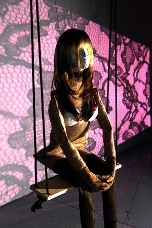
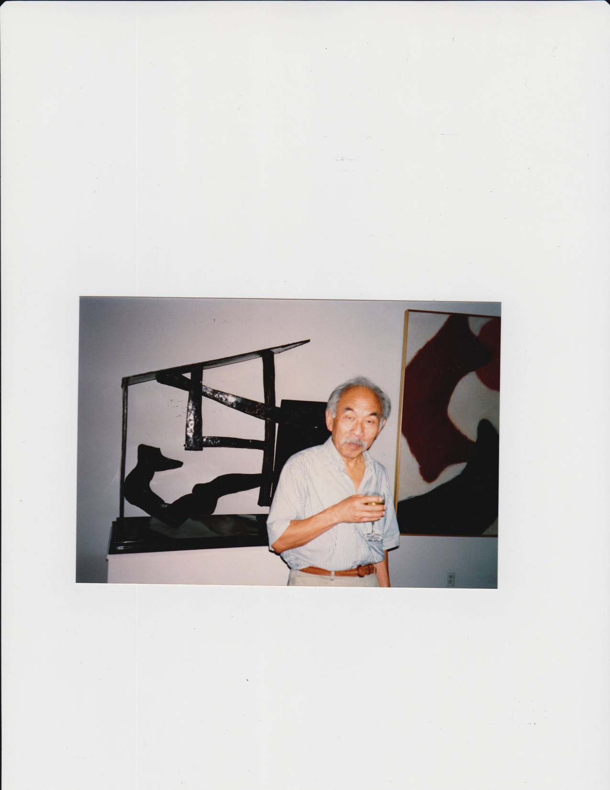
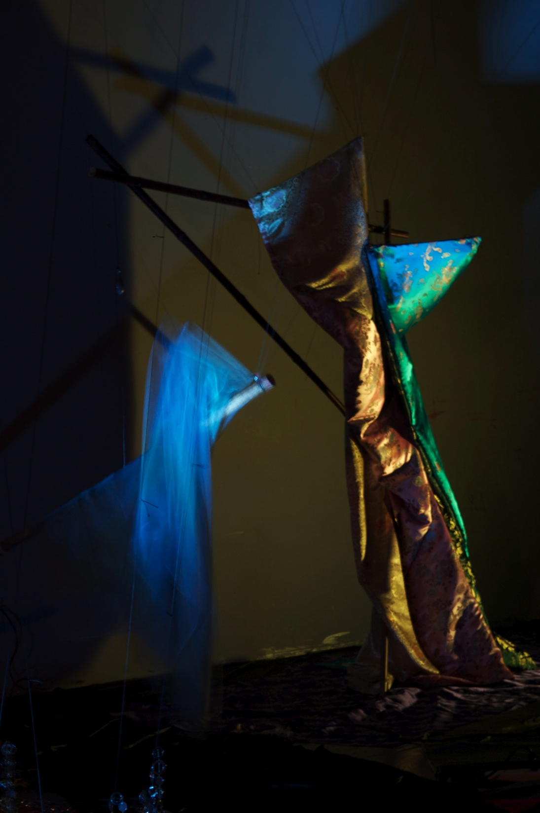

Gary R. Mar

Hao Wang’s Logical Journey in Life

Abstract

> Hao Wang (1921-1995) was a prolific philosopher and researcher known
> for his close intellectual companionship with Kurt Gödel during the
> last decade of Gödel’s life, yet “rather little has been published on
> Wang’s considerable body of work or on the man’s personality and
> unusual personal history.”[1] Wang spent the first 25 years of his
> life in China, where he studied both Chinese and Western philosophy
> earning an MA in philosophy at Tsinghua University in 1946 before
> studying at Harvard. Wang study of mathematical logic in China was
> sufficient advanced for him to complete his Ph.D. under Quine in less
> than two years. As his Chinese classmate and lifetime friend He Zhaowu
> remarked at Wang’s memorial: “Yet his whole life from beginning to end
> was ‘chock full of contradictions,’ be it in his thought, in his
> studies, or in his personal life. *These contradictions were not only
> of his own, they belonged also to a part of the difficult course of an
> entire generation and people.”*[2] The goal of this article is to see
> what light Wang’s life and philosophical work can shed on Chinese
> philosophy and the Western analytic tradition.

<u>Keywords</u>: History of Analytic Philosophy, Chinese Philosophy,
Orientalism, Hao Wang, Gödel, Wittgenstein, Critical Race Theory, Asian
American Philosophy[3]

Section 1. Hao Wang’s Journey.

On May 20, 1921 Hao Wang Hao (or, in Chinese, 王浩 *Wáng Hào*) was born
into a family of intellectuals in Jinan, Shandong Province, China. Hao
learned from his parents, who were teachers, both Chinese tradition and
modern European-American approaches to science, art, and politics. The
influence of Western approaches was brought about by Sun Yat-sen’s
Revolution of (1911–12) that overthrew the Qing (or Manchu) Dynasty.
Wang early education was in the context the “Post-May Fourth Movement in
China” (Wang’s phrase in \[1993\], 40), which was inspired by the May
4th, 1919 student demonstration in Tiananmen Square to
protest Japanese and Western imperialism in the aftermath of World War
I.

“During the War of Resistance”[4] (the second Sino-Japanese 1937 -
1945), Hao earned B.Sc. Mathematics from National Southwestern
Associated University (a consortium of Peking, Tsinghua and Nankai
Universities) with the intention of using mathematics as a foundation
for philosophy, which Wang pursued rather than engineering which was in
vogue at the time. In 1941 Hao married Yenking, his first wife, which
was the same year that both China and the U.S. entered into World War
II. Wang wrote his “virgin work” in philosophy (in Chinese), a study of
Hume’s problem of induction in 1942, which was also the year President
Franklin Roosevelt issued Executive Order 9066 authorized the force
relocation and incarceration of 110,00 persons of Japanese descent
living in America, 2/3 of whom were American citizens. In 1943 about 30
million people were dying of starvation in China, while in the U.S. the
Magnuson Act was passed to repeal the 1882 Chinese Exclusion Act, the
first immigration law in U.S. history to target a group for exclusion by
race and class, given that China and the U.S. were allies.

Having taken all the courses in mathematical logic offered at his
university in China, Hao agreed to form a reading group with two of his
professors to work through Hilbert and Bernay’s *Grundlagen der
Mathematik*. After Hao presented the first chapter, however, the
professors were unable to continue. Wang notes, “*I also became lazy…
\[and\] it wasn’t until seven or eight years later, when I was going to
teach a class on that subject, that I finished reading the whole
book.”*[5] Wang’s Chinese writings include “The metaphysical system of
the New Lixue” \[1944\], “Language and Metaphysics” \[1945\]. Wang
characterizes the time of his education as during the “Post-May Fourth
Movement” which was characterized with disillusionment with the Chinese
Republic and traditional Chinese culture to protect China from
imperialism. A recurrent theme of Wang’s Chinese writings was the
dilemma facing Chinese intellectuals in light of the Opium Wars (1839
–1842, 1856 – 1860).

In 1945 Wang earned his M.A. in Philosophy at Tsinghua University.
“During the defense,” Wang recalled, “Professor Shen Youding asked me
why I wanted to study philosophy. I said I was interested in the human
dilemma. Professor Shen said, ‘In the West it is literature that focuses
on the human dilemma, not philosophy.” This was the same year that
Truman ordered atomic bombs to be dropped on Hiroshima (Aug. 6th) and
Nagasaki (Aug. 9th) after which Japan surrendered (Aug. 15th).

The following year at the age of 24 Wang left China on a U. S. State
Department scholarship, to study philosophy at Harvard.[6] Given his
background in mathematical logic in China, Wang was able to complete his
dissertation *An Economical Ontology for Classical Arithmetic* under
Quine in one year and eight months, becoming Quine’s fifth dissertation
student. Wang then became a Junior Fellow of the Society of Fellows at
Harvard. During this time Wang was able to find an elegant repair for
Quine’s inconsistent first edition of *Mathematical Logic* \[1946\] and
demonstrate the consistency of his proposal relative to Quine’s *New
Foundations,* a repair adopted and acknowledged by Quine in the second
edition \[1951\]. In October of 1949 Mao Zedong declared the existence
of the People’s Republic of China (PRC), and China, who had been an
ally, became a communist threat. McCarthyism created a climate of
anti-Communism domestically and the U.S entered into the Korean War
(1950-53).

During the academic year 1950-1951, Wang studied in Zurich under the
auspices of Paul Bernays, where he pursued the philosophy of
mathematics, with a specialization in the type of predicative
mathematics advocated by Bernays. Wang worked on questions of the
relative strengths of axiomatic set theories and pioneered the revival
of Hermann Weyl’s work on predicative mathematics, which takes its
motivation from Russell’s “Vicious-Circle Principle.” In 1953 Wang
contributed his own principle of *autonomous iteration* as a natural
extension of *predicativism*.

In the Spring of 1955 Wang was invited to be the second philosopher to
deliver the prestigious John Locke Lectures at Oxford and then became a
reader in the Philosophy of Mathematics at Oxford. This period coincided
with the beginning of U. S. involvement in Vietnam (1955 – 1975). In
1956 Wang received a letter from Chancellor Ma Yinchu of Peking
University offering him a teaching position, but Wang declined at the
time because of interest in pursuing philosophy. Two years later the
Cultural Revolution forced Chancellor Ma to resign making it impossible
for Wang to retrun to China. Jane Wang (*Hsiaoching*) was born in Oxford
to Hao and Yenking in 1957.[7]

In the Spring of 1958 Wang arranged for his teacher Professor Jin Yuelin
who had promoted logic in China, to report to a meeting of Oxford
philosophy professors in which Jin explained why he had abandoned
academic philosophy and become a Marxist. Wang, who wrote beautifully
but whose English could be difficult to understand, remarked, “*Most of
the professors who heard the lecture felt his proof a bit too
simplistic. But because Professor Jin’s British English was especially
elegant and polished, the majority of Oxford professors treated him with
utmost respect.”*[8] At this time, the Soviet Union, under the influence
of Marxist philosophy, denounced mathematical logic *“as a conceptual
game of capitalist class idealism”.*[9]

Upon returning to Harvard, Wang offered a professorship, not in
Philosophy where most of his contributions, research and passion had
been devoted, but in Applied Mathematics. Ahead of his time, Wang found
ways to create academic partnerships with the emerging computer
industry. While at IBM Wang \[1961\] invented a representation of formal
systems known as Wang Tiles, graphically represented by square tiles
with a color on each side. Wang’s student Robert Berger \[1966\]
demonstrated in his dissertation the Undecidability of Wang’s Tiling
Problem by showing its decidability would contradict Turing’s proof of
the *Unsolvability of the Halting Problem*. Berger also found a
counterexample to Wang’s conjecture that there were no aperiodic Wang
Tilings.[10] Wang popularized his geometrization of logic in his
*Scientific American* article, “Games, logic and computers” \[1965\].

Becoming an American citizen in 1967,[11] Wang moved his academic home
from Harvard to Rockefeller University where he headed a research group
in logic and computation. Wang began corresponding with Gödel while
helping select and clarify various passages on the logical writings of
Skolem for Jean van Heijenoort’s classic anthology *From Frege to
Gödel.*[12] In October of that year Wang began his weekly conversations
with Gödel at the Institute for Advanced Studies at Princeton. The first
series of conversations from 1971 - 1972 influenced significant parts of
Wang’s *From Mathematics to Philosophy* \[1974\], which were published
subject to Gödel’s approval. The second series of conversations with
Gödel began in the Fall of 1975. These remarkable conversations are
chronicled and commented upon in four of Wang’s books beginning with
*From Mathematics to Philosophy* (1974) and continuing in *Beyond
Analytic Philosophy* \[1986\], *Reflections on Kurt Gödel* \[1987\] and
his posthumously published *A Logical Journey: From Gödel to Philosophy*
\[1997\].

Even with the publication of Solomon Feferman’s *et al.* monumental
20-year project, the *Collected Works of Kurt Gödel*, vols. I–V \[1986 -
2003\], Wang’s pioneering books remain significant because they provide
the philosophical background missing in Gödel’s published papers and
even in his *Nachlass*. The philosophical themes or threads that run
through Gödel’s work remain unstated not because they were secret but
because they were so interwoven into the fabric of his thought that it
was unnecessary for him to spell them out. Wang books on Gödel made
*mathematicians* aware of the *philosophical* views that led to Gödel’s
remarkable theorems and showed *philosophers* how philosophical views
could be made *mathematically* rigorous. Wang’s accounts of his
conversations with Gödel \[1974, 1985, 1987, 1996\] remain invaluable to
philosophy. In China Hao Wang “was publically acknowledged as the
inheritor of the mantel of Gödel”, but as Parsons and Link add in a
footnote “an acknowledgement that would not extend globally.”[13]

Section 2. Hao Wang’s Contradictions in Life.

Charles Parsons and Montgomery Link, in their editorial preface to *Hao
Wang: Logician and Philosopher* \[2011\], a memorial volume not
assembled until 15 years after Wang death, make an intriguing
observation:

> Clearly \[Wang\] never lost his identification as Chinese, and we
> think he resisted being categorized as Chinese-American or
> Asian-American, although he did become an American citizen in 1967.
> The influence on him of Chinese culture and thought comes through in a
> number of his writing, maybe especially in his reaction to the very
> Western rationalism of Kurt Gödel, which fascinated him but which he
> could never fully embrace.

There is no reason to question the editors’ opinion with regard to
Wang’s preferences about terms he would use to express what we would
today call his “identify politics.” The asymmetry of the hyphenated
terms “Chinese-American” or “Asian-American” typically implies that one
is referring exclusively to a type of American. However, a different
question can be raised. We can use terms with solidus (e.g.,
“Chinese/American” or “Asian/American”) to refer to Wang’s status as an
individual of Chinese or Asian descent residing in America. What facts
about the racial formation of Asian/American intellectuals during Wang’s
lifetime shaped their life prospects and career possibilities?

Charles Parsons has, perhaps, done more than any other philosopher to
bring the unduly neglected accomplishments of Hao Wang to the attention
of the APA. However, Parsons’ repeated remarks on of Wang’s
“*Chineseness*” may hide the complexities of racial formation faced by
Wang and his generation. Parsons notes that Wang essentially thought of
himself “as simply Chinese, a member of the *Chinese diaspora* that has
existed for centuries.”[14] Parsons characterized Wang’s extensive
exchanges with Gödel as “conversations between two thinkers with
synoptic ambitions, one of whom sought resources from earlier Western
traditions, and the other of whom, however Western his training and
career, *never ceased to be Chinese*.”[15] Parsons characterized Wang’s
responses to Gödel’s discussions of *Weltanschauung* (e.g., of
pre-Kantian rationalism and Leibnizian optimism) as “show\[ing\] his
*Chinese cultural background*.”[16]

The characterization of Chinese in America as part of the global
diaspora of *“Overseas Chinese”* is often used to explain why Chinese
failed to assimilate and to become American. This *cultural* explanation
blames culture for the isolation and marginalization that
Chinese/American[17] intellectuals faced and ignores the more subtle
forces of racial formation operating on Oriental scholars in American
academic institutions. The construction of the Oriental as a
“*sojourner*” in the West whose life goal of the triumphant journey home
often functioned as a rationalization. This dream of returning home
served as a powerful defensive mechanism for many Chinese/American
intellectuals coping with social isolation and professional
discrimination.

*Professional Orientalism* in the *careers* and *outlook* of academics
of Asian descent in America has been examined by Henry Yu in *Thinking
Orientals* \[2001\] a sociological study of historical transition from
“gentlemanly to institutionalized Orientalism” experienced by
intellectuals of Chinese and Japanese descent living in the American
from 1920 – 1965. Yu’s study focuses on the Chicago School of Sociology,
spear-headed by Robert Ezra Park (1864–1944), who with the help of his
mid-westerner colleagues, recruited Oriental scholars, but the same
sociological forces and racial formations were faced by other academics
of Asian descent.

In Chapter “Strangers from the Midwest: Robert Ezra Park and Other Men
with Three Names” of *Thinking Orientals*, Yu explains why these
Midwestern sociologists were so interested in Orientals and how their
outlook was conditioned by orientalism. The conceptual link between the
European *white immigrant* and the Negro *non-white non-immigrant* was
provided by the Oriental, who was both *immigrant* and *non-white.* The
“Oriental Problem” was to explain the cultural inability of Orientals to
overcome the last stage of the *assimilation* cycle, which the Chicago
School equated with becoming *American*. Park and his associates sought
an explanation of the failure of Orientals to become American through a
cycle of assimilation, not in terms of *racial formation,* but in terms
of *cultural distance*.

Robert Park, blinded by his culturalist assumptions, came to think of
the Oriental face as a mask that could disguise the inner thoughts and
feelings, which is strikingly evidence in the following passage: *“I
recently had the curious experience of talking with a young Japanese
woman who as not only born in the United States, but was brought up in
an American family, in an American college town, where she had almost no
association with members of her own race…. I found myself watching her
expectantly for some slight accent, some gesture or intonation that
would betray her racial origin… When I was not able, by the slightest
expression, to detect the Oriental mentality behind the Oriental mask, I
was still not able to escape the impression that I was listening to an
American woman in a Japanese disguise.”*[18]

Quine in his autobiography *The Time of My Life* characterizes Wang as
“persistently unhappy” during his time at Harvard. This begs the
question: did Hao Wang have reason to be unhappy? Recall that Wang,
having already studied mathematical logic in China, wrote his
dissertation under Quine in under two years. Wang had repaired Quine’s
inconsistent system in *Mathematical Logic*, had spent five years at
Oxford where he was invited to be the second philosopher to give the
John Locke Lectures. The topic of Wang’s lectures was “On Formalizing
Mathematical Concepts.” Wang had been preceded by O. K. Bouwsma and was
followed by a distinguished list of philosophers: A. N. Prior, A. C.
Jackson, Gregory Vlastos, Nelson Goodman, Jaakko Hintikka, Wilfred
Sellars, Paul Lorenzen, Noam Chomsky, Donald Davidson, Saul Kripke,
Hilary Putnam, and so forth. Wang’s time at Oxford overlaps with his
first period of engagement with the philosophy of Wittgenstein (1953 –
1958).

Upon returning to Harvard, Wang as offered a position, not in
Philosophy, but in Applied Mathematics. Juliet Floyd reports: *“In
conversation Wang told me that one reason he had found his professorship
at Harvard unsatisfying is that he was appointed in the Department of
Applied Mathematics, and not in Philosophy, where he felt the bulk of
his efforts and his contributions had been made.”*[19] Quine was a
mid-westerner with roots in Akron, Ohio with three names, a fact that he
proudly details in *The Time of My Life* (1986): he was the child of
Colye Robert *Quine* and Harriet (“Hattie”) Ellis *née* *van Orman*
named after a mathematician.[20] One wonders why W. V. O. Quine did not
intervene on Wang’s behalf.

Juliet Floyd notes: “Wang’s role in shaping more than one generation’s
understanding of the fundamental problems in logic and their history
through the 1950s was significant, and not as widely acknowledged as it
should be…. Because Wang taught at Harvard and Oxford, the cumulative
impact of his teaching on the dissemination of logic was significant….
Hide Ishiguro has stressed to me how supportive Wang was of Michael
Dummett during his early years teaching at Oxford, when logic was not a
very popular subject among philosophers there.”[21] Among Wang’s
students who went on to have distinguished careers as philosophers and
logicians were Charles Parsons, Burton Dreben, Michael Dummett, Donald
A. (Tony) Martin, and Hilary Putnam.[22]

Wang expressed his dissatisfaction with analytic philosophy in *Beyond
Analytic Philosophy: Doing Justice to What We Know* \[1985\]. Quine, who
described himself as a “disciple of Carnap for six years,” declared his
independence from Carnap his celebrated “Two Dogmas of Empiricism”
\[1951, 1961\].

\[DATE\]. Similarly, Wang playfully labeled Quine’s philosophy “Logical
*Negativism*” (a contrast that plays off of Carnap’s “Logical
*Positivism*”) which captures Quine’s peculiar combination of *local
precision* and *global indefiniteness*, supported by such *negative*
Quinean dogmas as the “*indeterminacy* of translation,” the
“*inscrutability* of reference,” and, to borrow Gilbert Harman’s phrase,
the “*death* of meaning.” Supported by vaguely enunciated pragmatic
appeals to semantic holism, Quine’s logical negativism not only “failed
to do justice to what we know”—but, ironically Wang noted, failed to
give an adequate account of logic, mathematics, and science, the
disciplines from which Quine’s philosophical positions drew their
rhetorical strength. Wang’s criticism of Quine was frustrating to
analytic philosophers trained to publish “piecemeal exercises” of
focused argument analysis and to diagnose arguments in terms of
precisely defined logical failings.

Instead of adopting a *piecemeal* approach, Wang’s writings aimed at
*perspicuity*—clarity of the sort that can be found in an elegantly
arranged mathematical proof or an insightfully arranged set of
quotations. Wang was known for his ability to locate a philosophical
position in *intellectual history*—a history not told dramatically but
with discerning and judicious insight.[23] Floyd characterizes Wang’s
*synoptic* style of argument: “When arguments are found in Wang, they
are deductions from his observations, or relative comparisons of the
interest and correctness of different responses, concepts, or
principles. The tone of the whole is always tentative, pluralistic, and
… synoptic rather than systematic in aim.“[24]

Wang was concerned that philosophy “do justice to what we know.” He
characterized his major statement on the philosophy of mathematics,
*From Mathematics to Philosophy*, not in terms of *constructing* a grand
*theory*, but in terms of seriously *collecting* *data*:

> This book certainly makes no claim to be philosophical theory or a
> system of philosophy. In fact, for those who are convinced that
> philosophy should yield a theory, they may find here merely data for
> philosophy. However, I believe, in spite of my reservations about the
> possibility of philosophy as a rigorous science, that philosophy can
> be relevant, serious, and stable. Philosophy should try to achieve
> some reasonable overview. There is more philosophical value in placing
> things in their right perspective than in solving specific problems.
> Both hasty speculations and piecemeal persistence on artificial issues
> tend to hamper cumulative progress in philosophy.[25]

As an active researcher in the emerging field of computational logic,
Wang was able to see the impediments imposed by Quine’s overly narrow
analytic conception of logic pronouncing limitations on the proper scope
of philosophical and logical inquiry. Wang, in his contribution to
Quine’s “Schilpp volume” one year after his critique in *Beyond Analytic
Philosophy*, sharpened his critical assessment: “for the working
logicians, much of Quine’s work is thought to be off the
mainstream.”[26]

Eckehart Köhler was scholar interested in Gödel’s Platonism, who first
contacted Wang in 1979 on the advise of Solomon Feferman, and who later
in 1986 as founder of the Kurt Gödel Society in Vienna invited Wang to
become its first president. Köhler in his “Collaborating with Hao Wang
on Gödel’s Philosophy” \[2011\] in the memorial volume recounts a
revealing with Wang:

> I began explaining to Wang the well-known work of Herbert Simon, a
> major figure in Artificial Intelligence. He and his students had done
> some of the best work on scientific discovery, using AI methods. (I
> had at other times tried explaining related concepts of decision
> theory, statistical weighing of evidence, concepts of probability, in
> attempting to justify Gödel’s famous claim that mathematical knowledge
> is analogous to empirical knowledge, especially…. Wang practically
> exploded. He was disgusted with Simon and did not want to hear a thing
> about him, and considered him an execrable logician. Wang would brook
> not contradiction, so I changed to topic (Köhler adds in a curious
> footnote: “Oddly enough, Simon… spent quite a lot of time in China and
> had learned Chinese.”)

Köhler speculates on the source of Wang’s anger:

> Without knowing any details of Wang’s work in computer proofs, I am
> sure that he was a logician vastly superior to Simon, and I suppose he
> got sick of hearing form AI researchers that Simon was allegedly the
> first to do an AI logic proof. I am also sure that Simon was would
> agree with Wang that the proof he presented at the famous 1956
> AI-conference was utterly trivial and without much inherent merit.

Let’s examine some of the logical and historical details before drawing
any conclusion about Wang’s anger. Newell and Simon wanted to program a
computer to carry out heuristic problem solving through symbol
manipulation, and they considered such problems as playing chess, the
solving of geometrical problems, and, as an afterthought, proving
logical theorems. In 1955 Simon claimed “over Christmas Allen Newell and
I invented a thinking machine”[27] because he had simulated “by hand” a
proof from Whitehead and Russell’s *Principia Mathematica*, but it
wasn’t until August 1956, that the *Logic Theorist* program actually run
on RAND’s Johnniac computer (named after von Neumann) completed the
proof of theorem 2.01.

The *Logic Theorist* was given a list of axioms and definitions and kept
in memory a list of previously proved theorems. When it is given a new
logical theorem to prove, it runs through all the operations of which it
is capable searching for a proof. Consider a proof of theorem 2.01:

2.01 |- (*p* → ~*p*) → ~*p*

The program would have had as an axiom

|- (*p* ∨ *p*) → *p* ,

which by a rule of substitution of ~*p* for *p* could obtain

|- (~*p* ∨ ~*p*) → ~*p* ,

from which, in turn, by a rule of substitution of equivalents, in
particular, an instance of the definition

> *p* → *q* :=: ~*p* ∨ *q*

could obtain the required theorem.

It should be kept in mind that Newell and Simon *structured* the
problems given to the program, including the order in which they were
given. In other words, it could be argued that the *Logic Theorist* did
not by any stretch of the imagination show that one could mechanize
Gödel’s notion of intuition: the program was only doing what it had been
programmed to do in a very limited realm of problem solving. Eventually
the *Logic Theorist* was able to prove 38 of the first 52 propositional
theorems. About half the proofs accomplished in less than a minute, most
of the remainder taking between 1 – 5 minutes, some taking as much as 15
– 45 minutes.

How did this compare with Wang’s accomplishments? In 1959 Wang programed
an IBM 704 computer to prove all the logical theorems (over 350,
including theorems involving not only propositional logic but also
predicate logic and identity) of *Principia Mathematica* in less than 9
minutes. In contrast to Herbert, who triumphantly announced his
accomplishment as showing the power of AI to simulate human logic, Wang
regarded his accomplishment as demonstrating the “essential lack of
conceptual richness” of Russell and Whitehead’s *Principia
Mathematica*.[28] Wang help to define the new research area of ATP
(automated theorem proving) and to show how it rested upon results in
mathematical logic.

This work would be the basis of his later work (Wang \[1960, 1961,
1963\]) on the ∀∃∀ case of Hilbert’s *Entscheidungsproblem*. Instead of
stocking the computer program with *ad hoc* “heuristics,” a research
program which has since gone out of style, Wang programmed the
“cut-free” formalisms of Herbrand the Gentzen and emphasized the
importance of algorithmic pruning, which could eliminate useless terms
in advance. Furthermore, Wang provided a well-conceived list of theorems
of predicate calculus that could serves as “benchmarks” for judging the
effectiveness of new theorem-proving programs. For these achievements
Wang would eventually be awarded in 1983 on the recommendation of a
committee composed of David Luckham, John McCarthy and chaired by Martin
Davis the first *Milestone Prize for Automated Theorem Proving* (ATP) by
the *International Joint Conference on Artificial Intelligence.*

To return to Köhler account, Köhler found Wang’s reaction to be
inconsistent:

> A few days after the clash on Simon, while musing on Gödel’s notion of
> intuition, I mentioned how close it seemed to what AI people
> (following Simon) now call heuristics; … Wang again rebuffed me,
> calling this too “scientistic.” I slyly hinted that his refusal to
> consider the idea violated his own injunction “to do justice to what
> we know.” Wang of course immediately got the point and did not reply….

Perhaps even more inconsistent is the suggestion that Wang’s silence
indicated his *capitulation* to Köhler’s criticism. One cannot dismiss
the *legitimacy* of Wang’s anger on the grounds of Wang’s *incivility*
or Wang’s *silence*. Anger towards institutionalized discrimination can
be a legitimate and healthy response. It is presumptuous for more
privileged parties to assume that unrecognized parties expressing anger
“be civil” before their complaints can be given a hearing, especially
when this requires, in effect, that they case cease making forceful
points about unfairness. Silencing of those in subordinate positions
protects institutionalized discrimination by removing any record of
wrong. The vicious circle principle of silencing can work in two
ways—when one’s colleagues dismiss one as a knower with a legitimate
perspective due to one’s anger and when one in frustration perceives
one’s colleagues as unwilling or unable to listen to one’s testimony and
so engages in self-censoring.

This *vicious silencing principle* is a form of racial formation is
often at play in academic circles. This principle combines stereotyping
with an asymmetrical application of a principle of civility. When
someone from the dominant group is uncivil, this very incivility is
valorized as being “forthright” or “refreshingly honest” or even
“courageous.” However, when those from a subordinated group are uncivil,
perhaps uncharacteristically, this angry outburst is used as grounds for
not taking their complaints seriously. For example, the silencing
response “I can’t hear you when you’re angry” to Black or women
philosopher is now widely acknowledged as ways of illegitimately
delegitimizing the criticism.

Oientalism functions not only professionally but personally. Scholars of
Asian descent establishing themselves as academics in America during
Wang’s generation would often *re-orient* their lives selectively around
acceptable Asian values (e.g., Chinese culture and philosophy) while
distancing themselves from cultural traits considered to be un-American
(e.g., clannishness and indirectness). Ever since his youth Wang
conceived of philosophy as a more holistic enterprise: “One might wish
to say that the task of every philosopher is to describe eventually ‘the
world as I see it’ and that his achievement is to be evaluated by how
significant a picture he gives.”[29]

Henry Yu’s book takes as a case study Rose Hum Lee (1904–1964), a first
generation Chinese American, who was the first *woman* to become
chair*man* in an American university (to succeed Lee was forced not only
to become more *modern* but also more *masculine*). In research papers,
Lee adopted the cultural analysis of alienation of the Chicago School of
sociology and wrote objectively:

> *To retaliate for not heeding their wishes, they spread tales of her
> supposed misdeeds in the Midwest, where she attended a famous
> university. The Chinatowners of this prairie city were delighted to
> have a plum to pick. No native-born of this group had ever obtained a
> doctorate in philosopher, though some received their master’s and
> medical degrees… The local Chinese, instead of being sympathetic to
> professional attainments, disparaged this girl’s achievements. Her
> personal life was the subject of slander, gossip, envy and conspiracy.
> There were no congratulations when her doctorate was awarded.*

Perhaps Wang’s self-representation of himself as a “Chinese in exile”
was conditioned by the discrimination he faced professionally and
personally, a self-presentation that evolved during the two thirds of
his life that he lived in America. While Wang was still entertaining
thoughts of returning to China—after the birth of the PRC in 1949 but
before the Cultural Revolution in China (1966 – 1976) brought about the
public persecution of intellectuals—he shifted his research focus to
computation with the thought that programming skills would be more
useful to China than his research in philosophy. Martin Davis (\[2011\],
76) in the midst of his account of Wang’s contributions to Automatic
Theorem Proving and to Hilbert’s *Entscheidungsproblem*, recalls a
turning point in Wang’s disillusionment:

> Like to many others, he eventually became disillusioned with the
> Maoist order. I remember particularly his telling me of his
> astonishment at a letter severely criticizing him that he received
> from his father, a secondary school teacher in China, during the
> Cultural Revolution. He understood with considerable distress that his
> father would have written such a letter only under great pressure.

Wang reminisced about how he and his classmate in China He Zhaowu
visited each other in 1980 in Kunming and in New York:

> *I began to doubt my own most recent views. I had imagined certain
> facts that were grounded in wishful thinking; upon this foundation I
> had erected a logical construction that really was a castle in the
> sky….. I remember the pain that bitterness I suffered at the time
> because of the wrenching transformations of my thinking and the lost
> of my convictions.*”[30]

Influenced by Zhaowu’s presentation of the poetic pentology of
*Bodhisattva Barbarians*, Wang wrote a personal essay about
*“homesickness in a foreign land”* but did not publish it regarding it,
in the end, as *“sick with self-pity”* and *“nauseating.”*[31]

Section 3. Hao Wang’s Philosophical Journey.

Wang believed that “Philosophy has a longer history and a larger
diversity of traditions to select from” (Wang \[1986\], 192). As an
*analytically trained* philosopher who was an active researcher in
logic, Wang contributed an important *diagnosis* of the *misconceived*
role of logic in Anglo-America analytic philosophy. Wang was in a
position to comment knowledgeably on the contradictory roles *logic*
played in Quine’s analytic philosophy: logic was at once *excessively
emphasized* and *ineffectively employed*:

> Directly and indirectly logic plays an important part in much of
> contemporary Anglo-American academic philosophy…. The way logic is
> commonly used in philosophy seems to me to do less than justice to the
> full richness of logic as a study of the foundations of mathematics;
> and that excessive emphasis on the importance of logic for philosophy,
> combined usually with a misapplication of logic, seems to me to have
> led to a far from balanced view of philosophy, especially as it is
> understood in the traditional sense. Moreover, the much-publicized
> juxtaposition of logic with positivism (or empiricism or ‘analytic’
> philosophy) has burdened logic with a guilt-by-association, resulting
> in a surprising ignorance of logic on the part of philosophers of
> other persuasions.[32]

As a *Chinese philosopher*, Wang was attached to a broader view of the
philosophical enterprise “beyond analytic philosophy.” In a concluding
chapter entitled “Metaphilosophical observations” of *Beyond Analytic
Philosophy*, Wang acknowledges the Chinese influences on his conception
of philosophy: “… my professional training is nearly all in Western
philosophy (much of it even logic-oriented), yet my formative years were
lived in China. I have tried hard but have not been able to shake off my
early conviction that philosophy is not just one subject more or less
like any other, but something special. Even today such a belief, I think
persists in China…. I continue to believe that philosophy should somehow
be comprehensive and aim at a unified … outlook…. I find myself attached
to the Chinese tradition of mixing together philosophy, literature, and
history—a tradition that conditions and is conditioned by the central
concerns of its philosophy; the interest in politics ties it and the
concern with the unity of nature and person overlaps with art and
literature.”[33]

To advance the dialogue on such topics as “The Analytic Tradition and
Chinese Philosophy,” we need to overcome the *duality* of viewing
philosophy in terms of “East versus West”—in particular, the unexamined
tendency to view the relationship in terms of “*challenges*” or
“*contributions*” to the mainstream. “Challenges” presuppose a false
philosophical polarity, e.g., in discussing Eastern versus Western
ethics in terms of polar concepts of *shame* versus *guilt* tends to
stereotype the meaning of each and to discourage remembering cases of
ethical reasoning or traditional virtues in which both qualities are
present. “Contributions” presuppose one tradition as the philosophical
*mainstream* thereby marginalizing the other as making “contributions.”

*Orientalism* shaped the *disciplinary* self-understanding of
philosophy. A kind of *professional orientalism*, also shaped the
careers of many academics of Asian descent living in America (as well as
England and Europe) as well as their *autobiographical*
self-understanding of themselves as academics. Edward Said famously
coined the term *orientalism*,[34] which is used by scholars of Cultural
Studies for a type of depiction of the Orient (East Asia, South Asia,
and especially, for Said, the Middle East) by writers, artists and
scholars from the West. While Said’s use of the term was far too
sweeping and impressionistic, scholars in Asian American Studies have
more carefully articulated various forms of orientalism.

An essential aspect of Said’s thesis was that orientalism was essential
to the West’s self-understanding and self-promotion. Consider Hegel’s
claims in his *Lectures on the History of Philosophy* (1825–1826):

> \[In the East\] conscience does not exist, nor does individual
> morality. Everything is simply in a state of nature, which allows the
> noblest to exist as it does the worst. The conclusion to be derived
> from this is that no philosophic knowledge can be found here.… The
> Eastern form must therefore be excluded from the history of
> philosophy…. Philosophy proper commences in the West.[35]

Even Bertrand Russell’s more liberal lament over Great Britain’s
colonialist policies in *The Problem of China* (1922) appeals to
orientalism to find cultural reasons for the dominance of the West:

> The British view is still that China needs a central government strong
> enough to suppress internal anarchy, but weak enough to be always
> obligated to foreign pressure…. Possession, which is one of the three
> things that Lao-Tze wishes us to forego, is certainly dear to the
> heart of the average Chinaman. As a race, they are tenacious of
> money—not perhaps more so than the French, but certainly more than the
> English or the Americans. Their politics are corrupt, and their
> powerful men make money in disgraceful ways…. Nevertheless, as regards
> the other two evils, self-assertion and domination, I notice a
> definite superiority to ourselves in Chinese practice. There is much
> less desire than among the white races to tyrannize over other people.
> The weakness of China internationally is quite as much due to this
> virtue as to the vices of corruption ….[36]

Wang himself noted the historical, if not conceptually necessary,
collusion between Great Britain’s imperialism and the aesthetic and
autonomous morality embraced by its intellectuals:

> In the heyday of British imperialism, a rather influential ethical
> doctrine came out of Cambridge which signaled out esthetic enjoyments
> and personal affection as good in themselves. In theory, this doctrine
> does not reject the suggestion that for a long time to come
> eliminating miseries will be of more moral value than pursuing
> personal enjoyments. In practice, it has had the effect of enhancing
> the complacency of intellectual aristocrats.[37]

In 1985 Wang received honorary doctorates from Peking (China’s
‘Harvard’) and Tsinghau (China’s ‘MIT’) Universities, and was again
seriously considering returning to China. Although China was reversing
the repressions of the Cultural Revolution under Deng Xiaoping, Wang
“sorrowfully torn up his invitation” to teach and do research in Beijing
after the 1989 Tiananmen Square massacre.[38]

Racial intermarriage was of special interest to the Chicago School of
Sociology because in their minds it was ultimate proof of assimilation
and hence, in their view, of becoming American. However, it should be
kept in mind that anti-miscegenation laws were in effect since before
the United States was a republic and remained in effect until ruled
unconstitutional by the U.S. Supreme Court in 1967. For example, prior
to the Cable Act of 1922, women, but not men, lost their U.S.
citizenship if they married a foreign spouse. The Cable Act guaranteed
such women could retain their citizenship but only if married to an
"alien eligible to naturalization." Since at the time of the act's
passage, Asian aliens were not considered to be racially eligible for
U.S. citizenship, any woman who married an Asian alien lost her U.S.
citizenship.

Around 1988 Wang met Hanne Tierney[39] at an invitation-only gathering
of artists, academics and other accomplished persons called the “Reality
Club.” Hanne Tierney, who would become Hao’s third wife, was a German
immigrant, who lived in Prague and journeyed to America by way of
England at the age of nineteen. She authored a successful children’s
book about her experience in America and then created an *avante-garde*
style of puppetry that offered her a three-dimensional language of
sculpture. According to Hanne, Hao characterized the difference between
herself and himself: “You are an *immigrant*, I am an *exile*.” Hao once
explained to her that “China was God”, that is, China served much the
same purpose for exiled Chinese as God did in Western religion: what
overseas Chinese desired from China was *forgiveness*, and the *good
deeds* they performed in a hostile environment were done for China. The
“Death of God” explains the depth of suffering caused by Wang’s loss of
his faith in Marxism and Maoism in 1979. Hao and Hanne visited China
together in 1992.

# 

# Section 5. Wang, Wittgenstein, and Gödel.

Wang approvingly quotes a mimeographed manuscript of Yueh-Lin Chin
\[1981\]: “Chinese philosophers were all of them different grades of
Socrateses.”[40]

Towards the end of his life, Wang continued to work on a manuscript for
*Gödel, Wittgenstein and Purity of Mind: Logic as the Heart of
Philosophy* but had great difficulty in completing his manuscript and
set the project aside. Despite his reservations about Gödel’s overly
optimistic faith in the “possibility of philosophy as a rigorous
science,” Wang unreservedly praised Gödel’s way of life:

> *Gödel exemplified, I think, a way of life and work that inspires a
> greater faith in reason, questions the ‘prejudices of the time’ and
> stirs our imagination to strive for more autonomy by examining our
> largely derivative sense of what is important in life.*[41]

While Wang never became a *Wittgensteinian*, he seriously engaged
Wittgenstein’s *philosophical* insights. Wang’s second period of
engagement with Wittgenstein’s philosophy spanned the years 1981 – 1995.
Wang admired Wittgenstein’s life-long struggle to achieve *perspicuity*:
“*One main difference between Wittgenstein and most contemporary
Anglo-American academic philosophers would seem to be the indulgence of
the latter in clever, small arguments clouded by all sorts of extraneous
detail.”* [42]

Let’s summarize some of our conclusions thus far. As a
*Chinese/American* philosopher, Wang was able to pursue philosophy in
ways that embodied the virtues of both the Analytic and Chinese
Traditions—e.g., combining the technical precision of Gödel’s
meta-mathematical approach to logic as well as the artistic and
aesthetic perspicuity of Wittgenstein and Chinese philosophy. As an
*analytically trained philosopher,* Wang was able to correct
misconceptions of logic held by many Anglo-American philosophers due to
the “guilt by association” in their minds of logic with positivism and
the Vienna Circle, a view about the nature of logic that was not held by
Gödel, who briefly attended the Circle. As a *mathematical logician*,
Wang was able to provide a meta-mathematical perspective on logic to
Chinese logicians. Wang quotes a mimeographed manuscript of Yueh-Lin
Chin \[1981\] written in Kunming in 1943: “One of the features
characteristic of Chinese philosophy is the underdevelopment of what
might be called logico-epistemological consciousness.”[43] As an *active
researcher* in *mathematical logic* and *computation*, Wang was ahead of
his time in proposing new graphical representations of computability,
pioneering collaborations between academia and the emerging computer
industry, and proposing new distinctions (e.g., feasible as opposed to
theoretical computability). As an *Asian/American* academic, the
trajectory, and limitations, of Wang’s professional career sheds light
on the unexamined practices of academic philosophy in the Anglo-American
tradition, and the complex sociological dynamics that entered into the
formation of the professional and personal lives of the “Thinking
Orientals” of a previous generation and still enters into the formation
of Asian American philosophers.

# Section 6. Wang’s Empty Boat.

From 1991–1994, Juliet Floyd spent time in the company of Hao Wang and
his wife Hanne Tierney and she notes Wang’s return the conception of
philosophy that had attracted him as a youth in China:

> Wang was inclined to consider artists with as much respect as he did
> scientists…. Wang’s literary ambitions became stronger over time, and
> importantly shape his final writings. These bear an important relation
> to his ideas about “intuition” and his interest in Wittgenstein, whom
> he came to regard as ‘art centered’ rather than ‘science centered’ in
> his conception of philosophy…. Wang felt the literary effects of
> Wittgenstein’s writing were not irrelevant to the content of his
> philosophy. I think we can assume that Wang felt the same way about
> his own books…. In the manner of Walter Benjamin, or perhaps better,
> of his Chinese forebears, Wang often proceeded by arranging
> quotations, without interpretation, in an effort to draw out the
> reader’s reflection and response, thereby showing, but not himself
> directly stating.

One of Wittgenstein’s most memorable sayings in the *Tractatus* is his
famous ladder metaphor:

> 6.54 My propositions are elucidatory in this way: he who understands
> me finally recognizes them as senseless, when he has climbed out
> through them, on them, over them. (He must so to speak throw away the
> ladder, after he has climbed up on it.)

Wittgenstein’s ladder, Wang noted, evokes the raft of the *Diamond
Sūtra*: [44]

> The dharma I am preaching is analogous to a raft (which is to be
> discarded after use); even the dharma can be discarded, *a fortiori*
> the non-dharma.

Wang completed his last book *A Logical Journey: From Gödel to
Philosophy* just months before his death s week before his
74th birthday, which was published posthumously in 1996.

In 2001 Hanne Tierney in collaboration with Wang’s daughter and jazz
musician Jane Wang created a performance piece “How Wang-Fo Was
Saved”[45] at the *FiveMyles Gallery* in Crown Heights, Brooklyn.

<table>
<colgroup>
<col style="width: 30%" />
<col style="width: 40%" />
<col style="width: 28%" />
<col style="width: 0%" />
</colgroup>
<thead>
<tr class="header">
<th></th>
<th></th>
<th colspan="2"></th>
</tr>
</thead>
<tbody>
<tr class="odd">
<td>
Puppet of Hanne Tierney

<em>“Hanne Tierney in a Nutshell”</em>
</td>
<td>Hao Wang at Knoedler Gallery, 1993</td>
<td>
<em>“How Wang-Fo Was Saved”</em>

FiveMyles Gallery, 2001
</td>
<td></td>
</tr>
</tbody>
</table>

The script for “How Wang-Fo Was Saved” was adapted from on a children’s
book by the Belgian-born French novelist and essayist Marguerite
Yourcenar (1903–1987) that retells an ancient Chinese legend: Captured
as he is walking with a disciple, the elderly painter Wang-Fo is brought
before the Emperor. Spoiled by the beauty of Wang-Fo’s paintings, the
Emperor complains that nothing in reality is as beautiful as the
artist’s depictions. Wang-Fo is therefore to be executed for his lies.
The Emperor commands Wang-Fo to finish painting one last canvas.
Dutifully serving his sentence by completing his last canvas, Wang-Fo
first paints a lake, then he draws a rowboat. As the waters rise and
fill the Emperor’s throne room, old Wang-Fo climbs into the boat and
rows away. What is left behind is an empty boat.[46]

*Who can free himself from achievement*

*And from fame, descend and be lost*

*Amid the masses of men?*

*He will flow like Tao, unseen,*

*He will go about like Life itself*

*With no name and no home.*

*Simple is he, without distinction*

*To all appearances he is a fool.*

*His steps leave no trace. He has no power.*

*He achieves nothings, has no reputation.*

*Since he judges no one,*

*No one judges him*

*Such is the perfect man:*

*His boat is empty.*

We shall end our reflections on Hao Wang’s logical journey with a
meditation on Wittgenstein’s famous advice:

*Wovon man nicht sprechen kann, darüber muss man schweigen.*

Whereof one cannot speak, thereof one must pass over in silence.

Even Wittgenstein could not follow his own austere advice, so perhaps it
is more fitting to conclude with the paradoxical humor and literary
elegance of Zhūangzi:

> 荃者所以在魚，得魚而忘荃；蹄者所以在兔，得兔而忘蹄；言者所以在意，得意而忘言。
>
> 吾安得夫忘言之人而與之言哉！ 

*The bamboo fish net exists for catching fish.  Once the fish is caught,
forget the net! *

*The rabbit snare exists for trapping rabbits.  Once the rabbit is
trapped, forget the snare! *

*Words exist because they are used for expressing meaning. Once the
meaning is grasped, forget the words!*

*Where can I meet those who have forgotten words and have a word with
them?*[47]

Wang’s many unsung contributions to the analytic tradition in philosophy
and his life “chock full of contradictions” shed light not only on his
own struggles but also on “*the difficult course of an entire generation
and people.”* The goal of this article has been to explore how Wang’s
life could add to the conversation about the Analytic Tradition and
Chinese Philosophy and to serve as a catalyst for diversifying what Wang
once praised as “the elusive concept of an American spirit.”[48]

**  
**

**References**

Berger, Robert \[1966\], “The undecidability of the domino problem,”
*Memoirs of the American Mathematical Society* **66**, 72.

Butts, Robert and Jaakko Hintikka (eds.) \[1977\]. *Logic, Foundations
of Mathematics, and Computability Theory* (Dordecht: Reidel).

Davis, Martin \[2011\], “Hao Wang’s Contribution to Mechanized Deduction
and to the *Entscheidunsproblem*,” in Parsons and Link \[2011\], 73–118.

Egan, Greg \[1995\], “Wang’s Carpets” in *New Legends*, a collection of
short stories edited by Greg Bear (Legend, London).

Feferman, Solomon \[2006\] with Charles Parson and Steven Simpson
(eds.), *Kurt Gödel: Essays for His Centennial*, Cambridge University
Press.

\_\_\_\_\_\_\_\_\_\_ \[2005\]. ‘Predicativity,’ in S. Shapiro (ed.),
*The Oxford Handbook of Philosophy of Mathematics and Logic*, Oxford:
Oxford University Press, 590-624.

\_\_\_\_\_\_\_\_\_\_ \[1988\], ‘Weyl Vindicated: *Das Kontinuum* seventy
years later’, reprinted in S. Feferman, *In the Light of Logic*, New
York: Oxford University Press, 1998, 249–283.

Floyd, Juliet \[2011\] “Wang and Wittgenstein” in Parsons and Link
\[2011\], 145-193.

Goldfarb, William \[2006\], “On Gödel's way in: the influence of Rudolf
Carnap,” in Feferman *et al.* \[2006\], 242-251.

Grossi, Marie \[2012\] with Montgomery Link, Katalin Makkai, and Charles
Parsons, “A Bibliography of Hao Wang,” *Philosophia Mathematica*, III,
1-17, reprinted in Parsons and Link \[2011\], 195-216.

Hegel, Georg Wilhelm Friedrich, *Lectures on the History of Philosophy*
(1840), translated by Haldane and Simon \[1892, reprinted 1974\],
(Routledge and Kegan Paul: London).

van Heijenoort, Jean \[1967\], *From Frege to Gödel: A Source Book in
Mathematical Logic, 1879 – 1931*, Harvard University Press.

Jandovitz, Richard and Montgomery Link \[2011\], “Hao Wang’s Chinese
writings,” in Parsons and Link \[2011\], 15-26.

Köhler, Eckehart \[2011\], “Collaborating with Hao Wang on Gödel’s
Philosophy,” in Parsons and Link

\[2011\], 55-72.

McCorduck, Pamela \[1979\], Machines Who Think (A. K. Peters: Natick,
MA).

Merton, Thomas \[1965\], *The Way of Chuang Tzu* (New Directions: New
York).

Parsons, Charles \[2011\] “Hao Wang as Philosopher” in Parsons and Link
\[2011\], 7-14.

\_\_\_\_\_\_\_\_\_\_ \[2002\], “Hao Wang and Mathematical Logic,” APA
Newsletter for *Asian and Asian-American*

*Philosophers and Philosophies* (Spring).

\_\_\_\_\_\_\_\_\_\_ \[1998\], “Hao Wang as philosopher and as
interpreter of Gödel,” *Philosophia Mathematica*, **3**(6),

3-24.

\_\_\_\_\_\_\_\_\_\_\_ \[1996\] “In Memoriam: Hao Wang 1921–1995”, *The
Bulletin of Symbolic Logic*, 2(1), 111.

Parsons, Charles and Montgomery Link \[2011\] (editors), *Hao Wang:
Logician and Philosopher*, Texts in Philosophy Series, vol. 16, College
Publications, King’s College London, Strand, London, UK.

Quine, Willard van Orman \[1985\], *The Time of My Life: An
Autobiography* (MIT Press).

\_\_\_\_\_\_\_\_\_\_ \[1954\] *From a Logical Point of View*, Harvard
University Press, revised edition \[1961\].

\_\_\_\_\_\_\_\_\_\_ \[1951\] “Two Dogmas of Empiricism,” originally in
*The Philosophical Review* 60, 20–43,

reprinted in Quine \[1954\] and revised in \[1961\].

\_\_\_\_\_\_\_\_\_\_ \[1937\] “New Foundations for Mathematical
Logic,” *American Mathematical Monthly*, 44: 70-80,

reprinted in Quine \[1953\].

Russell, Bertrand \[1967\], *The Basic Writings of Bertrand Russell*
(1903-1959), New York: Simon and Schuster.

\_\_\_\_\_\_\_\_\_\_ \[1922\], “Chinese and Western Civilizations
Contrasted,” from *The Problem of China* (1922),

excerpted in Russell \[1967\].

Schilpp, Paul Arthur \[1986\] (editor), *The Philosophy of W. V. Quine*,
Volume 18 (Library of Living Philosophers).

Tierney, Hanna, et al. \[2015\], *FiveMyles: An Exhibition and
Performance Space Where Art and Community Connect* (Toppan Printing Co.,
Ltd.: China).

Wang, Hao \[1996\] *A Logical Journey: From Gödel to Philosophy*
(Cambridge, Mass: MIT Press).

\_\_\_\_\_\_\_\_\_\_ \[1993\] “From Kunming to New York,” (Chinese).
*Dusha Monthly* (May), 140-143, English translation in Parsons *et al.*
\[2011\], 39-47.

\_\_\_\_\_\_\_\_\_\_ \[1987\] *Reflections on Kurt Gödel* (Cambridge,
Mass; MIT Press).

\_\_\_\_\_\_\_\_\_\_ \[1987\] “The way of Jin Yuelin,” (Chinese),
*Institute of Philosophical Research*, Chinese Academy

> of Social Science (ed.), *Studies in Jin Yuelin’s Thought*, 45–50
> (Chingdu Sichuan People’s Publishing Com.), English translation in
> Parsons and Link \[2011\], 27-38.

\_\_\_\_\_\_\_\_\_\_ \[1986\] *Beyond Analytic Philosophy* (Cambridge,
Mass: MIT Press).

\_\_\_\_\_\_\_\_\_\_ \[1982\] “Memories related to Professor Jin Yuelin”
(Chinese), *Wide Angle Monthly*, no. 122,

61-63, English translation in Parsons and Link \[2011\], 27-36.

\_\_\_\_\_\_\_\_\_\_ \[1977\] “Large Sets” in Butts and Hintikka
\[1977\], 309-333.

61-63, English translation in Parsons *et al.* \[2011\], 27-36.

\_\_\_\_\_\_\_\_\_\_ \[1974\] *From Mathematics to Philosophy*
(Humanities Press: New York).

\_\_\_\_\_\_\_\_\_\_ \[1961\] "Proving theorems by pattern
recognition—II", *Bell System Technical Journal* **40**(1), 1–41.

\_\_\_\_\_\_\_\_\_\_ \[1965\] “Games, logic and computers,” *Scientific
American*, 2**13**(5), Nov., 98-106.

\_\_\_\_\_\_\_\_\_\_ \[1950\] “A formal system of logic,” *Journal of
Symbolic Logic*, 15: 25-32.

Yu, Henry \[2001\] *Thinking Orientals: Migration, Contact, and
Exoticism in Modern America* (New York, NY:

Oxford University Press).

Zhaowu, He \[1995\] “*Remembering Wang Hao”* (Chinese), *Southwest
Associated Alumni Newsletter*,

translated by Richard Jandovitz and Montgomery Link in Parsons and Link
\[2011\], 49–53.

[1] Gary R. Mar is an Associate Professor of Philosophy at Stony Brook
University where he is also the Founding Directors of the Philosophy
Department Logic Lab and the Asian American Center. He was the last
dissertation student of the 20th century logician Alonzo
Church and co-author with Kalish and Montague of the logic textbook
*Logic: Techniques of Formal Reasoning* (second edition, OUP) and the
catalyst for the expansion of the APA Committee on Asian and
Asian-American Philosophers and Philosophies. Email:
Gary.Mar@stonybrook.edu.

Charles Parsons and Montgomery Link in their preface to *Hao Wang:
Logician and Philosopher*, a collected work published 15 years after
Wang’s death, p. 1.

[2] He \[1995\], translated in Parsons and Link \[2011\], 49, italics
mine.

[3] This paper is the result of participating in a panel “The Analytic
Tradition and Chinese Philosophy” at the 2016 Eastern Division Meeting
of the APA sponsored by the Committee for Asian and Asian-American
Philosophers and Philosophers. For the history of the usually long name
of this committee, see [(*APA Newsletter on Asian and Asian-American
Philosophers and Philosophies*, Spring 2003 (vol. 2, no. 2),
2)](http://c.ymcdn.com/sites/www.apaonline.org/resource/collection/2EAF6689-4B0D-4CCB-9DC6-FB926D8FF530/v02n2Asians.pdf).

[4] Wang’s phrase in Wang \[1993\].

[5] Wang \[1982\], Parsons and Link \[2011\], 31.

[6] The Chinese Exclusion Act \[1882\], and its various amendments
(strengthened in 1884 and expanded by the Scott Act (1888)) and renewed
(the Geary Act (1982) and again in 1902 without termination date) made
Chinese immigrants permanent aliens by excluding them from U.S.
citizenship, so that Chinese men in America had little chance of
starting families in America. Although the Chinese Exclusion Act was
“repealed” by the Magnuson Act (1943), this act only raised the quota of
100 Chinese per year from anywhere in the world to 105 as compared to a
quota of 65,721 immigrants from Great Britain and Northern Ireland. In
preparation for entering into World War II, through the “Lend-Lease”
program, President Franklin D. Roosevelt had $1.6 billion to invest in
China.

[7] Jane would grow up and become a jazz musician (Boston) and her
brothers San-You and Yi-Ming became a doctor (Boston) and an
astrophysicist (Washington), respectively.

[8] Wang \[1982\], in Parsons and Link \[2011\], 35.

[9] He \[1995\] in Parsons and Link \[2011\], 50.

[10] Computational ideas have been a catalyst for contemporary
philosophical investigations and speculations, e.g., Wang Tiles serve as
the plot engine for a short story “Wang’s Carpets” by Australian science
fiction writer Greg Bear \[1995\], a reflection on the nature of
reproduction, life, and intelligence in a post-human context.

[11] This was two years after the Hart-Celler Naturalization and
Immigration Act (19654), which removed the quota system and, for the
first time in U. S. history, put Asian immigrants on an equal footing
with other nations.

[12] van Heijenoort \[1967\], vii.

[13] He \[1995\] in Parsons and Link \[2011\], 50, footnote 4.

[14] Parsons \[2002\] 28, *italics mine*.

[15] Parsons, op. cit., *italics mine.*

[16] Parsons \[2011\], 78, footnote 30, *italics mine.*

[17] The solidus notation in ‘Chinese/American’ is here used
*inclusively* for being both Chinese and American and avoids the
asymmetry of the label ‘Chinese-American’ which typically refers
*exclusively* to a type of American.

[18] Yu \[2001\], 67.

[19] Floyd \[2011\], 157 footnote 17.

[20] See <http://www.quine.org/crq-tree.html>.

[21] Floyd \[2011\], 146.

[22] Floyd (\[2011\], 87) herself regarded Wang as a mentor who provided
her with an authentic example of what the Chinese call *xiansheng*
(先生, teacher, master).

[23] Floyd \[2011\], 156.

[24] Floyd \[2011\], 18.

[25] Wang \[1974\], x.

[26] Wang’s contribution in Schilpp \[1986\], 635.

[27] McCorduck \[1979\], 116.

[28] Floyd \[2011\], 164.

[29] Wang \[1974\], 334.

[30] Wang \[1933\] in Parsons and Link \[2011\], 41.

[31] Wang \[1992\] in Parsons and Link \[2011\], 44.

[32] Wang \[1976\], ix.

[33] Wang \[1986\], 194.

[34] Edward Said’s *Orientalism* (Vintage Books, New York, 1978), was
*catalytic*, if not always philosophically *accurate*. Said’s
philosophical misconceptions were elaborated in my presentation
“Critique of Orientalism” delivered at the Annual Meeting of the
Association for Asian American Studies, April 24, 2009.

[35] Hegel \[1882\] in Haldane and Simon translation \[1974\], 97-98.

[36] Russell \[1967\], 552.

[37] Wang \[1974\], 329–30.

[38] Köhler \[2011\], 58.

[39] After reading [Wang’s
obituary](http://www.nytimes.com/1995/05/17/obituaries/hao-wang-73-expander-of-logician-s-themes.html)
in the *New York Times*, I contacted his surviving wife Hanne Tierney,
who provided these recollections.

[40] Wang \[1986\], 194.

[41] Wang \[1987\], ix.

[42] Wang \[1976\], 348.

[43] Wang \[1986\], 193.

[44] Wang \[1986\], 100.

[45] See [Alexis Sottile,*<u> “Hanne Tierney’s String Theory</u>*,” *The
Village Voice*,
10/30/2001](http://www.villagevoice.com/2001-10-30/theater/hanne-tierney-s-string-theory/).

[46] Merton \[1965\], 115. ‘Chuang Tzu’ is another name for Zhūangzi.

[47] I am indebted to Professor T. K. Chu for calling my attention to
these poignant and paradoxical words of Zhūangzi.

[48] Wang \[1986\], 195, remarking on how despite the fact that Quine
was influenced by mathematical logic and Dewey by Hegelian philosophy,
there is nonetheless a “certain partial convergence of views.” I wish to
thank my colleague Ed Casey for giving me the opportunity to participate
in the APA panel on Chinese Philosophy and the Analytic Tradition,
organized by Professors Chung-ying Cheng and Linyu Gu. I also wish to
thank Hanne Tierney for talking with me and for photographs. When I
asked why she had agreed to meet sight unseen, Hanne with a sparkle in
her eyes, replied: *“You had me at ‘Hao’!”* In an email following up our
conversation, Hanne wrote: *“It was such a pleasure to me to meet you
and talk about Hao. He would have enjoyed it all himself very much, but
he also would have so completely known what Gary was talking about….”*
