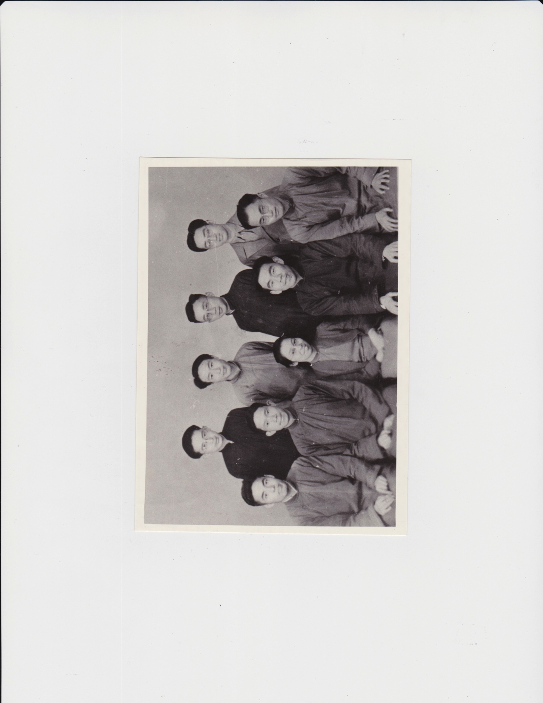
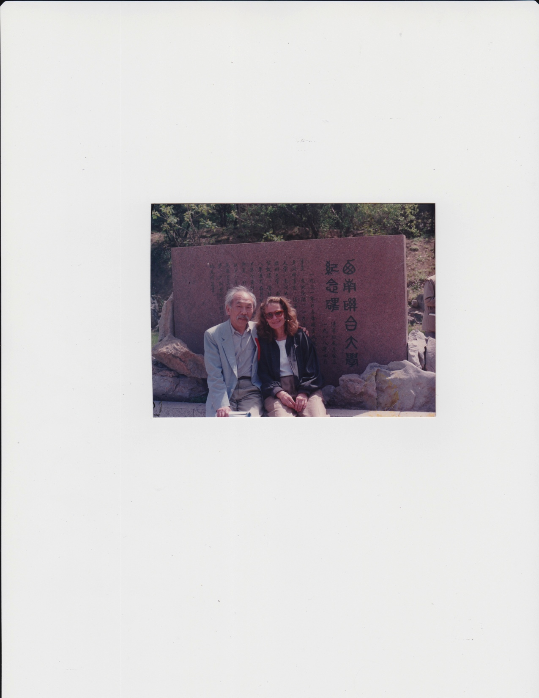
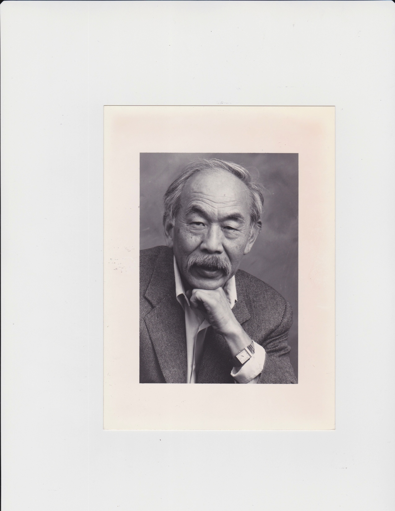

# A Chronology of Wang’s Logical Journey

<table>
<colgroup>
<col style="width: 7%" />
<col style="width: 9%" />
<col style="width: 41%" />
<col style="width: 41%" />
</colgroup>
<thead>
<tr class="header">
<th colspan="3">Wang Hao’s Early Life in China</th>
<th>Context</th>
</tr>
</thead>
<tbody>
<tr class="odd">
<td>1921</td>
<td>May 20</td>
<td>
Born Wang Hao, 王浩 to a family of intellectuals in Jinan,
Shandong Province, China. Wang learned from his parents both Chinese
tradition and modern European-American approaches to science, art, and
politics brought about by Sun Yat-sen’s Revolution of (1911–12) that
overthrew the Qing (or Manchu) dynasty and created the Republic of
China.

Wang grew up during the “Post-May Fourth Movement in China.” (Wang’s
phrase in [1993]), which arose from disillusionment with the Chinese
Republic and traditional Chinese culture to protect China from
imperialism.
</td>
<td>
The May Fourth Movement (1919) anti-imperialist movement grows
out of student protests in Beijing against China’s treatment in the
Treat of Versailles. In 1925 the Kuomintang party (KMT) is formed and
engages in a civil war against the insurgent Chinese Communist
Party.

The legacy of the 1882 Chinese Exclusion Act, the first immigration
law in U.S. history to target a group by race and class for exclusion,
is extended to discriminatory naturalization laws, e.g., the <em>Cable
Act</em> (1922) which stripped American women of citizenship if they
married a Chinese noncitizen, an “alien ineligible to
citizenship.”
</td>
</tr>
<tr class="even">
<td>1936</td>
<td></td>
<td>
Wang and He Zhaowu were classmates at the National Southwest
Associated University in Kunming, a wartime combination of Peking,
Tsinghua, and Nankai Universities.

An <em>annus mirabilis</em> for logic: Church’s Theorem, Turing’s
Unsolvability of the Halting Problem, Church-Turing Thesis, Tarski’s
Undefinability Theorem, Gentzen’s Consistency Proof for Arithmetic,
etc.
</td>
<td>
During the War of Resistance the KMT and the Communists make
peace to form a united front against Imperial Japan, 1937-1945.

Franklin D. Roosevelt’s <em>Lend Lease Program</em> (March 1941)
allows him to “… lease, lend,” or invest in countries “deemed vital to
the defense of the United States”, <em>e.g</em>., China ($1.6 billion)
and Great Britain ($31.4 billion).
</td>
</tr>
<tr class="odd">
<td>1941</td>
<td></td>
<td>Wang
marries Yenking (Sophie), with whom he had three children: San-You
(became a doctor/research scientist), Yi-Ming (became an
astro-physicist) and Hasiao-Ching (Jane) (became a jazz musician).</td>
<td>
In 1941, China officially joined the Allies in World War II.

On Dec. 7, 1941, Japan attacks the U.S. at Pearl Harbor and the
following day the U.S. declares war in Japan.
</td>
</tr>
<tr class="even">
<td>1943</td>
<td></td>
<td>
Wang earns B.Sc. in Mathematics.

Hao’s graduation with M.A. in Philosophy from Tsinghau University,
1945
</td>
<td>
In 1943 close to 30 million people were dying of starvation in
China.

On February 19, 1942 Executive Order 9066 authorizes with a trial or
any evidence the forced relocation and incarceration of between 110,000
- 120,000 persons of Japanese descent living, about two-thirds of whom
were American citizens, into ten internment camps in desolate parts of
the U.S. The Magnuson Act (1943) “repeals” the 1882 Chinese Exclusion;
however, the “repeal” raised the quota of 100 to 105 Chinese per year
from anywhere in the world compared with a yearly quota of 65,721 from
Great Britain and Northern Ireland.
</td>
</tr>
<tr class="odd">
<td>1945</td>
<td></td>
<td>Earns M.A. in Philosophy from Tsinghua University. Wang’s
philosophical essay “Language and Metaphysics” (Chinese), was later
published in English translation in the <em>Philosophical Review</em>
(1946).</td>
<td>U.S. dropped atomic bombs on Hiroshima (Aug. 6th) and
Nagasaki (Aug. 9th) resulting in the death of 129,000
civilians, the only use of nuclear weapons in the warfare history of the
world. Japan’s surrendered on August 15th.</td>
</tr>
<tr class="even">
<td colspan="4"><ul>
<li>
Journeying from China to America
</li>
</ul></td>
</tr>
<tr class="odd">
<td>1946</td>
<td></td>
<td>At the age of 25, leaves China on the U.S. Government State
Department scholarship to study abroad at Harvard.</td>
<td>The ENIAC (“Electronic Numerical Integrator and Computer”) is
unveiled at the University of Pennsylvania</td>
</tr>
<tr class="even">
<td>1947</td>
<td></td>
<td>
Publishes “Notes on the justification of induction” in <em>The
Journal of Philosophy</em>,

“A note on Quine’s principles of quanti-fication" in the <em>Journal
of Symbolic Logic<strong>.</strong></em>
</td>
<td>Beginning of “Red Scare” and the Blacklisting of Hollywood actors
who refused to testify to House Un-American Activities Committee</td>
</tr>
<tr class="odd">
<td>1948</td>
<td></td>
<td>Becomes Quine’s fifth Ph.D. student by completing his thesis <em>An
Economical Ontology for Classical Arithmetic</em> in one year and eight
months, becomes a Harvard Junior Fellow (1948-1951), begins research
into computatability.</td>
<td>On October 1, 1949, Mao Zedong declares the existence of the
<em>People’s Republic of China</em> (PRC); the Nationalist Kuomintang
(KMT) is confined to Taiwan.</td>
</tr>
<tr class="even">
<td>1950</td>
<td></td>
<td>
Repairs Quine’s first edition of <em>Mathematical Logic</em>
[1940], which was shown inconsistent 1941 by Rosser and independently by
Lyndon.

Peking University Chancellor Ma Yinchu offers Wang a teaching
position in China, an opportunity that ended when the Cultural
Revolution made it impossible to return.
</td>
<td>
U.S. experiences post-World War II economic boom; McCarthyism
creates a climate of anti-Communism.

Soviet Union under influence of Marxism denounces mathematical logic
<em>“as a conceptual game of capitalist class idealism”</em> [He [1995]
in Parsons and Link [2011], 50].
</td>
</tr>
<tr class="odd">
<td colspan="4"><ul>
<li>
Journeying to Switzerland;
</li>
</ul></td>
</tr>
<tr class="even">
<td colspan="2">1950 – 1951</td>
<td>Studies <em>predicative mathematics</em> in Zurich under the
auspices of Paul Bernays.</td>
<td>U.S. enters into the Korean War (1950 -53), the next war in
Asian.</td>
</tr>
<tr class="odd">
<td colspan="2">1951</td>
<td>
Becomes Assistant Professor at Harvard.

Wang’s repair of Quine’s <em>Mathematical Logic</em> is published in
the second edition [1951].
</td>
<td rowspan="2">1952 McCarran-Walter Act abolishes racial and ethnic
limitations naturalization while retaining a race-based National Origins
Quota System and created an Asia-Pacific restrictive zone to limit
immigration.</td>
</tr>
<tr class="even">
<td colspan="2">1953 – 1954</td>
<td>During his tenure at Harvard, Wang was ahead of his time in
partnering with the emerging computer industry, e.g., <em>Burroughs
Corporation</em>, IBM, Bell Laboratories.</td>
</tr>
<tr class="odd">
<td colspan="3"><ul>
<li>
Interlude in Oxford
</li>
</ul></td>
<td></td>
</tr>
<tr class="even">
<td colspan="2">1954 - 1955</td>
<td>Journeys from Harvard to Oxford, where he is the second philosopher
to deliver the John Locke Lectures. Wang’s topic is “On Formalizing
Mathematical Concepts.”</td>
<td>
January 7, the Georgetown-IBM experiment automatically translates
60 Russian sentences into English.

U.S. begins involvement in Vietnam.
</td>
</tr>
<tr class="odd">
<td>1956</td>
<td></td>
<td>Becomes Reader in the Philosophy of Mathematics at Oxford
University</td>
<td rowspan="4">
The U. S. <em>Chinese Confession Program</em> (1956 –
1965) launched by the Immigration and Naturalization Service cracks down
on Chinese immigrants and pressures Chinese Americans who are in America
illegally to confess to be eligible for leniency.

In 1959, Alaska becomes (Jan. 3) the 49th and Hawaii the
50th state. (Aug. 21)

March 24, <em>Texas Instruments</em> introduces the solid integrated
circuit or microchip.
</td>
</tr>
<tr class="even">
<td>1957</td>
<td>Aug. 24</td>
<td>Jane Wang (<em>Hsiaoching</em>) is born in Oxford to Hao Wang and
his first wife Yenking Wang.</td>
</tr>
<tr class="odd">
<td colspan="3"><ul>
<li>
Returning to America
</li>
</ul></td>
</tr>
<tr class="even">
<td>1959</td>
<td></td>
<td>Wang programs the IBM 704 computer to prove all the propositional
theorems, and most the predicate logic theorems of <em>Principia
Mathematica</em> in less than nine minutes, showing its <em>“essential
lack of conceptual richness.”</em></td>
</tr>
<tr class="odd">
<td>1961</td>
<td></td>
<td>Wang returns to Harvard as the <em>Gordon McKay Professor of
Mathematical Logic and Applied Mathematics</em>; publishes research on
Wang Tiles.</td>
<td>President John F. Kennedy addresses Congress on May 25, 1961 to set
the goal <em>“of landing a man on the Moon and returning him safely to
the earth”</em> within a decade.</td>
</tr>
<tr class="even">
<td>1962</td>
<td></td>
<td>
Wang proves in collaboration with Andrew S. Kahr and E. F. Moore
that the ∀∃∀ case of the decision problem for first-order logic is
unsolvable.

<em>A Survey of Mathematical Logic</em> (Peking: Science Press;
Amsterdam: North-Holland) published first in Chinese and then in English
(1963).
</td>
<td rowspan="2">
President Kennedy is assassinated on November 22,
1963.

The Hart-Celler Act (1965) abolishes the national origins quota
system that had structured American immigration policy since the 1920s,
ending the century long policy of legalized discriminatory immigration
laws directed against the Chinese and extended to other nations of
Asia.

1966 President Lyndon Johnson escalates the War in Vietnam.
</td>
</tr>
<tr class="odd">
<td>1966</td>
<td></td>
<td>
Wang begins to focus mainly on philosophy.

Wang’s student Robert Berger shows that Wang’s conjecture that Wang
Tiles would not allow aperiodic tilings is false and that the
<em>Undecidability of the Tiling Problem</em> .
</td>
</tr>
<tr class="even">
<td colspan="4"><ul>
<li>
Journeying from Boston to New York
</li>
</ul></td>
</tr>
<tr class="odd">
<td>1967</td>
<td></td>
<td>
An <em>annus mirabilis</em> for Wang, who becomes an American
citizen, and leaves Harvard for Rockefeller University to become a
Professor of Logic, where Wang is granted funds to establish his logic
research group.

Begins his correspondence with Gödel.

Wang’s journey from Boston to New York is not only active
professionally but also coincides with personal changes and
transitions.
</td>
<td rowspan="2">
The Cultural Revolution in China (1966 – 1976) brings
about the public persecution of intellectuals.

On October 21, 1967, one of the most prominent anti-war
demonstrations took place as some 100,000 protesters gathered at the
Lincoln Memorial with about 30,000 continuing on to protest at the
Pentagon.

Student protests at San Francisco State University and U.C. Berkeley
in 1968–69 established ethnic studies, launching the Asian American
Movement.
</td>
</tr>
<tr class="even">
<td>1971</td>
<td>Oct.</td>
<td>Begins a series of weekly conversations with Gödel at the IAS at
Princeton.</td>
</tr>
<tr class="odd">
<td colspan="3"><ul>
<li>
Journeying Back to China
</li>
</ul></td>
<td></td>
</tr>
<tr class="even">
<td>1972</td>
<td>Summer</td>
<td>Wang, 26 years after leaving China, returns as a member of first
delegation of Chinese American scientists to visit the PRC. Wang
immerses himself in Maoism and Marxism, an <em>“infatuation … that
lasted about 7 years”,</em> and reawakens his desire for <em>“a
comprehensive philosophy unifying thought and action.”</em></td>
<td>From February 21–28, President Nixon’s visited the People’s Republic
of China, an important step in formally normalizing relations between
the U.S. and the PRC after a separation of 25 years. Nixon’s rationale
is for the U.S. to gain more leverage against Soviet Union and to
resolve the Vietnam War.</td>
</tr>
<tr class="odd">
<td>1974</td>
<td></td>
<td>Publishes <em>From Mathematics to Philosophy</em></td>
<td>On August 8th, after the Watergate scandal, President
Nixon announces his resignation.</td>
</tr>
<tr class="even">
<td>1975</td>
<td></td>
<td>Dummett makes “Wang’s Paradox” or the “Paradox of Small Numbers”
famous.</td>
<td>U.S. pulls out of the “quagmire” of Vietnam, with Nixon declaring
“Peace with Victory.”</td>
</tr>
<tr class="odd">
<td>1976</td>
<td></td>
<td>Wang’s logic research group is disbanded after which Wang remained
alone.</td>
<td>September 9, 1976 Mao Zedong dies, the Gang of Four is charged with
treason.</td>
</tr>
<tr class="even">
<td>1980</td>
<td></td>
<td>Wang visits classmate He Zhaowu in Kunming, and Zhaowe visits Hao in
New York. Wang laments: “<em>I remember the pain the bitterness I
suffered at the time because of the wrenching transformation of my
thinking and the lost of my convictions.”</em></td>
<td>GPS time epoch begins. Microsoft creates an operating system for the
IBM personal computer. Deng Xiaoping introduces market reforms and
allows hundreds of thousands of Chinese students to study in America and
Europe.</td>
</tr>
<tr class="odd">
<td>1981</td>
<td></td>
<td>Publishes <em>Popular Lectures on Mathematical Logic,</em> based on
his lectures in China.</td>
<td>IBM introduces the IBM PC, the first personal computer which uses
MS-DOS.</td>
</tr>
<tr class="even">
<td colspan="4"><ul>
<li>
Honored as a Computer Scientist in America; Honorary
Professorships in China
</li>
</ul></td>
</tr>
<tr class="odd">
<td>1983</td>
<td></td>
<td>Awarded (the first) Milestone Prize for automated theorem proving by
the International Joint Conference on Artificial Intelligence.</td>
<td><em>U.S.-China Conference on Science Policy</em> in Washington, D.C.
brings together the National Academy of Science and the Chinese Academy
of Science<em>.</em></td>
</tr>
<tr class="even">
<td>1984</td>
<td></td>
<td>He stays with Wang in New York for the most of the year having
“joyous get-togethers” while Wang completes <em>Beyond Analytic
Philosophy.</em></td>
<td>September 26, the Sino-British Joint Declaration on the Question of
Hong Kong agrees the Chins will “resume sovereignty” over Hong Kong in
1997.</td>
</tr>
<tr class="odd">
<td>1985</td>
<td></td>
<td>Publishes <em>Beyond Analytic Philosophy: Doing Justice to What We
Know</em> with MIT Press.</td>
<td>Awarded Honorary Professorships at Peking University and Tsinghua
Universities.</td>
</tr>
<tr class="even">
<td>1986</td>
<td>August</td>
<td>Invited as the main speaker of the <em>11th Annual
Wittgenstein Symposium</em> in Kirchberg Amwechsel speaking on “Gödel
and Wittgenstein.”; Wang becomes the founding president of Vienna’s
<em>Kurt Gödel Society</em>.</td>
<td>
On January 28 Space Shuttle Challenger disaster happens.

IBM unveils PC Convertible, the first laptop computer. LISTSERV, the
first email list management software, is developed.
</td>
</tr>
<tr class="odd">
<td>1987</td>
<td></td>
<td>Publishes <em>Reflections on Kurt Gödel</em> (Cambridge, Mass.: MIT
Press)</td>
<td>Black Monday (10/19), the worldwide stock market crash begins in
Hong Kong.</td>
</tr>
<tr class="even">
<td>1988</td>
<td></td>
<td>Met Hanne Tierney through the “Reality Club” in New York, an
accomplished group of artists, academics, and other accomplished
individuals.</td>
<td rowspan="6">
The Tiananmen Square protests (1989) known as the
June Fourth Incident (六四事件) or '89 Democracy Movement (八九民运) in
China.

Hao and Hanne visit China 1992

The 1997 transfer of sovereignty over Hong Kong from the United
Kingdom to China.
</td>
</tr>
<tr class="odd">
<td>1989</td>
<td>June 4th</td>
<td>Wang ”tore up his invitation” to return to China after Tiananmen
Square resigning himself to living in the west, intensifies Gödel
studies ([Köhler [2011], 58)</td>
</tr>
<tr class="even">
<td>1990</td>
<td></td>
<td><em>Computation, Logic, Philosophy. A Collection of Essays</em>
first published in Beijing and then by Dordrecht: Kluwer Academic.</td>
</tr>
<tr class="odd">
<td colspan="2">1991-1994</td>
<td>Juliet Floyd begins meetings with Hao Wang and his wife artist Hanne
Tierney. Hanne encourages Hao to reconcile with his first wife and
children.</td>
</tr>
<tr class="even">
<td>1995</td>
<td>May 13</td>
<td>Wang dies one week before his 74th birthday.</td>
</tr>
<tr class="odd">
<td>1997</td>
<td></td>
<td><em>A Logical Journey: From Gödel to Philosophy,</em> completed
months before Wang’s death, is published posthumously.</td>
</tr>
<tr class="even">
<td colspan="4">Honored Artistically and Academically in America</td>
</tr>
<tr class="odd">
<td>2001</td>
<td>
Oct 11th -

Nov 10th
</td>
<td>Hanne Tierney in collaboration with Wang’s daughter Jane Wang create
and perform “How Wang-Fo Was Saved.”</td>
<td rowspan="2">

Hao Wang (王浩 <em>Wáng Hào</em>)

1921 – 1995
</td>
</tr>
<tr class="even">
<td>2011</td>
<td></td>
<td>Publication of the memorial volume <em>Hao Wang: Logician and
Philosopher</em>, eds. Charles Parsons, Montgomery Link.</td>
</tr>
</tbody>
</table>
